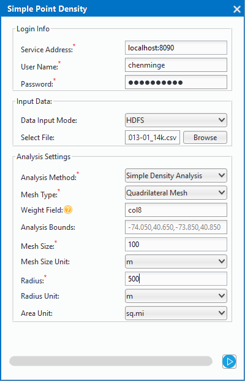
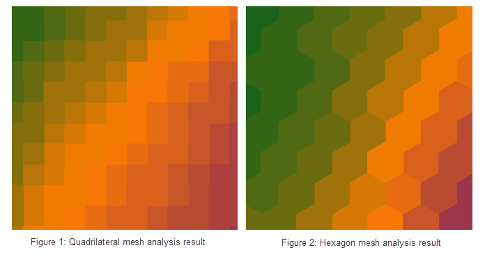

title: Density Analysis
---

　　There are two kinds of Density analysis supported by big data online analysis service: Simple Density Analysis and kernel density analysis.

- Simple density analysis: Used to calculate magnitude-per-unit area within a specified neighborhood around each point. Calculation method is point measure value is divided by a specified neighborhood area, where the neighborhood is overlay, the density value also is added, density of every output raster is the sum of all neighborhood density value overlaying in grid. The unit of result raster value is reciprocal of the original dataset square, such as: if original dataset unit is meter, the unit of result dataset will be per square meter. 
- Kernel density analysis: Used to calculate unit density of point or line features measure value within a specified range. It can visually reflect the distribution of discrete measurements in continuous surfaces. It can be used to: calculate population density, calculate building density, get crime situation report, monitor population density in tourist area, analyze operation situation of retail store chain and so on.

##### 　　Functional Entry

　　There are two functional entries.

- In the "Online" tab and "Online Analysis" group, select "Simple Point Density" or "Kernel Density Analysis".
- In the "Model Builder" tab click "New" and the "Tollbox" panel will pop-up, then click "Simple Density Analysis" or "Kernel Density Analysis" under the "Online Analysis", or drag them to the "Model Builder" window. Double click corresponded functions and "Parameter Settings" panel will be displayed.

##### 　　Parameter Description

　　The parameter settings for simple density analysis and kernel density analysis are almost the same, including three major categories: login information, input data, analysis parameter.

　　

- **Login Information**

　　Mainly used to set login information for iServer server address, username and so on.

  - Service Address: for setting IP address of the iServer server which has been enabled and configured.
  - Port Number: for setting port number of server.
  - Username/password: for setting username/password of iServer management.

- **Input Data**

　　Input method: supporting HDFS, iServer DataStore, UDB. For data preparation, please reference: [Data Preparation](DataPreparation.html).

　　**HDFS**

　　For using HDFS method, you can click "Browse" button on the right side of "Select File", input HDFS data address in the pop-up dialog box and select scv file. **Note**: there must be a meta file corresponding to scv data, if not, you only need to click "OK" button in the prompt box (the prompt content is: meta file doesn't exist, please set it), then set related parameters and click "Save", a meta file is created.

　　**iServer DataStore**

　　For using iServer DataStore method, you need to open iServer DataStore datasource first, at the same time, PostgreSQL datasource which stores the same data will be opened automatically. The detail operation is as follows:

1. Open iServer DataStore datasource in "Open Web datasource...", meanwhile PostgreSQL datasource is opened. The PostgreSQL datasource name is **iServerDataStore_Database name**.
2. Set related parameters including: server address, database name, username, password, you can view these parameters by right-clicking **iServer DataStore** datasource and selecting "Property", as follows:
　　
3. Set name of PostgreSQL database where dataset to be analyzed is located, and select the dataset and its type.

　　**UDB**

　　Big data online analysis can be performed based on data from server UDB data, You only need to store data to UDB, during analyzing, the UDB can't be opened or occupied.

1. Datasource Path: Sets path and name for UDB datasource.
2. Dataset Name: Sets dataset name.
3. Dataset Type: Selects dataset type.

- **Analysis Parameter Settings**

1. Analysis Method: Specifies the method as simple density analysis or kernel density analysis. Required parameter.
2. Grid Type: Specifies whether the grid cell is a quadrilateral grid or a hexagonal grid.
3. Weight Field: Specifies a set of field name where weight value of point to be analyzed is located. Format is such as: col7,col8. Optional parameter. **Remarks**: You can pass multiple field indexes which indicates weight and are separated by commas. If the parameter is null, the point weight is 1. Whether the parameter is set or not, it will be analyzed that the weight value is 1. The results are reflected in the attribute table field of the result dataset.
4. Analysis Range: The points outside the analysis range will not participate the calculation. The default is full range of input data.
5. Grid Size: For quadrilateral grid, it is the side length; for hexagonal grid, it is the distance from vertex of the hexagon to the center point. (Default value is 10.)
　　
6. Grid Size Unit: Can select: Meter, Kilometer, Yard, Foot, Mile (Default value is Meter)
7. Search Radius: Default value is 100
8. Length Unit of Search Radius: Can select: Meter, Kilometer, Yard, Foot, Mile (Default value is Meter)
9. Area Unit: Can select: SquareMeter, SquareKiloMeter, Hectare, Are, Acre, SquareFoot, SquareYard, SquareMile (Default value is SquareMile)

###  Related Themes

　　 [Environment Configuration](BigDataAnalysisEnvironmentConfiguration.html)

　　 [Data Preparation](DataPreparation.html)

