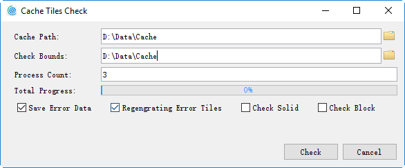
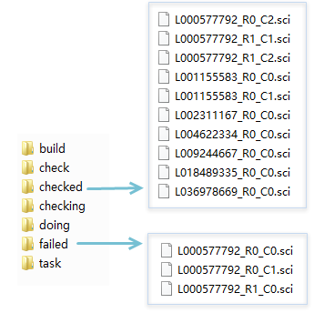

title: Cache Check
---
　　SuperMap iDesktop 9D provides a tool to help users validate the cache data, currently supporting the type of compact and MongoDB. It also supports multi-process validating. The *.sci files which have problems will be put in the failed directory in the CacheTask folder under the cache directory, and the successful ones will be put in the checked directory.

### Basic Steps     　　

  1. Clicks on "Maps" > "Mapping" > "Cache Check", and then the dialog box "Cache Tiles Check" pops up.
  
　 　　

　2. **Cache Path**: The path of the CacheTask folder when creating the task, e.g., if the CacheTask folder is saved under D:\Data\Cache, here set the value is D:\Data\Cache.
　3. **Check Bounds**: Sets the check bounds. It can be set directly or customized by user.
　4. **Process Count**: Sets the count of progresses according to the computer condition.  
　5. **Save Error Data**: If checked, it will save wrong data to the generated UDB previously.
　6. **Regenerate Error Tiles**:  If checked, after finishing checking, it will start the multi-process caching function, then the wrong tiles will be regenerated.
　7. After setting all the parameters, click "Check" button to begin the operation. The correct tasts will be saved into the folder "checked", while the tasks with some problems will be save into the folder "failed".
　   
  8. When the checkbox Regenerate Error Tiles is checked, after completing, it will start the multi-process caching function to regenerate wrong tiles (if existed).

   
