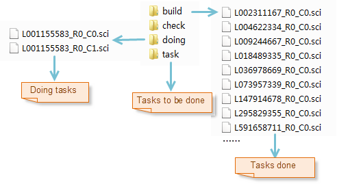
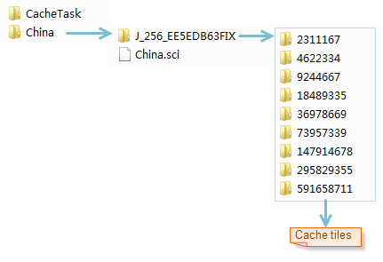

title: Execute Caching Tasks
---
　　After you split the map caching task into multiple sub tasks, you can perform a multi-process caching on a single machine or multiple machines. It uses computer resources reasonably to improve the efficiency. The specific steps are as follows:

### Basic Steps     　　

  1. Click on "Map" > "Mapping" >"Multiitask", and then choose "Execute Map Cache Task" in the shown "Cache Type" dialog box.

  2. Click "Next" button, and the "Multi-process Generating Cache" box will pop up. You need to set the workspace path, map name, number of processes, and cache path.
   - **Workspace Path**: Select the workspace the cached map is in. Note: Users need to ensure that the map is consistent with the one when splitting the task, otherwise, it will lead to the results not be properly viewed.
   - **Map Name**: Set a name of the map to be cached.
   - **Process Number**: Set the number of the processes. The number of processes needs to be set according to the configuration of the machine and the use of the process. The number of processes can be adjusted according to the machine at any time.
   - **Cache Path**: Set the cache directory to the same one when splitting the task, e.g., if it is set as D:\Data\Cache when splitting the task, here it is also set to D:\Data\Cache.
    
  3.  Click OK to start caching. The progress information of the caching will be shown at the right of dialog box.
　
    

  4. When you perform a multi-process caching task, it will generate a "doing" folder in the CacheTask directory, and the subtasks that each process gets will be moved from the "task" folder to the "doing" folder. When the sub task caching is completed, the task will be moved from the "doing" folder to the "build" folder in the same level, the sub tasks in failure will remain in the &quot;doing&quot; folder, if all the tasks are completed, there is still a *. sci file in the "doing" folder, it means that the caching for this time fails, you can move it to the task and make caching for it again.
  
     
  5. The cache tiles will be stored in the directory in the same level with the sci file, as shown below, the tiles are saved in the corresponding scale folder. After the map caching is completed, load the the China.sci file to view all cache.
  
　 　　

　6. Add the map cache file to iDesktop to view the cache result.
　  

   
