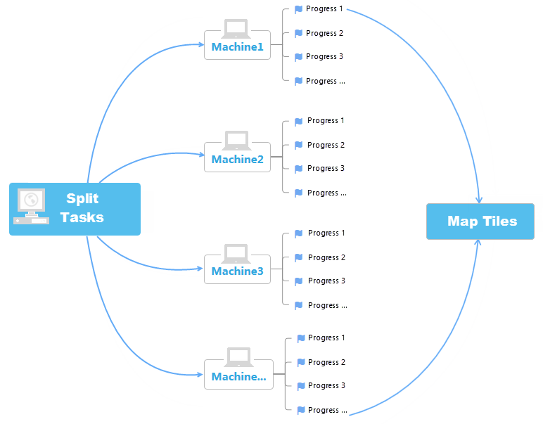
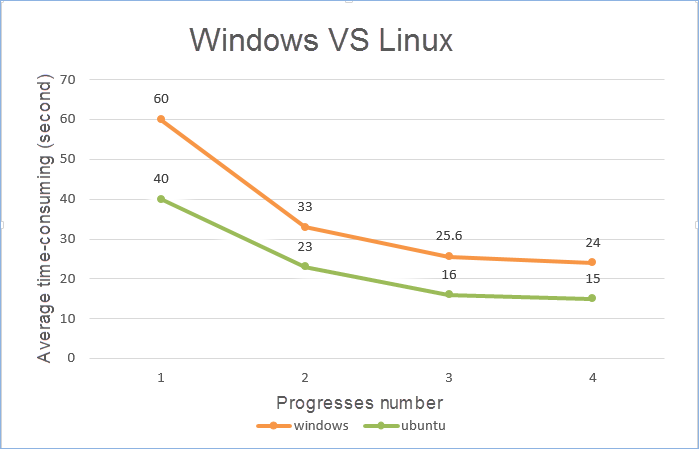

title: Multi-process map cache
---
　　Map cache is generated according to the specified range and scale map file, and improves the map loading, browsing efficiency by loading the desktop or web side of the map cache slice. Traditional map caching is performed in a single thread or single process, and the number and scope of maps used for production caching are large, and layers and scales are more hierarchical, and the map information is rich and the map cache is usually consumed a long time. For example, in the ordinary work machine, it may take more than ten days to generate dozens of scale cache for the Chinese range, dozens of layers of the map. In order to improve the efficiency of the user's mapping, the rational use of the computer system resources, SuperMap iDesktop Cross 9D provides a multi-process cut function, and map cache check and fill the tool to make the map cache generation operation more controllable.

##### Multi-process cut principle
　　A process is a separate unit of resource allocation and scheduling for a system, and a program that usually has a separate function allocates a process. Multi-process cut needs to split into multiple sub-tasks for map cache cut task, while opening multiple processes, each process will obtain and perform the cut map task to the specified directory, and save  the cut results to the same file folder.　　

　　Multi-process cut supports to open multiple processes to perform the cut map task in a computer, and also supports multiple machines to open multiple processes, respectively obtaining subtasks to perform a cut.　　　

　　

##### Multi-process cut cache points

　　In the process of multi-process cache, pay attention to the following points:

　　**Split the task**: Before executing a multi-process cut, you need to split the map cache into multiple cut tasks, making it easy for each process to obtain independent, non-repetitive tasks. Split sub-tasks are * .sci cache configuration files. The overall cache configuration file is split into multiple * .sci files, which split according to the set tile scale and range, and the number of cache blocks per sub-task of 128 * 128.

　　**Read only**: when Multi-process cut is performed, each process will also visit the map where the data source, then the problem which the data source will be occupied appears, so before the implementation of multi-process cut,  through the &quot;Read-only open&quot; option of the data right-click menu, set the data source to read-only open, and save the workspace.

　　**Shared directory**: To perform multi-machine multi-process cut, you need to set up a shared directory in the machine where the task is located, to ensure that other machines have read and write permissions to the shared directory, and no password is set. The contents to be stored in the shared directory include: split sub-tasks, the cut required workspace and data source, the cut results. It is convenient for each machine to obtain cut task and the required data, and it is convenient to store and summarize the results.

　　**The map.**: Before you split the task, you need to determine and save the map to be cut, making sure that the map at the time of the split is consistent with the map of the workspace at the time of the cut. If the map is not consistent with the map when the map is split may lead to the cache not being displayed properly. If the map to be cut is updated after the task is split, it is recommended that users re-split the task and then cut the map cache after they save the map and workspace.

　　**Multi-machine cut map**: Before performing multi-machine multi-process cut, check whether the other machine can connect to the host, such as on Windows OS entering \\ 198.168.1.20 (host ip) in the resource folder, to access the shared directory. For a Linux OS, you can mount a shared folder under Windows OS. In ubuntu OS, you can use the command "mount -t cifs -o username=root,password=map //198.168.1.20（host ip）/testdata /mnt" to mount a shared directory to the mnt directory. The operations for different OS are different, you need to set related parameters according to system environment. Note: iDesktop can't open a workspace with the address "smb:\\ip".
##### Cache Efficiency Comparison　　

　　Multi-process caching can use the computer resources reasonably so as to improve the caching efficiency, which is much faster than the single process, shown as the following sample:　

　　**Cache Data**: The China map in SampleData, scale: 1:144448.　　

　　**Hardware**: CPU:Intel Core(TM) i5-4440, memory: 8GB, 4 cores CPU.　　

　　**System**: Windows10 x64, Ubuntu.　　　　

　　**Cache Type**: MongoDB.　

　　The comparison for costing time of a single process and multiple process in Windows OS and Linux OS respectively is shown as following table:

　　

　　From the above table we can see that multi-process of single machine caching is more efficient than the single process. With the increase in the number of processes, the efficiency has improved significantly, when the number of processes increase to a certain number, the caching time tends to be stable, and to continue increasing the number of processes not to improve the efficiency significantly. In the Ubuntu system, the efficiency of the caching is higher than the Windows system, as shown in the comparison chart below:　

　　
　　

  

　　

　　

　

　　
　　　

　　
　　
　　　　　　　　　

