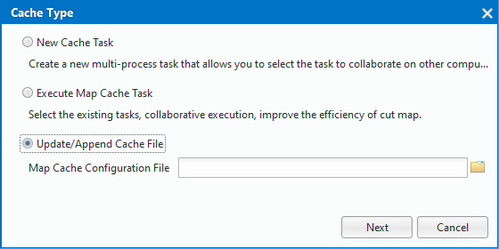
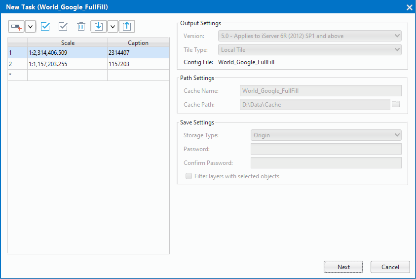

title: Resume/Restore Cache File
---
　　If the map process encountered a power outage, the program unexpectedly quit, etc. lead to cut the situation, in the case of the cache configuration file * .sci in the same level directory, it will generate a * .log file, by importing * .sci File, and determine whether the same level of log files, you can start resuming cache file.

### Basic Steps     　　

  1. Click "Maps" > "Mapping" > "Single Task", and pop up "Cache Type" dialog box, and then check "Resume/Restore Cache File" and set the configuration file (*.sci) to be resumed or restored.
  
  

　2. Open *. sci file to judge whether there is a resume.log file at the same level, if not will pop up a massageBox to prompt the user the log file lost, can not perform the operation; if there is a log file, it is pop up the following dialog box.
　  
   
 
　3.set the cut scale in the dialog box, and display the relevant parameters in the cache configuration file (* .sci), click "OK" to resume cache file.

   

　

   
