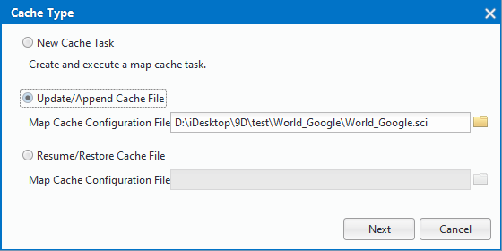
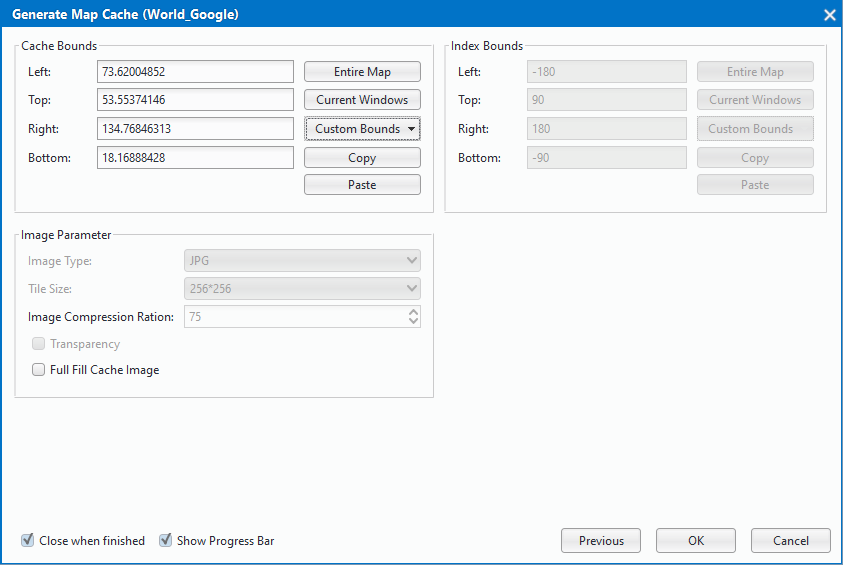

title: Update Cache
---
　　Update cache function refers to the update cache tile of the specified cache range and a specific scale. It applies to: a region of the map which has been cut cache, among them, the feature elements in a certain area have changed, it needs to update the cache of the region. At the same time, through the &quot;update cache&quot; function, you can update the cache according to the sci cache file, re-specify the cache to be updated, scale, picture compression rate.

### Basic Steps     　　

  1.  Click "Maps" > "Mapping" > "Single Task", and pop up "Cache Type" dialog box, and then check "Update/Append Cache File" and set the sci cache file to update
  
  

　2. Clcik "Next" and pop-up "Generate Map Cache" dialog box, and set the cache scale to be updated by the functions "Add Scale" and "Delete".
　  
    
　3.After clicking "Next", re-specify the cache range, and set the scope to be updated. Note: The index range is not updatable and is consistent with the index range of the original * .sci cache file, making it easy to index cache tiles within the specified range. You can re-specify the picture compression rate of the tile, and the picture compression rate is range of 0-100.

  
　4.After completing the settings, click "OK" to execute the operation.

   
