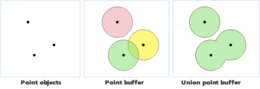
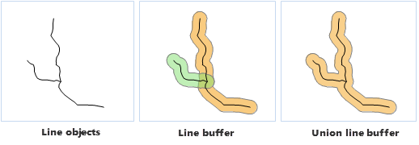
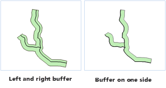
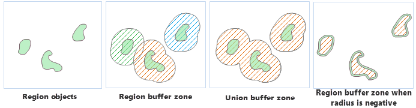
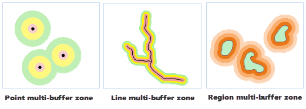

title: Theory of Buffer Analysis
---

　　Buffer analysis can build a zone with certain length around geometry object (point, line, or region) based on a specified distance. It can resolve practical problems by combining  with Overlay Analysis. Buffer analysis is used for identifying areas surrounding geographic features. The process involves generating a buffer around existing geographic features and then identifying or selecting features based on whether they fall inside or outside the boundary of the buffer.

　　The basic buffer feature is point, line or polygon. Buffer analyst supports point dataset, line dataset, polygon dataset (recordset) and network dataset. The buffer analyst of the network dataset focuses on edges. Two types of buffer analysis: single ring buffer and multiple ring buffer (analysis). Following is the introduction of point, line and region buffer zone, which takes the single ring buffer as an example.

### Point Buffer Zone

　　The point buffer zone is a circular region generated by a specified point object (the center of a circle) and a specified buffer distance (the radius of a circle). If the buffer distance is large enough, the buffer zone of two or more point objects may overlap. If you select Dissolve Buffers, the overlapped part will be dissolved, the output buffer zone is a complex polygon object.

   

### Line Buffer Zone

　　The line buffer zone is an enclosed region, which is formed by joining the two lines that is generated by moving the specified line object a fixed distance on both sides and along the normal direction with the smooth curves (or flat heads) at the endpoints of the two lines. Similarly, if the buffer distance is large enough, the buffer zone of two or more line objects may overlap. Its dissolved result is the same with dissolving the point buffer zones.

  

　　When the buffer for line data is of a flat type, the buffer distance on the two sides of the lines can be different. You can also create a buffer on either side, as shown below:

   

### Polygon Buffer Zone

　　It is similar to generate the polygon buffer zone. The difference is the polygon buffer zone only extends or contracts on one side of the polygon boundary. If the buffer radius is positive, the buffer zone extends outside the boundary of the polygon object; and if the buffer radius is negative, the buffer zone contracts inside the boundary of the polygon object. Similarly, if the buffer distance is large enough, the buffer zone of two or more polygon objects may overlap. Its dissolved result is the same with dissolving the point buffer zones.

  

### Multiple Buffer

　　Multiple Buffer is to create multiple buffers around the geometry object according to the several specified buffer radius. For the line object, you also can create one-side multiple buffer, but it doesn't support the creation of the network dataset.

   

###  Related Topics

[Generating a Single Buffer](SingleBuffer.html)

[Sample Application for Buffer Analysis](BufferAnalyst_Example.html)

