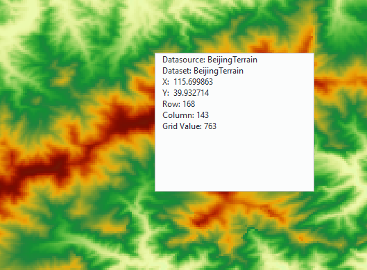

　　Pixel is basic information storage unit in a raster data, and each pixel has a given attribute value to represent geography entities or a phenomenon in reality world. As raster data has a certain spatial resolution, and a pixel corresponds to surface area with certain range, pixel values represent main phenomenon or elements of area covered by the pixels. Such as: the spectral values in satellite imagery and aerial photographs reflect the reflectivity of light in a certain band; value of pixel in DEM raster can indicate surface elevation, precipitation, pollutant concentration, distance and so on. The pixel information where the mouse is located can be queried by the function Query Raster Value, including coordinate value, column and row number, raster value and so on.

### Basic Steps

　　1.  Open raster data, and then click on "Spatial Analysis" > "Raster Query".

　　2.  View pixel information in the displayed message box by moving mouse to raster data. The information includes: the datasource and dataset where raster data is located, geographic coordinate of raster position, raster coordinate (column/row number) and raster value.

　　

　　3.  Click a point, it will be highlighted in map window meanwhile its geographic coordinate, raster coordinate and raster value will be shown in output window.

　　4.  Press ESC key or right mouse button can cancel query operation, and press ESC key can clear the highlighted points.
