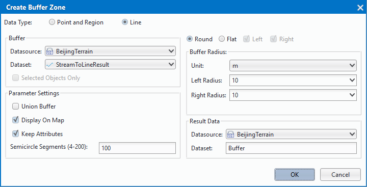
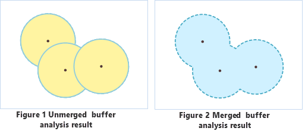

### Instructions

　　A single-buffer is a polygon with a certain width automatically created around a point, line, or region entity. The resulted buffer can be utilized in further analyses.

-   Currently, buffer analysis can be applied to only point, line, and region datasets. Buffers cannot be created for CAD datasets, network datasets, or route datasets.
-   Parameter settings for buffer analysis on different types of data are different. When generating buffers for line data, either the round or the flat type can be chosen; when creating buffers for point or region data, only the round type can be chosen. A flat buffer can be unsymmetrical, with its right radius and left radius unequal, or with only one side.
-   When specifying the buffer radius is numeric values, negative values can be applied only to region datasets, and positive values must be assigned for point or line datasets.  A buffer distance of 0 is not valid for any types of datasets.
-   When specifying the buffer radius is a field (non system field), if a field value is null or 0, no buffer will be generated for the corresponding object. Negative values in the specified field will be taken as positive values when dataset in the analysis is a point or line dataset. When generating flat buffers for line data, if a negative value is assigned to the left (right) radius, the absolute value will be used. When buffers are generated for a region dataset, a negative distance value will be used as it is.

### Basic Steps

1. Click on "Buffer..." in drop-down menu of "Analysis" menu bar, and "Generate Buffer" dialog box pop-up.

  

2. Select the type of the data which needs to generate buffer. Buffers can be created for point/line/region datasets. The buffer type, either round or flat, must be set when generating buffers for line data, whereas it does not need to be set for point or region data. That is why more options are there in the Create Buffer dialog box when the buffer is created for a line dataset. Below are the explanations about parameters in the dialog box when generating buffers for line data.

3. Set the dataset which will generate buffer. The system will automatically pick out the corresponding datasets and filter other datasets contained in the selected datasource according to the type of the data for the buffer analysis.

  * **Selected objects only:** If there are objects selected in a dataset, the "Selected objects only" check box can be checked, checking it means buffers will be created only for the selected objects, in which case the datasource and the dataset for the buffer analysis cannot be specified; if it is unchecked, buffers will be created for all the objects in the dataset, and the datasource and the dataset for the analysis can be changed.

4. Set the buffer type. Different parameters need to be set for different buffer types.

  * **Round:** Two parallel lines are drawn at a certain distance of a line object, one on each side. A half-circle, with the buffer distance as its radius, is drawn to connect the same-side ends of the two parallel lines to form a buffer. Round is the default buffer type.

  * **Flat:** When generating a buffer, a rectangular buffer is formed by taking the line segment connecting adjacent nodes of a line object as one side and the left or right radius as the other.

5. When generating a flat buffer for a line object, the left and right buffer distance can be different. It can also be a one-sided buffer. Two-sided buffers will be generated only when "Left" and "Right" are both checked. By default, both left buffers and right buffers are generated.

6. Set the buffer unit: Units of the buffer distance can be one of the following: Millimeters, Centimeters, Decimeters, Meters, Kilometers, Inches, Feet, Miles, Degrees, and Yards.

7. Set the mode for specifying the buffer distance.

-   **Numeric: **If "Numeric" is checked, the buffer distance is set by inputting a number. The input value is a double precision number.
-   **Field: **If "Field" is checked, the buffer distance will be specified using a numeric field or expression, only non system field from current dataset can be selected.

8. Set the result options. It can be set whether to merge the generated multiple buffers, whether to retain the field attributes of the original objects, whether to add the buffers into the current window, and the number of semicircle segments.

  * **Union buffer zones: **If this option is checked, a Union operation will be performed on the generated buffers. If it is unchecked, generated buffers will remain unchanged in the result and no union operation is to be performed. Note: If the option is not checked, the Union operation will not be performed for the buffer of different objects.

-   **Keep attributes: **If this option is checked, the non-system field information of the original object will be reserved for the corresponding buffers. If it is unchecked, the non-system field information of the original objects will be lost. The option is checked by default. Note: When "Union buffer zones" is checked, this option is not applicable.

-   **Show result in map: **If this option is checked, the generated buffers will be added in the current map window. If it is not checked, the buffer analysis result will not be added in the window. It is checked by default.

-   **Semicircle Segments(4-200):**This parameter is used to set the smoothness of the buffer boundaries in the result. The greater this value is, the more circle segments there will be, and the smoother the buffer boundaries will be. The value range is from 4 to 200. The default value is 100.

9. Set the result dataset name and the result datasource name. Click on "OK" button to perform the operation of generating buffer.

### Related Topics

 [About Buffer Analysis](BufferTheory.html)

 [Sample Application for Buffer Analysis](BufferAnalyst_Example.html)

