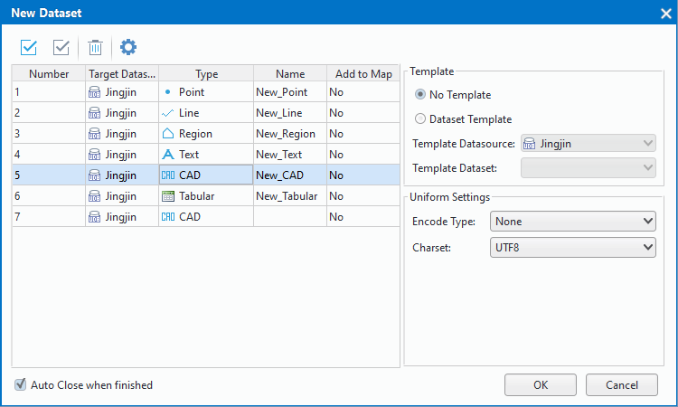
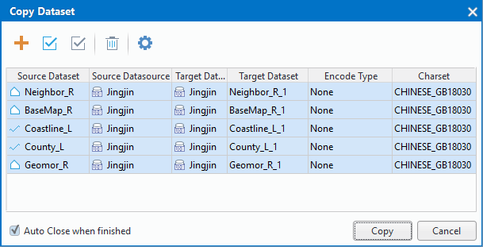

　　As a basic unit for geospatial data organization, a dataset is used to store data of the same theme. Currently, SuperMap supports point, line, region, tabular, network, CAD, text, LineM, image/grid datasets.
　　Manging datasets includes creating, copying, deleting, closing, renaming datasets, as well as sorting datasets, viewing dataset properties, setting encoding for datasets, etc.

### New a dataset

   11 kinds of datasets can be created including: point, line, region, text, CAD, image, raster, attribute table, 3D point, 3D line, 3D region. Also you can create a vector collection to save all vector datasets with the same data type and coordinate system.

　　Two entrances are provided for create a dataset. 
  
+   You can click "New Dataset" or "New Vector Collection" in the "Start" tab on the "New Dataset" group.
+   Right click your datasource and then select "New Dataset" or "New Vector Collection".
   
**Basic Steps**       
1. After click the "New Dataset", the "New Dataset" dialog box will appear. 
2. At right of the dialog box, you can set the types, names, target datasources and whether to add a dataset to a map for datasets.　  
        
  
+ **Type**: Click the cell in the type column to choose the dataset type you want to create from the pop-up list. 
+ **Target Datasource**: You can select either a file datasource or a database datasource. 
  
3.In the "Template" area, you can set whether to select a template for producing a dataset.
  
+ **No Template**:  If you select this, you need to set the Encode Type and Charset of the dataset. 
**Encode Type**: This option is provided only for line and region datasets, it's the encoding of the new dataset, all the encoding types are listed in the dropdown list, for more details, please consult: Dataset Encoding Types. 
**Charset**: You can select an appropriate charset for the new dataset. For a list of supported characters and their introduction, please consult: character set list.  
  
+ **Dataset Template**:  If you select this, you can create a dataset based on the template you specified, and the dataset attribute table structure and most of the attributes you want to create are consistent with the template dataset. Note: The newly created dataset range is 0 with no spatial index and no objects. 
  
4. After all, click "OK" button to finalize the operation.
  
**Note**    
  
+ When creating point, tabular or CAD datasets, encoding type is no encoding and can't be changed.   
+ Naming rules of datasets are:   
  1. Composed of letters, numerals and underlines, and can only start with a letter.   
  2. The length can not be 0 or greater than 59.
  3. Can't contain illegal characters.
  4. Can't use the reserved fields. 

  
### Copy datasets  

Copy one or more datasets to the target datasource. The selected datasets can be added into the "Copy Dataset" window directly. 
   
  
　　Two entrances are provided for copying datasets:
  
+   Click "Start" tab > "New Dataset" group > "Copy Dataset".
+   Select the dataset you want to create and then right click and select "Copy Dataset".
   
**Basic Steps**       
1. Select one or more datasets in the same datasource. 
2. Right click and select "Copy Dataset...", then the "Copy Dataset" dialog box appears.
   
3. Set necessary information on coping datasets including: target datasources, names, encoding and character set types of new datasets. For more details on encoding and charset types, please refer to "Encoding and charset list".
4. Click "Copy" button to finalize the operation.
         
### Delete datasets   
Select one or more datasets in the same datasource then right click and select "Delete Dataset" to delete it/them from your datasource.
 
### Rename datasets  
Use to modify your dataset's name.
1. Select your dataset then press F2 or right click and select "Rename Dataset", now you can enter a new name for your dataset.   
2. Click your mouse anywhere to finish the operation.   
**Note**: The layers that has been renamed can not be displayed on maps normally.
  
### View properties of datasets 

　　Right click your dataset then select "Properties" and the "Properties" window will appear at right to show relative information of your dataset. What information will be shown on the "Properties" depends on the type of your dataset. 
  
　　**Vector Dataset**: If your dataset is a vector dataset, four panels are shown on the "Properties" window including: Dataset, Vector, Field, Coordinate System.
　　**Raster Dataset**: If your dataset is a raster dataset, three panels are shown on the "Properties" window including: Dataset, Raster, Coordinate System.
　　**Image Dataset**: If your dataset is an image dataset, three panels are shown on the "Properties" window including: Dataset, Image, Coordinate System.

### Common parameters  

+   **Dataset**: Shows some basic information (name, type, etc.), bound information and detail descriptions of your dataset.
+   **Coordinate System**: Shows the coordinate system, geographic unit and descriptions of the coordinate system adopted by your dataset. Also, you can re-specify a coordinate system or perform the projection transform. For detail operations, please refer to "Projection Settings" and "Projection Transform".
  
### Property parameters of a vector dataset
+   **Vector**: Shows the number of objects, the index type, the charset and some tolerances relative to your dataset. All information is detailed in following contents.
     
	 **Vector dataset**  
	+ **Records**: Total number of objects.
	+ **Charset**: The charset used by your dataset.You can choose another charset for your dataset from the drop-down list that shows all supportive charsets. Please refer to "Charset List" for introductions on charset.  
	+ **Index Type**: Spatial index type of your dataset. For detail information on spatial index, please see: Spatial index type.
	+ **Read-only**: Shows whether your dataset is read-only. While you can check the check box or cancel checked to set the state of your dataset. If it is read-only, you can't perform any operations to the dataset. 
	+ **User Cache**: Shows whether your dataset has used caches, you can check the check box or cancel checked to set whether the dataset uses caches. Note: it is only available for datasets in Oracle Plus datasources with image indexes built.   
	<!-- **Clear Cache**: Clear cache files of your vector dataset.  -->
   
 	**Tolerance**    
	+ **Fuzzy**: The least distance between two vertices. Two vertices would be merged into one if the distance between them is less than the fuzzy tolerance. The unit is identical that of the dataset.   
	+ **Overshoots**: Displays and Sets the tolerance for short suspension for the currently selected vector dataset. Any dangles shorter than this tolerance are recognized as overshoots, which can be removed in the topology processing. The unit is the same with that of the dataset.  
	+ **Undershoots**: Displays and Sets the tolerance for long suspension for the currently selected vector dataset. Any dangles whose distances to another line or arc that they can extended to intersect with are smaller than this tolerance are recognized as undershoots and can be extended to intersect with another line/arc in the topology processing. The unit is the same with that of the dataset. 
	+ **Grain**: The controlled distance between vertices when adding circles, arcs and curves. The unit is identical that of the dataset. 
	+ **Sliver Polygon**: The smallest polygon in the vector dataset. During topologizing, polygons smaller than the specified value are marked as sliver polygon. You can set to delete sliver polygons during topologizing. The unit for Sliver Polygon is identical to the area unit of the vector dataset. 
 
+   **Field**: Shows the structure of attribute table of your vector dataset. Each row shows relative information of a field in the attribute table, and each column shows one type of information of fields including: field types, field lengths and so on, You can click Add or Delete button to add or delete a field, also you can modify an existed field, but you need have a focus on: 
　　1. For fields that have been created successfully, only the Alias and Type of the field can be modified. Currently modifying field types of datasets based on Oracle, SQL Server, MySQL, PostGreSQL, or KingBase database engines are allowed, SuperMap has no support to modify field types of UDB datasources. For datasets in a database-type datasource, because of some limitations of the database itself, to modify types of them, please see "modify dataSet of attribute field type support".
　　2. For fields got from datasets, only their aliases can be changed. For the fields you created and are not saved, you can modify all information relative to them, but the new name of a field can not be the same with an existed field name.  
　　3. When you create a field, its name must be unique and follow some naming rules:　　
　　(1) Composed of letters, numerals and underlines, and can only start with a letter but "sm". 
　　(2) The length can not be 0 or greater than 30.  
　　(3) Can't contain illegal characters.
　　(4) Can't use the reserved fields. 
  
### Property parameters of a raster dataset
  
**Raster**: Shows image properties and extremum information. 
   
+   **Image Properties**: 
	+ Pixel Format: The number of bits used to represent the color value of each pixel in a grid dataset.
	+ Resolution X/Y: The resolution in the X/Y direction.   
	+ NoData: The value for cells with no data. 
	+ Rows/Columns: The number of rows/columns of the pixel matrix for the grid dataset. 
	+ Raster Block: The number of grid blocks. Such as, if it is 3*4, that means total number of raster blocks is 12. 
 
+ **Extremum**: The maximum value and the minimum value of raster value in your raster dataset. 
+ **Color table**: Used to set the display color of pixel of grid dataset. This setting is useful only for the grid dataset, if you want to modify the color table of the grid dataset in map, please see "Color Table Setting". The color scheme can be shown on a newly opened map.
+ **Visible Bounds**: Set up the display range for your raster dataset and contents out of the range are invisible.  
　　1. Click "Settings..." button to head for the "Set Visible Bounds" dialog box. You can choose a region dataset from the current workspace as the display range, or you can click the "..." button to open the "SQL Expression" dialog box where you can set a filter expression to control the display of your raster dataser.

　　　　　　  
　　　　2. Click the "Clear" button to make your dataset entirely display.
 
### Property parameters of an image dataset   
 
**Image**: Shows image properties and band information of your image dataset.

+ **Image Properties**:   
	+ Bands: Number of bands included in your multi-bands image dataset.
	+ Resolution X/Y: The resolution in the X/Y direction.      
	+ NoData: The specified NoData value of bands in your dataset.
	+ Rows/Columns: The number of rows/columns of the pixel matrix for the raster dataset.

+ **Band Info**:   
	+ Index: The index value of band currently displayed in your multi-bands image dataset.
	+ Name: Each band name.   
	+ Pixel Format: The pixel format saving image data in your image dataset, that is how many bits represents a pixel.
	 
+ **Others** 
	+ **Pyramid**: Shows whether the image pyramid has been built in your image dataset. 
	+ **Visible Bounds**:  Set up the display range for your raster dataset and contents out of the range are invisible. The way of setting display range for an image dataset or a raster dataset are the same.
	+ **Clear**: Click the "Clear" button to make your dataset entirely display.