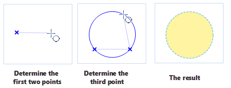
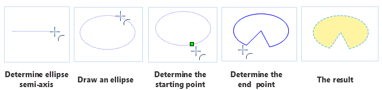

Drawing of region objects is applied to production of data, such as data corresponding with digital, parcel of land and so on. Region object includes polygon, circle, sector, etc.

### Drawing Rectangle

   1.  Click "Object Operation" > "Object Drawing" > "Polygon" > "Rectangle".
   2.  Move mouse to map window and determine a starting position, and a rectangle is displayed in real time with the movement of mouse, then select a proper position and click mouse to finish the drawing of rectangle.

    **Note**: If you press Shift key at this time, a square will be got.

   3.  Right-click to cancel the operation.

### Drawing Round Rectangle

1.  Click "Object Operation" > "Object Drawing" > "Polygon" > "Round Rectangle".
2.  Move mouse to map window and determine a starting position. Move cursor, and a round rectangle will be displayed in real time, left-click in appropriate position to determine length and width of rectangle.

   **Note**: If you press Shift key at this time, a square will be got.

3.  Continue to move the cursor to determine radius, then click mouse to finish the drawing.
4.  Right-click to cancel the operation.

　　

### Drawing Parallelogram

   1.  Click "Object Operation" > "Object Drawing" > "Polygon" > "Parallelogram".
   2.  Move mouse to map window to determine a vertex 
   3.  Move mouse to determine the second control point, that means to determine length and direction of one side of parallelogram.
   4.  With the movement of mouse, you can preview the parallelogram in real time, right-click to determine the third control point and finish the drawing.
   5.  Right-click to cancel the operation.
   

### Drawing Polygon

   1. Click "Object Operation" > "Object Drawing" > "Polygon" > "Polygon".
   2. Move mouse to map window and determine a starting position. Continue to move mouse to determine other points on polygon, and any shapes of polygon can be drawn.
   3. Right-click to close the polygon and finish the operation.

### Drawing Circle 

Create circle with several methods. Such as specify the center, radius, diameter, the points on the circumference, etc. The application provides five methods for drawing the circle, the default method is specify the center and the radius.

**Draw circle with the center and radius**

1.  In "Object Operation" menu, select "Center, Radius" in the sub menu of "Ellipse".
2.  Move mouse to map window and left-click mouse in an appropriate position to determine center.
3.  Move mouse again and determine radius.

**Draw circle with two points on the circumference**

1.  Click "Object Operation" > "Object Drawing" > "Ellipse" and then select "Circle 2P".
2.  Move mouse to map window and left-click mouse in an appropriate position to determine the first point (starting point of diameter).
3.  Determine position of another point by moving cursor, and left-click mouse to finish the drawing of circle. 

**Draw circle with three points on the circumference**

1.  In "Object Operation" menu, select "3 Points" in the sub menu of "Ellipse".
2.  Move mouse to map window and left-click mouse in an appropriate position to determine the first point.
3.  Continue to move the cursor to determine the second and third points, then a circle appears. The circle is a  circumcircle of the triangle consisting of the three points.

　　

### Drawing Ellipse

**Draw the inscribed ellipse of rectangle**

1.  Click "Object Operation" > "Object Drawing" > "Ellipse" and then select "Ellipse".
2.  In this way, ellipse is drawn by drawing circumscribed rectangle.  Move mouse to map window and left-click mouse in an appropriate position to determine the starting point.
3.  Click mouse again to determine the position of ellipse. Before that, you can find out with the movement of mouse, size of a temporary blue ellipse is changing.

   **Note**: Press Shift key at this time, a circle will be got.

4.  Right-click to cancel the operation.

**Draws an oblique ellipse**

1.  Click "Object Operation" > "Object Drawing" > "Ellipse" and then select "Oblique Ellipse".
2.  Determine the starting position of an axis (the major axis and the minor axis) of oblique ellipse. In this way, an ellipse is drawn with the major axis and the minor axis.
3.  Determine direction and length of an axis by moving cursor. Another axis is changing with the movement of the cursor, left click in an appropriate position and an oblique ellipse is drawn. 
5.  Right-click to cancel the operation.

### Draw Sector

The sector object is a part of the ellipse object, so it is needed to draw an ellipse object before drawing a sector object.

**Elliptical Sector**

1.  Click "Object Operation" > "Object Drawing" > "Ellipse" and then select "Sector".
2.  Move mouse to map window.
3.  Draw an ellipse with the major axis and the minor axis. 
4.  Determine starting angle of sector in the ellipse, with the movement of cursor, a sector appears and its size changes, click muse to finish the drawing of sector.
5.  Right-click to cancel the operation.

　　

