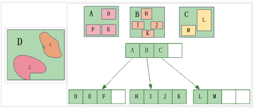
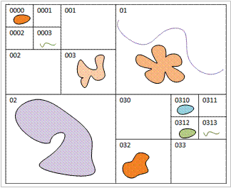
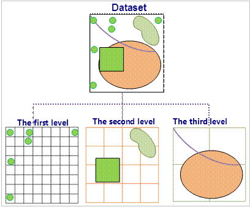
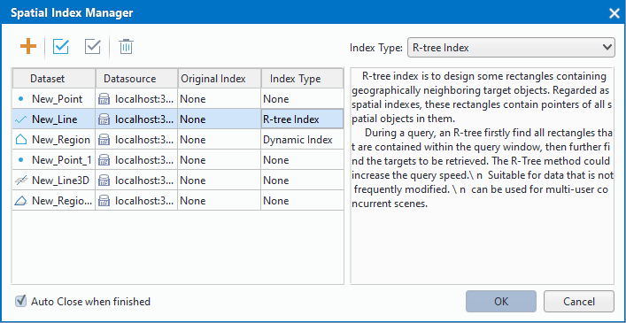

　　Over the development of GIS, GIS quantity is more and more thereby leading to a slow access speed. Spatial index is one kind of data structures which can enhance the efficient querying spatial data.
　　The field index is a data structure which can locate key values in a fast way, which is very popular in database systems and computer systems. In addition, the field index is able to access certain specific keys in a fast way. Generally, the field indexes employ the B-tree index or B-tree index derivative data structure. Since traditional field indexes cannot manage with the fast locating the spatial data that is spatially related, spatial indexes are necessary to improve the access speed of spatially related data. 
　　SuperMap provides four types of spatial indexes applicable to vector datasets: Q-tree index, R-tree index, mapsheet index and dynamic index.
　　A dataset can have only one type of spatial index at the same time. The current spatial index of a dataset will be automatically maintained if the dataset is being edited. The indexing efficiency might be negatively affected after several times of editing. Therefore, you need to rebuild the spatial index.　  
　
### Indexes Supported By Engine Types   
 
Engine Type | R-tree index | Q-tree index | Dynamic index | Mapsheet index  
-|-|-|-|-
UDB|Y (all types of datasets) | N | N | N  
SQLPlus|Y Excluding 2D&3D point datasets and tabular datasets) |Y Excluding 2D&3D point datasets and tabular datasets) |Y (Excluding CAD datasets))|Y (Excluding route datasets))
PostgreSQL|Y Excluding 2D&3D point datasets and tabular datasets) | N | N | N
OraclePlus|Y Excluding 2D&3D point datasets and tabular datasets) |Y Excluding 2D&3D point datasets and tabular datasets) |Y (Excluding CAD datasets))|Y (Excluding route datasets))  
OracleSpatial| Y (all types of datasets) | N | N | N
KingBase |Y Excluding 2D&3D point datasets and tabular datasets) |Y Excluding 2D&3D point datasets and tabular datasets) |Y (Excluding CAD datasets))|Y (Excluding route datasets))  
MySQL | Y Excluding 2D&3D point datasets and tabular datasets) |Y Excluding 2D&3D point datasets and tabular datasets) |Y (Excluding CAD datasets))|Y (Excluding route datasets))
DB2 | N |Y Excluding 2D&3D point datasets and tabular datasets) |Y (Excluding CAD datasets))| N
BeyonDB |Y Excluding 2D&3D point datasets and tabular datasets) | N | N | N
GBase |Y Excluding 2D&3D point datasets and tabular datasets) |Y Excluding 2D&3D point datasets and tabular datasets) |Y (Excluding CAD datasets))|Y (Excluding route datasets))
Altibase |Y Excluding 2D&3D point datasets and tabular datasets) | N | N | N  
HighGoDB|Y Excluding 2D&3D point datasets and tabular datasets) | N | N | N   
SinoDB | N| N | N | Y Excluding 2D&3D point datasets and tabular datasets)     
MongoDB | N| N | N | Y Excluding 2D&3D point datasets and tabular datasets)  

### R-tree index
  
　　R-tree is a disk-based index structure, it is a natural extension of B-tree (one-dimensional) in multi-dimensional space, and it is easy to integrate with existing database systems. It can support various types of spatial query processing operations, in practice, it has been widely used and it is one of the most popular spatial indexing methods.

　　The R-tree spatial indexing method is to group nearby objects into their minimum bounding rectangle, and each rectangle stores pointers to the corresponding spatial objects. Such as, the rectangle A contains spatial objects D, E, and F, while the rectangle B contains H, I, J, and K, and the rectangle C contains L, M. 

   　　  
  
　　In spatial indexing, every rectangle of objects will be determined whether it overlaps the search rectangle, if yes, then determine which objects will be searched.
  
**Features**   
 
+ This searching method has high efficiency and good precision.
+ Index data and geographic data are saved independently. Because of the update of R-tree index is involved in its balance and grouping, after editing data, updating R-tree index is very slow and searching efficiency is very low unless you rebuild spatial index. Hence, it applies to read-only data or the data that is not edited often.
  
**Applies**   
  
+  R-tree index is suitable for static, for example data used as base map data, or data infrequently edited data.
+  Engine types supporting to create R-tree index include: UDB, SQLPlus, PostgreSQL, OraclePlus, OracleSpatial, KingBase, MySQL, BeyonDB, GBase, Altibase.  
  
**Q-tree index**   
 
It is an effective two dimensional spatial index. Its basic idea is: the entire working space is encoded to 0, with horizontal and vertical lines divided into four parts, which are encoded to 00, 01, 02 and 03 as the order, the upper left corner is 00, the lower right corner is 03; the same way to divide each grid, e.g., the grid 00 is divided into 000, 001, 002 and 003. According to the need, you can also continue to divide them. The number of layers divided depends on the number and the average size of the objects in the research area.

 
     
    
If the object shown above is objects contained by the entire dataset, then its quadtree index structure is established as shown below:
 
    
    
**Applies**  
    
+ It's suitable for high concurrency editing of data with small data volume.  
+ Supportive engine types creating Q-tree index include: SQLPlus, OraclePlus, KingBase, MySQL, DB2, GBase.

### Mapsheet index  
  
In SuperMap SDX+, the spatial objects are classified according to a given attribute field or a range (sheet length and width). Then through the index, the spatial objects are managed thereby improving the query speed. As shown in the figure below, after the tile spatial index is created according to the given range, the map of the administrative boundaries of the Chinese municipal administrative boundaries shows the h4708 scene. The tile spatial index is very useful for the display and query of the huge amounts of data (i.e., the number of objects is more than one million). After the establishment of the index, it only shows what you need to see so as to greatly shorten the display time.  
 
     
  
The mapsheet index can also be cached to the local (in the form of binary file), so that it can further improve the speed of query and retrieval. File caching is an intelligent distributed storage scheme, which is provided by SuperMap SDX+ to balance the network and server load and improve the whole performance. After you open the file cache option, when the application is accessing data stored in the spatial database, it will firstly check whether the data exists in the local cache libarary, if there is no corresponding cache data or the cache data is not the latest version, it will read the data from the server and update the local cache data, so the next time it can read the local cache data. If the local cache has the latest version of the corresponding data, it does not need to use the network to access the server to request data, but directly read the local cache data to complete the display or analysis. Through this solution, the database server load and network load can be reduced greatly, and the whole performance of the application is greatly improved.
  
**Applies**  
  
For the datasets stored in the database and with the standard scale(such as 1:25 million, 1:10 million, 1:5 million), it can provide a very good query performance after the tile spatial index is built, with the provided caching option, it can achieve better map browsing speed.
  
**Note**   
 
+ The algorithm of building the mapsheet index has made a substantial improvement in version 5.3. According to the data quantity, the index time consuming can be reduced 4-10 times. To build the tile spatial index for the dataset whose records are more than 50000, it's recommended to use the version 5.3 and above.  
+ The mapsheet index is currently only supported by the point, line, region, text and CAD datasets in the database datasource. 
+ Supportive engine types include: SQLPlus, OraclePlus, KingBase, MySQL, GBase.   
   
### Dynamic index      

This kind of indexes uses multi-level grids to organize and manage data. The basic method of the dynamic index is that it divides a dataset into equal size or unequal size grids, and records the locations of the grids which are occupied by the features. The regular grid is usually used in GIS . When performing spatial query, first the cells that contain the queried features will be calculated, then, the features will be queried rapidly. This multi-level grid index is used to optimize spatial query performance. 
 
     

The spatial grid index has three grid levels, namely one, two, and three grid levels in current version, and each level has its own distinct cell size. The first grid level has the smallest cell size, and the data of 50% belongs to the first level. The second and third cell size must be larger than the previous level.
  
**Feature**  
  
+ Using the dynamic index can make the speed of browsing datasets faster.
+ Good ability of index update and concurrency. 
+ The spatially search accuracy is high.    
+ This index type supports dynamic concurrency editing, supports database datasources.
  
**Applies**    

Dynamic index combines the advantages of R tree index and quad-tree index to provide a very good concurrent editing support. It has good universality, which is the default spatial index type. If you cannot determine which spatial index is applied to your data, it is recommended to build a dynamic index.
  
**Note**  
  
+ Supportive engine types creating dynamic index include: SQLPlus, OraclePlus, KinBase, GBase, DB2 and MySQL.
+ After creating a dynamic index, the user can make a local cache according to the map range, which can greatly improve the speed of query and browse, especially for the GB level data. For the data that is stored sheet by sheet, such as the national basic scale topographic map, the dynamic index can be set according to the size of the map sheet.   
  
### Manage spatial indexes  
  
View spatial index information and create a spatial index for your dataset.   
  
**Basic Steps**  
  
1. Select one or more datasets in the Workspace Manager. 
2. Click the "Start" tab > "Data Processing" group > "Spatial Index" button to open the "Spatial Index Manager" dialog box.   
  

     
   
+ **Original Index**: The index type of the vector dataset.
+ **Index Type**: Choose an index type to create for your dataset.
+ **Index Type**: At right of the dialog box. Both the two "Index Type" have the same values. The two drop-down buttons are associated. After you specify an index type, its descriptions will be shown on the area under the "Index Type".
  
For mapsheet index, two parameters need settings, detail instructions are: 
 
+ Field Index: Sorts spatial objects by the values of a specific field.  
+ Tile Index: Sorts the dataset objects by dividing the dataset into grid cells with a specified width and height. The unit of the width and height is the same with that of the dataset.   
  
For dynamic index, some parameters need settings, detail instructions are: 
  
+  Base Point: Set the center of the index, usually it is the cetner of the dataset. 
+  1st Level Size: Set the cell size of the first level. This parameter cannot be set as 0. Its unit is the same with the dataset unit. 
+  2nd Level Size: Set the cell size of the second level. The unit of this parameter is the same with that of the dataset. 
+  3rd Level Size:: Set the cell size of the third level. This parameter cannot be set as 0. The unit of this parameter is the same with that of the dataset. 
  
3. Click "OK", the application will create spatial indexes according to the index types you specify for your datasets.

  
### Recreate spatial indexes  
  
A dataset can only has one kind of spatial index, but you can change its index. For example, you can create a dynamic index for a dataset which need editing frequently, but when the dataset need displaying statically, you can replace the index with R-tree index.  

When the data set is in the edit state, the system automatically maintains the current index. In particular, when the data has been edited several times, the efficiency of the index will be affected to varying degrees, the need to re-establish the spatial index.  
  
**Basic Steps**  
  
1. Right click your vector dataset and then select "Rebuild Spatial Index..." to open the "Spatial Index Manager" dialog box.
2. And then choose an appropriate index for your dataset in the "Index Type" column, and click "OK".

  

 

 

 
  
  

  

    
  

    
 

     
    

 
　　  

 

  

