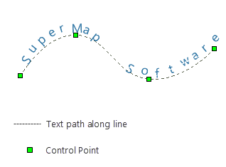

　　There are two methods for drawing text objects: Drawing normal text and Drawing alongline text. The function applies to editable text layers or CAD layers.

### Drawing Common Text

　　Click "Object Operations" > "Object Drawing" > "Text" drop-down button and select "Text" option, and a cursor will appears when moving the mouse to map window. Left-click in the position where you want to add text, and then you can start on a new line by pressing Enter key.

　　

### Draws alongline text

　　It means drawing text along lines. Detail steps is as follows:
1. Click "Object Operations" > "Object Drawing" > "Text" drop-down button and select "Alongline Text".
2. Determine starting point by left clicking on map, then draw text path like drawing a curve and right click to finish the drawing, enter content in pop-up dialog box "Alongline Text".
3. Click "OK" button to complete the operation.

　　

### Note

- To end drawing, you can:
    -   Right-click anywhere in the map window where any non-text box is located.
    -   Or click the button in the Text Objects group again.

- Alongline Text is composed of several sub text objects. A single Chinese character, a continuous alphabet, and a continuous number are treated as a sub-text object. A space character is not counted as a sub object, and is used to separate consecutive characters or numbers. For continuous letters or numbers, you need to add space between them to achieve the alongline text effect, otherwise it will as a sub-object. You can view and modify content of every sub object in "Property" dialog box.
- The direction of Alongline Text is a curve direction, so when creating alongline text, pay attention to the direction of the curve drawn.

