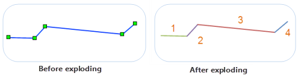
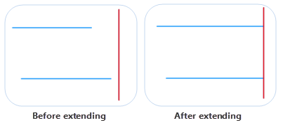

### Explode

　　The line objects will be divided into some straight lines in smallest unit. A straight line object is a simple object which must have two ends.

　　As shown below, the line object has 5 nodes, after performing the Explode operation, the line object is divided into 4 objects. Right picture shows the result by using the exploded objects to create a thematic map. 

　　 

**Instruction**

-   Line layer and CAD layer can activate the Explode function, and in layer, line object must be selected.
-   Complex objects also apply to the Explode operation, after performing the operation, the complex objects will be divided into straight lines in smallest unit. 

**Basic Steps**

1.  Select one or more line objects to explode in editable layer.
2.  Click on "Object Operation" > "Line Operation" > "Explode" to perform the operation.
3.  A prompt is shown about how many objects are generated after completing the operation.

**Note**: For those objects who have many nodes, after exploding them, the generated objects are too small and can't be displayed at a little scale, so the application program filters and displays the objects whose length is greater than 0.4mm.

### Extend

　　The Extend function is used to extend the line objects who are not intersected in the tolerance range to make sure they can be intersected finally.

**Instruction**

- In an editable line layer or CAD layer, extending the selected line object (line object in CAD layer) to the specified object (base line). 
- To select the extending object, click a position on the target object that close to the baseline.
- In extending mode, if a line object has been selected as a baseline, you can only make other line objects extend to the baseline.
- The extending operation works for line objects that will intersect with the base line after extending. No operation would be performed for line objects that will not intersect with the base line after extending. 
- In the line layer, a base line could be any type of line object, such as the straight line, parallel line, circle, etc, as well as the complex line objects. The line to be extended could be any open simple line object, such as the straight line, polyline, arc, multi-segment line, etc. Be noted that the parallel lines are complex objects with two sub objects.
- In the CAD layer, both baseline and the extending line must be line type objects. Object types can be examined through the spatial information in the object attribute.

**Basic Steps**

1. Click on "Object Operation" > "Line Operation" > "Extend".
2. Moving mouse to the map window and a prompt will pop up: Please select a base line. After selecting a line object as the base line, another prompt will show: Please click line object to be extended.
3. Click the line object to be extended, and be sure to select a position on the line object that close to the baseline; the endpoint that near the baseline will be extended to the baseline automatically by the application. If you click the endpoint that away from the baseline, it will not be extended.
4. If other line objects need to be extended to the baseline, continue to click the line object to be extended. Click ESC key or right-click to finish the operation.

　　 

### Trim

　　The Trim tool can removed a intersection segment if one selected line object (baseline) intersects with another line object.

**Instruction**

- When using the Trim tool, first you should select a line object as baseline, then click an intersection segment and it will be removed.
- It can trim line layer objects or line objects in the CAD layer, and it requires the object to be trimmed in an editable layer.
- The trim operation only works for line objects that intersect with the baseline. No operation would be performed for line objects not intersect with the base line.
- The object to be trimmed must be a simple line object; the baseline can be a complex line object or a simple line objects but not a compound object.
- When you need to trim multiple lines that all intersect with the same line (base line), firstly you can select a line object as the baseline, and then trim the line objects that intersect with the baseline one by one.

 
**Basic Steps**

1. Click on "Object Operation" > "Line Operation" > "Trim".
2. Select one line object as a baseline, and then a prompt will be shown: Please select a segment to be trimmed.
3. Select the part of the line object that you want to trim off. After trimming, the baseline is still retained, and the part of the line segment that was clicked by the mouse will be deleted. **Note**: The system field (except SmUserID) values of the new object are assigned by the system, and values of non-system fields and the SmUserID field will keep that of the trimmed object.

　　

### Join Line

　　The Join Line function means that some disconnected line objects are connected according to certain rules. There are two modes: end to end, adjacent points. The shape of connected objects are different by different modes.

- **End to End**: Connect the start and end points one by one according to the line order. The created line direction is the same with the first line object.
- **Connecting the adjacent points**: It doesn't consider the start and end points, and judge the distance between the endpoints of line objects. Connect the first line endpoint to the nearest endpoint of the line object. The created line direction is the same with the first line object.

　　

**Instruction**

- This function applies to a line layer and CAD layer.
- Only there is a line object being selected in an editable layer, the function can be activated.
- Can't execute the operation on complex objects and composite objects.
- The order introduction for line objects. When the lines are connected by end to end, it needs to determine the order of the line objects, in order to determine the line object direction. The application has two methods to determine the order of line objects. The first one is pressing the Shift key to select multiple line objects. The line objects connect according to the select order.; Another method is dragging a area by the mouse, and connect the objects with the SMID.

**Basic Steps**

1. Select two or more line objects to be connected in an editable layer.
2. Click on "Object Operation" > "Line Operation" >"End to End" or "Connect Adjacent Points"
3. Set an attribute reserved mode for result object in the pop-up dialog box, for details, please reference union in [Region Operation](PolygonEdit.html)
