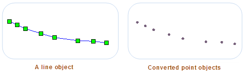
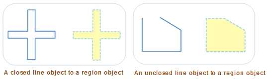
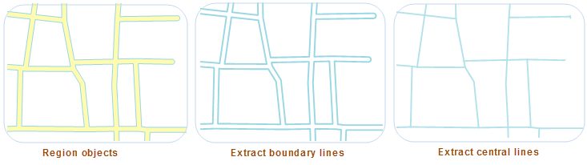

### Line to Pint

　　Convert the selected lines to points, and save them to a point dataset or a CAD dataset. When a line object is converted to points, all nodes in the line object can be saved directly to the points, as shown in the following diagram, left figure is the line object to be converted, left is the points saved in the point or CAD dataset.

  

**Basic Steps**

1.  Select one or more line objects in current map window, click on "Object Operation" > "Convert" > "Line to Point", and pop up "Line to Point" dialog box.
2. In the dialog box, select the target datasource and dataset of the new points. The result data is stored in two ways: save it to the existing dataset or create a new point dataset to save.
    -  Save to an existed dataset: Select an existed point dataset or CAD dataset in "Target Dataset" which is used to store generated point objects.
    -  Save to a new dataset: Check "New Dataset", then set name for new dataset, and new generated points will be saved to the new point dataset.
    
3. If the layer where the chose lines locate is editable, you can check the &quot;Delete Source Object&quot; to delete the selected lines in the source dataset.

4. Click OK to finish the operation.

### Line to Region

- Convert the selected lines to regions, and save them to a region dataset or a CAD dataset.

- >When converting line objects into region objects, the closed line object will be converted as the region boundary; the non closed line object will be connected end-to-end, then converted to the region boundary. As shown in the following figure, 
figure 1 is to convert the closed line object to the region object, and the figure 2 is to convert the non closed line object to the region object.

  

**Basic Steps**

1.  Select one or more line objects in current map window, click on "Object Operation" > "Convert" > "Line to Region", and pop up "Line to Region" dialog box.
2.  In the dialog box, select the target datasource and dataset of the new regions. The result data is stored in two ways: save it to the existing dataset or create a new region dataset.

    - Save to an existed dataset: Select an existed region dataset or CAD dataset in "Target Dataset" which is used to store generated region objects.
    - Save to a new dataset: Check "New Dataset", then set name for new dataset, and new generated region objects will be saved to the new region dataset.

3. If the layer where the selected regions locate is editable, you can check the &quot;Delete Source Object&quot; to delete the selected regions in the source dataset.

4.  Click OK to finish the operation.

**Note**

1.  One line object will be converted to one region object. The grouped line objects will be converted to a grouped region objects.
2.  A straight line can not be converted to a region object, if you choose a straight line, then the output window will prompt that it fails to convert the straight line.

### Region to Line

　　It is to convert the boundary line or central line of the selected region into the line object, and save it to a line or CAD dataset. It supports two modes: the boundary line and central line, detail instructions are as follows:

- Extract boundary: convert the boundary line of the region to a line.
- Extract center line: convert the center line of the region to the line object. When selecting the center line mode, the maximum width and minimum width are required. The region whose width is between the maximum and minimum value will be exacted the center line; the region whose width is less than the minimum value will not be processed; the region whose width is larger than the maximum width will be extracted the boundary line.

　　

　　The Extract Boundary function can be used to extract boundaries of lake, road and river object; Extract Center Line function applies to extract center lines of roads. **Note**: For complex crossroads, the extracted result maybe not be favorable.

**Extract Boundary**

1. Select one or more region objects in current map window.
2. According to users' needs, selecting "Extract Boundary" option in "Convert" from "Object Operation".
3. Set dataset where target objects will be saved to in the pop-up dialog box, the dataset could be line or CAD dataset which has existed, as well, you can check "New Dataset", then set name for new dataset, and result objects will be saved to the new line dataset.
4. If the layer where the selected regions locate is editable, you can check the &quot;Delete Source Object&quot; to delete the selected regions in the source dataset.
5. Click OK to perform the operation.

**Extract center line**

1. Select one or more region objects in current map window.
2. According to users' needs, selecting "Extract Center Line" option in "Convert" from "Object Operation".
3. Result of the operation will be saved a new line dataset. Set "Target Dataset" name in the pop-up "Extract Center Line" dialog box.
4. The settings of maximum and minimum width between boundaries of region objects has influence on accuracy of result data, users need to enter the values very precise.

 - Maximum: the maximum distance between the two border lines of the region (greater than 0). If the distance between them is larger than the max width, then the boundaries line of regions will be extracted. The unit of this parameter is the same with the source dataset. You can use the Measure Distance tool to calculate the widest part of the region for the max width.

   **Suggest**: it is advised that the max width a bit larger than the measured distance value.

 - Minimum: the minimum distance between the two border lines of the region (0 or greater than 0). If the distance between them is less than the min width, then no center line will be extracted for that part of the region. The unit of this parameter is the same with the source dataset. Minimum value should be less than Maximum value.

  **Note**: Center lines will only be extracted from regions with border distances between Max and Min Width. If the distance between them is larger than the max width, the border line will be extracted; If the distance between them is less than the min width, then no center line will be extracted.

5. Click OK to execute the operation.
