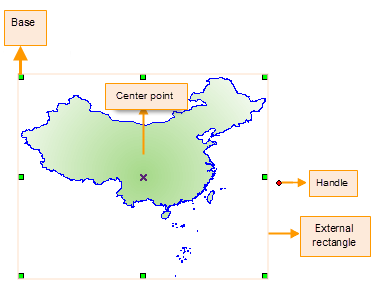
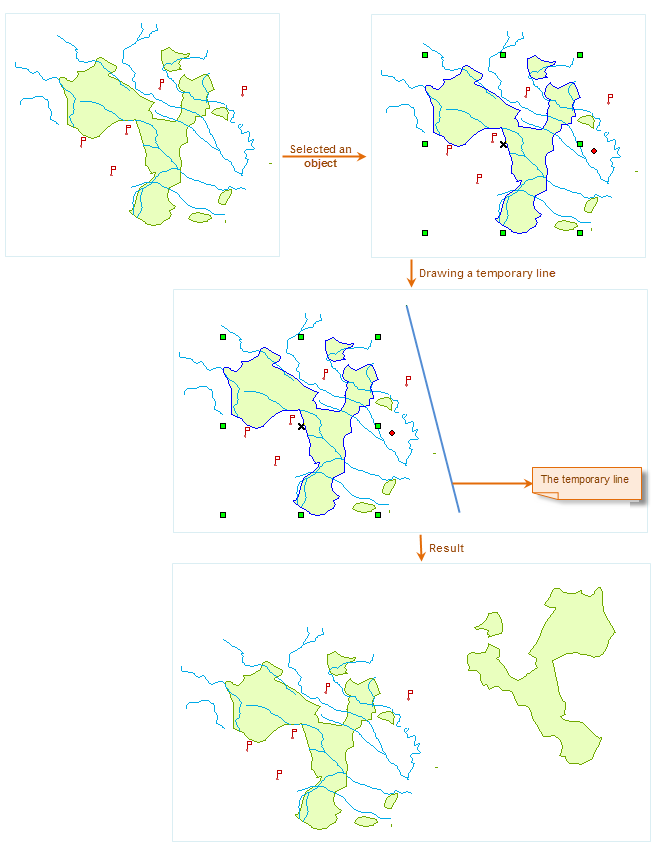
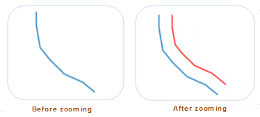
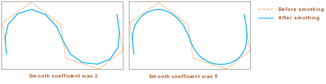
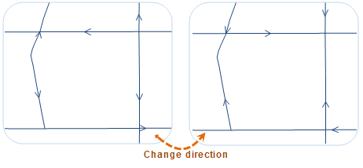

### Rotate

　　There are two methods for rotating objects: Pivot and Rotation Center. The pivot is the upper left corner of the geometric object bounding box, and the rotation center (X-shaped as shown below) is located inside the geometry object. When making geometric objects rotate, the pivot keeps still, and the geometric object is rotated around the rotation center at the angle you specified. When multiple objects are selected, the pivot is the upper left corner of the common bounding box of these objects.

　　

　　SuperMap supports rotation operation for point layers, line layers, region layers, text layers, CAD layers and routing layers. During the rotation, you can make the object rotate to the target position by dragging or manually entering the rotation angle. The detail steps is as follows:

**Dragging Rotation**

1.  In an editable layer, select one or more objects.
2.  Place the cursor on the rotate handle, when the cursor becomes , hold down the left mouse button, drag the object to the position you want, and release the left mouse button.

**Precise Rotation**

1.  In an editable layer, select one or more objects.
2.  Click "Object Operations" tab > "Object Editing" gallery > "Object Operations" group > "Rotation" and the "Rotation Settings" dialog box is shown.
3.  The rotation center shows its (X, Y) coordinates. The default rotation center is the anchor on the upper left corner of the bounding box of the geometric object. Users can reset the rotation center by modifying the (X, Y) coordinates.
4.  Entering a positive angle value rotates the objects counterclockwise, whereas entering a negative angle value rotates the objects clockwise.
5.  Click OK to rotate.

### Mirror

　　Flip the selected geometry objects (non text objects) along a temporary line to create mirror objects. The main steps are:

1.  Select one or more objects (non text objects) in an editable layer.
2.  You can select multiple objects by pressing Shift or Ctrl.
3.  Click "Object Operations" tab > "Object Editing" gallery > "Object Operations" group > "Mirror". Move the mouse to map window, then click mouse at an appropriate position for confirming starting point of a temporary mirror line. After that, you will find out with the movement of mouse, the line also changes, you can determine another point of the mirror line by clicking mouse to finish current operation.

　　

### Zoom

　　Zoom means to create an object that the shape ratio is the same with the original object according to the specified distance.

-   The zoom operation is applicable to line layer, region layer and CAD layer.
-   The zoom operation is applicable to not only simple objects, but also the complex objects. For the complex objects, every child object in the complex object zooms according to the same distance.
-   The parametric objects in the CAD layer (such as regular polygon, pie and so on), and composite objects don't support the zoom.
-   If the input distance is positive, it indicates upward zoom; if the input distance is negative, it indicates down zoom.

**Basic Steps**

1.  Enable layer editable, click "Object Operations" > "Object Editing" gallery > "Object Operations" group > "Zoom"
2.  Select an object (line or region object) as a zoom object.
3.  Drag the cursor and you can see a temporary object whose shape is the same as the selected object moving as you move the cursor.
4.  Move the cursor to the right position and left-click the mouse to complete the zoom operation. Pressing ESC or right-clicking mouse to finish the operation. The figure below shows an object before zooming and after zooming. The blue one is the source object and the red one is the object after zoom. 

　　

**Remarks**

-   The result of zoom is creating a new object and save the original object. The non system field attribute of new object stays the same with the original object attribute.
-   If the new object interacts with itself, the zoom distance of line object should be less than the distance between any two points; For the simple region object, the zoom distance should be less than half distance between any two points.

### Smooth

　　The smooth function is mainly used to smooth boundaries for line or region geometric object, turning the polyline into a smooth line object. Smooth function is aim to simplify data with too many segments in boundary of polyline or polygon. Resampling and Smooth is used to simplify data. The way of Smooth is to use curved or straight line instead of original polyline through adding nodes.

　　Usually, length of a polyline will be shorter after Smooth operation with direction of the polyline changing, but the relative positions of two ends will not change. For region object, its area will be smaller after Smooth operation.

**Instruction**

-   The line object involved in the smooth operation must have more than three nodes (including three). Because the straight line between two points is already smooth.
-   This function smooth vector data with B-spline method, the larger the smoothing coefficient, the smoother the result data. In B Spline, it is the number of segments after inserting the points in the segment. It is recommend to get the value of smooth coefficient in [2, 10]. When smooth the unclosed segments, please keep the shape of original curve. The methods are: Keep the stat and end points the same and add the section number of insertion points (it is usually twice of the smooth coefficient). There are two methods for calculating the B Spline intersection number:
  - If the segment is closed, the node number = (number of control point - 1)* smooth coefficient + 1.
  - If the segment is unclosed, the node number = (number of control point + 1)* smooth coefficient + 1

　  The control point can be construed as the real node number in line object before smoothing.

**Basic Steps**

1.  Make the layer editable, and then select one line or region object also you can select more objects by pressing Shift or Ctrl.
2.  Click "Object Operations" > "Object Editing" > "Object Operation" group > "Smooth" and enter the value of smooth coefficient (default is 4) in the pop-up dialog box.
3.  Click "OK" button to complete the operation. Following pictures illustrates different result on different coefficient values.

　　

### Resample

　　Remove some nodes from line objects or boundaries of region objects while trying to keep their original shapes.

　　SuperMap provides two resampling algorithm: Blend and Douglas–Peucker.

**Basic Steps**

1.  Select one geometry object, or you can select multiple objects by pressing Shift or Ctrl in current editable layer. 
2.  Click "Object Operations" > "Object Editing" > "Object Operation" group > "Resample" and pop up "Resampling Settings" dialog box.
3.  Select an appropriate algorithm at the drop-down box, and enter distance dimension, default is 0.4
4.  Click "OK" button to perform the operation.

**Note**

- If topology has been used to preprocess public boundaries of multiple region objects, only the boundary of one region object among them is resampled, this boundary of other objects will be adjusted based on result. While enabling the Multi-layer Editing function, multiple layers can be set to be editable.
- If the distance dimension is greater, the result may be incorrect.

### Change Direction

　　The function is used to change nodes' order of selected line or region object. It can be performed on the following objects: 2D line, 3D line, 2D region, 3D region and compound objects. 

　　Basic steps are: first select one or more line (region) objects, then choose "Change Direction" on "Object Operation" menu, finally the direction of selected object is changed, as shown below:

　　

**Note**

1.  The reverse operation can only be implemented on the editable line or region objects among all the selected objects.
2.  Changing directions of lines and objects actually creates new lines and regions, so for CAD datasets, when you change the directions of line and region features, the styles for them will be changed to the default ones.

### Copy

Copy is used to copy the selected object(s) to the specified location.

1.  Select one or more objects to be copied.
2.  Click on "Object Operations" > "Object Editing" > "Move Object" group > "Copy".
3.  At an appropriate position click mouse or enter coordinate value to determine coordinate for basic point. 
4.  Move the cursor in the map window, the previews of the object to copy will be shown in real time (dotted line), input the coordinate value or click at the proper location to identify the location of the object.
5.  Click to finish the operation; or repeat the last step to continue.
