　　Under the usage of the Snap function, it is more easier and convenient to position objects. 

### Open "Snap" function

　　The "Snappable" command is used to control whether a layer can be captured, that is whether your mouse can capture objects in the layer when selecting or editing objects in the vector layer.

Following three methods are used to open the "Snappable" function:

 
**Snappable button**: In the Layer Manager, click the "Snappable" image button to turn its status into . When its status is , the relative layer can not be captured.
  
**Context-menu**: Right click your layer, then select "Snappable".
  
**Layer Properties panel**: In the "Layer Properties" panel,  check "Snappable" check-box.

**Note**: An object in a vector layer can be snapped only when the layer is in an editable and snappable status. 
  
### Use Snappable  
  
The Snap Settings can help establish exact locations in relation to other features. Snapping is conducive to your efficient object editing and mapping. You can choose the snap modes according to your needs. If snapping capability is enabled, the drawing node will be automatically snapped to edges, nodes, or other geometric objects within the tolerance.

In the Object Operations tab, click Snap Settings on the Object Operations group. The Snap Settings dialog box pops up.  
  
#### Type  
  
+ The Type tab allows you to control which snap modes to use. 11 commonly used snap modes are listed in the box. For detailed information on these modes, please refer to Snap Types. To enable a snap type, check the box ahead.  
  
       

+ Priority: Set the priority of the snapping modes in the list. Shown as below, select one or more snapping types, you can use the up, down, top and bottom buttons to change the priority. 
  
 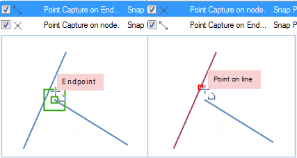    
  
+ Enable: Select the Enable check box, representing enable all snapping modes; otherwise, disable all the snapping modes. 
+ Default: Restore the default settings. 
  
#### Parameters  
  
The Parameters tab allows you to set relevant parameters for snapping. These parameters include: snapping tolerance, fixed angle, fixed length, min snapped length and whether to add nodes. 
  
 
 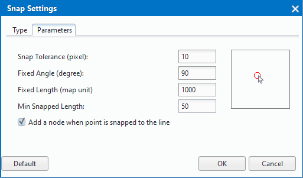     
  
+ **Snap Tolerance (pixel)**: The snapping tolerance ranges from 1 to 20 pixels and the default is 15. The value specified can not be out of the range. If the distance between an object and the cursor is less than the tolerance you set, the object will be snapped.
+ **Fixed angle**: The fixed angle ranges from 0 to 360 degrees and the default is 90. The value specified can not be out of the range. If the angle between the drawing line segment and the other one equals the angle you set, the fixed angle icon shows up. 
+ **Fixed Length **: The unit of the fixed length is the same with the map unit and the default is 1000. If the length of the drawing line reaches the fixed length you set, the fixed length icon shows up. 
+ **Min Snapped Length**: The min snapped length ranges from 1 to 120 pixels and the default is 15. The value specified can not be out of the range. The value of the parameter is the minimum length of a line snapped. The line will not be snapped if its length is less than the specified value.
+ **Add a node when point is snapped to the line**: When capturing to a line, a vertex will be added in the line.
+ **Default**: Restore the default settings.   
  
**Note**: Snap Setting are a gloal setting and will be applied to all map windows. When you close the program, the last snap settings will be saved and used when you restart the program. 

### Supportive snapped types  

 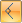 The current line segment perpendicular to the other linear element or its extension. Illustration: The line being drawn is perpendicular to an existed line.   
 
 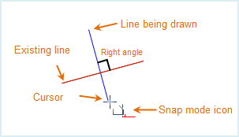    
 
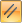 The current line is parallel to another line. Illustration: The line being drawn is parallel to an existed line. 
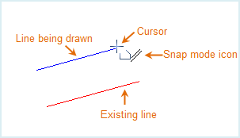  
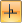 The current line is vertical or horizontal. Illustration: The line being drawn is horizontal.
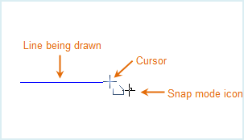  
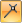 The current line intersects another line. Illustration: The line being drawn intersects another line at its endpoint. 
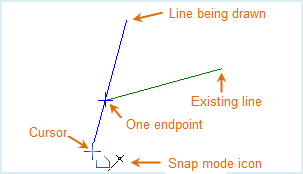  
 The current line segment is drawn with a fixed length. Illustration: The length of the line being drawn is fixed.
 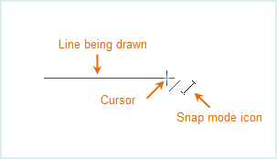  
 The line is drawn at a fixed angle to an previous line. Illustration: The line is at a 90 degree to the last line.
    
 The point being drawn is on the endpoint of a line or a polygon. Illustration: Capture an endpoint.
 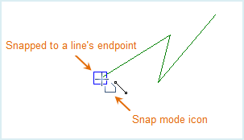  
<!--
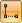 当前鼠标点与其他线性要素上的点构成水平或垂直线。Illustration: 鼠标定位点与任一线段端点连接而成的虚拟线是水平的或竖直的。  
 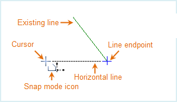  -->
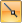 Current point being drawn is on another line. Illustration: Current cursor is located to an existed line.
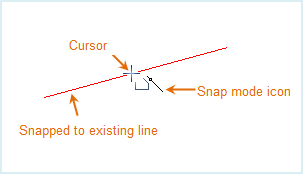  
 Current point being drawn is on the center of another line. Illustration: Current cursor is located in the center of an existed line. 
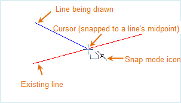  
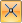  Current point being drawn overlays another point or node. Illustration: Current cursor is located to a node of a line. 
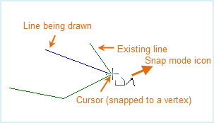   
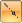 The drawing point to the prolonged line of an existing line segment. Illustration: Snapping the extension of another line segment.
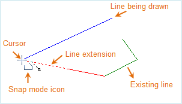

 

 
