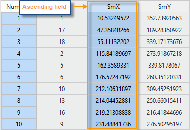
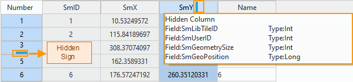
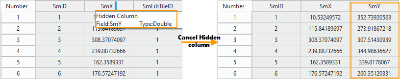
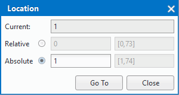

　　You can view, edit, count and analyze attribute information by viewing attribute tables.
"Properties" tab is a context tab which is bound with attribute tables of vector datasets or tabular datasets. To make the "Properties" tab appear on ribbon, you must open an attribute table.
  
In the "Prperties" tab on the "Browse" group, some features are provided for browsing attribute tables. Following contents details the provided features.
  
### Ascending/Descending
  
Sort the attribute table as values of the selected column in ascending order or descending order.
  
**Basic steps**  
  
1. Right click your vector dataset and select "Browse Attributes" or you can open a tabular dataset.
2. Select a column first, then click "Ascending" or "Descending" or you can right click and select "Ascending" or "Descending".
  
     

**Note**   
 
+  If you have selected several columns at the same time, the system will choose the first column from the selected columns as the sorting field to sort the table.  
+  Only there is at least one column selected, Ascending/Descending button can be active.
+  Once an attribute table is sorted, you can cancel the sorting operation.

### Hidden Column/Hidden Row  
  
Make the selected columns or rows invisible.

  
**Basic steps**  
  
1. Select one or more columns or rows.
2. Click "Hidden Column" or "Hidden Row", also you can right click and select "Hidden Column" or "Hidden Row". After that, a sign will appear after/below the column/row beside the hidden column/row.
3. Move your mouse on the sign and detail information about the hidden column/row will be shown.
  
     

**Note**   
 
+  Only there is at least one column or row selected, Hidden Row/Column button can be active.
+  Using Hidden Row/Column commands can make the selected rows/columns invisible but deleting them, you can click "Cancel Hidden Column" and "Cancel Hidden Row" to make them visible.
+  Close an attribute table then open it again, all rows and columns will be visible.
   
### Cancel Hidden Column / Cancel Hidden Row
  
Show up the rows or columns which have been hidden in the attribute table.

  
**Basic steps**  
  
1. If there are hidden columns/rows in your attribute table, you can click "Cancel Hidden Row" and "Cancel Hidden Column" to show them up.
  <!--+  可选择隐藏列的前一列，单击“取消隐藏列”按钮，显示被选择列后的所有被隐藏列。 也可以选择隐藏列的前一列和后一列，单击“取消隐藏列”按钮后，显示被选择的两个列之间的被隐藏列。   
  +  可选择隐藏行的前一行，单击“取消隐藏行”按钮，显示被选择行后的所有被隐藏行。 也可以选择隐藏列的前一行和后一行，单击“取消隐藏行”按钮后，显示被选择的两个行之间的被隐藏行。   
  +  若当前属性表中无可选择的列/行，则说明所有属性列/行都被隐藏，则单击“取消隐藏列/取消隐藏行”按钮后，显示所有隐藏列/行。 
   -->
2. After all hidden rows/columns are visible, the hidden signs will disappear.
 

  
     

**Note**   
 
<!--+  只有在当前属性表中有选中的列/行时，“隐藏列”或“隐藏行”按钮才可用。  
+  隐藏列/行操作并不会删除被隐藏的属性列/行，只是让数据暂时不可视，可以使用“取消隐藏”按钮显示隐藏的属性列/行。   
+  关闭属性表后再次打开，将不会保留前一次的隐藏行或隐藏列操作，会显示属性表中所有的行、列信息。
-->
### Go to 
  
You can directly select a row you want.

  
**Basic Steps**  
  
1. On the Properties tab, in the Browse group, click "Go To" to display the Location dialog box, in which the current position of the cursor is displayed and you can specify to move to any record in the table. You can locate a record by specifying a relative or absolute position, or an expression. 
  + Relative: Move from the current location to the relative position any number of rows up or down. A positive value value indicates how many rows the cursor will be moved up from the current location while a negative ones indicates how many rows down.   
  + Absolute: Move to a specific record number.  
   
          
    
2. Then click "Go To" button.
3. On the Properties tab, in the Browse group, click "Go To" drop-down button, and then select "First Record" to select the first row in the attribute table.
4. On the Properties tab, in the Browse group, click "Go To" drop-down button, and then select "Last Record" to select the last row in the attribute table.

**Note**   
 
+  The current, relative, and absolute positions in the attribute table are all concepts related to rows instead of fields.   
+  You can use the Up and Down keys to move up or down to other records.  
+  For Oracle and SQL datasources, it is not supported to locate to record by using Equal condition on two binary fields. 

