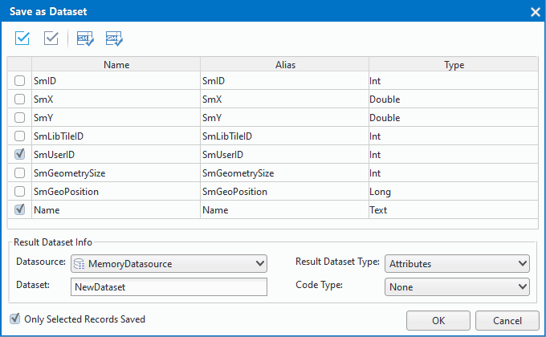

　　Export the attribute information of a vector dataset into a new dataset of the same type or a tabular dataset in records. Besides, you are allowed to export a tabular dataset into a new tabular dataset. 

  
**Basic Steps**  
  
1. Open an attribute table: In the Workspace Manager, right click your vector dataset and select "Browse Attributes". For a tabular dataset, you can double click it directly to open it.
2. Select the rows you want to export. 
3. Right click and select "Save as Dataset", in the pop-up dialog box, set related parameters.   

  
     

  + Field info: select fields you want to save to another dataset. 
  + Datasource: Where the result dataset will be saved in.
  + Dataset: The name of result dataset. 
  + Result Dataset Type: Set the result dataset is a new vector dataset or a tabular dataset if your dataset is a vector dataset. But if your dataset is a tabular dataset, the result dataset only can be a tabular dataset.
  + Code Type: When you save an attribute table of a vector dataset as a new dataset, you can reset the encoding for the result dataset.
You can specify either the single-byte, double-byte, triple-byte or four byte encoding mode for the new dataset when exporting a non-point vector dataset.  
  + Only Selected Records Saved: Set whether to save the selected rows only, checking it means Yes. If you do not check it, all data in your attribute table will be exported.

4. Click OK. The new dataset appears under the specified datasource in the Workspace Manager.      