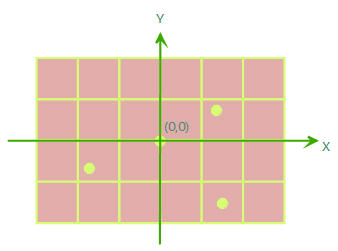
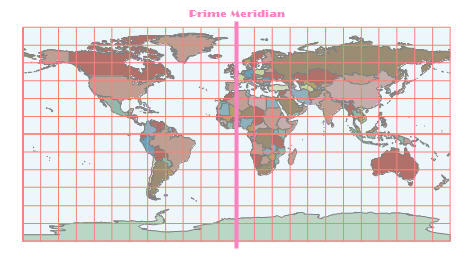

　　In SuperMap, there are three types of coordinate systems: planar coordinate systems, geographic coordinate systems, and projected coordinate systems.

### Planar Coordinate System

　　It is generally used as the coordinate reference of data that is irrelative to geographical location, and is also the default coordinate reference of new data. For example, CAD files, scanned picture of a paper map, a sketch map that is irrelative to geographical location.  Planar Coordinate System is a two-dimensional system. The coordinate of its origin is (0, 0), and the coordinate of other points can be measured by the vertical distance from the point to X and Y axis.

  

### Geographic Coordinate System

　　It uses longitude and latitude to denote any location on earth spheroid. In Geographic Coordinate System, the definitions of datum, prime meridian and units of angle are usually included.  WGS 84, Beijing 1954, Clarke1866 are commonly-used Geographic Coordinate System.  Many data, such as KML data of Google Earth and GPS data, employ WGS84 as coordinate reference.  In China the coordinates of control points from geodetic survey use Xi'an 80 or Beijing 1954 as coordinate system. Below is a map of the world that uses WGS 84 as coordinate system.

  

### Projected Coordinate System

　　It uses various projection types to make any location on earth spheroid projected onto a plane. It uses two-dimensional Planar Coordinate System to denote the locations of point, line and region features. In projected Coordinate System, the definitions of Geographic Coordinate System, map projection, projection parameters and units of distance are usually included. Gauss-Kruger, Albers, Lambert and Robinson are commonly-used Projected Coordinate System. Generally, projected geographic data can be used in measurement, spatial analysis and mapping etc.  For example, in basic scale topography maps of China, Albers Projection is used in topography maps with the scale of 1:1 million and most of others use Gauss-Kruger Projection with three-degree zone or six-degree zone.  In urban planning, large scale maps, such as road construction map and architecture design map with the scale of 1:500 or 1:1000, often use Planar Coordinate System. Below is a map of the world that has been projected from WGS 84 to Robinson Projection.

  
