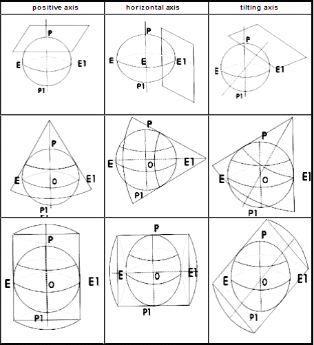
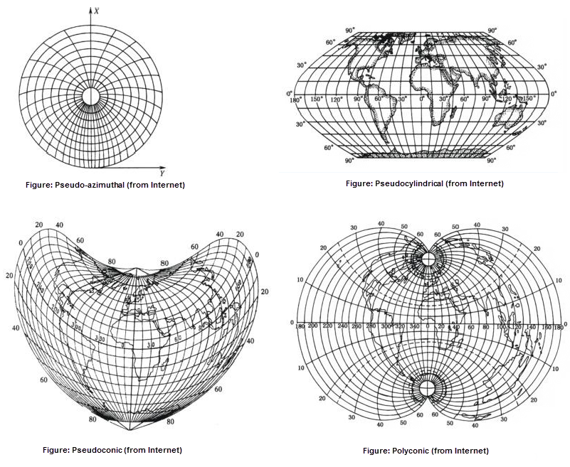

　　
There are many kinds of projections, they can be classfied according to two standards.

#### Classify the projections based on the property of distortions

　　The projections can be classified as: 

-   Conformal: map projections preserve angles locally, implying that they map infinitesimal circles of constant size anywhere on the Earth to infinitesimal circles of varying sizes on the map. In contrast, mappings that are not conformal distort most such small circles into ellipses of distortion. An important consequence of conformality is that relative angles at each point of the map are correct, and the local scale (although varying throughout the map) in every direction around any one point is constant. 
-   Equal-area: Equal-area maps preserve area measure, generally distorting shapes in order to do that. 
-   Arbitrary projection: any kinds of distortions are existed. Equidistant is a special projection. 

####  Classify the projections based on the their constructions

　　The projections can be classified as Geometric Projection and Analysis Projection. 

-   The theory of geometric projection is that the graticules on the ellipsoid surface directly or with some additional conditions projects onto the geometric surface, then expanding the geometry plane to plane.

   

  - **Azimuthal Projection**: It has the property that directions from a central point are preserved and therefore great circles through the central point are represented by straight lines on the map. 

  - **Conic Projection**: The term "conic projection" is used to refer to any projection in which meridians are mapped to equally spaced lines radiating out from the apex and circles of latitude (parallels) are mapped to circular arcs centered on the apex.

  - **Cylindrical Projection**: The mapping of meridians to vertical lines can be visualized by imagining a cylinder whose axis coincides with the Earth's axis of rotation. This cylinder is wrapped around the Earth, projected onto, and then unrolled.

-   The theory of Analysis Projection is that the graticules can be got directly by using some methods. These kinds of projections are main: Pseudo-azimuthal projection,Pseudoconic, Pseudocylindrical, Polyconic projection.

 
