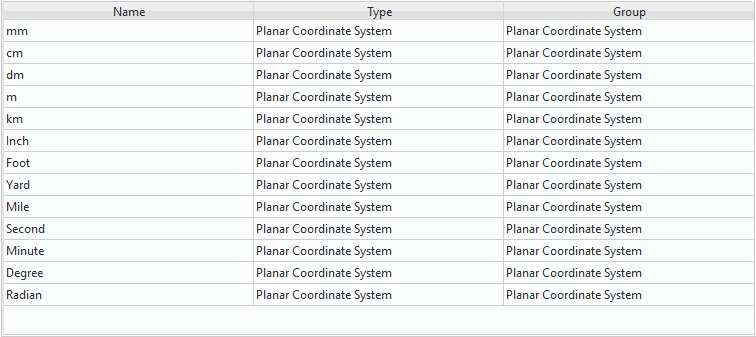
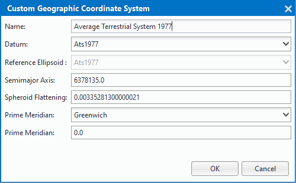
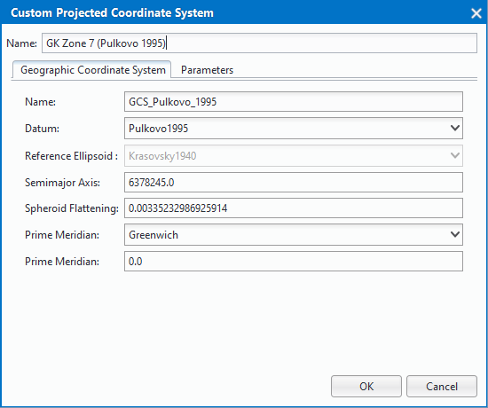
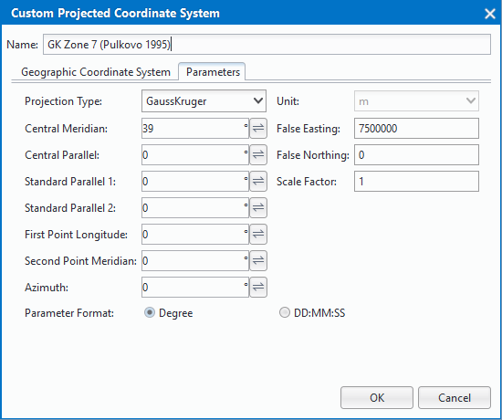

### Instruction

　　In SuperMap, there are three types of coordinate systems: planar coordinate systems, geographic coordinate systems, and projected coordinate systems. Coordinate system can be set for datasource or dataset based on needs. Projection settings can be used for setting and managing coordinate information of current data.

### Basic steps

　　First select a datasource or a dataset, and then click "Coordinate System Settings" button on "Data Processing" menu to open the "Coordinate System Settings" dialog box. The dialog box also can be opened by right-clicking mouse in the datasource or a dataset, choosing "Properties", and then selecting "Reset Coordinate System..." in the "Coordinate System" panel.

　　Current coordinate system information is presented on the dialog box. The coordinate system provided by SuperMap includes: planar coordinate system, geographic coordinate system and projection coordinate system.

**Planar coordinate system**

It is generally used as the coordinate reference of data that is irrelative to geographical location. Click "Planar Coordinate System" on the left tree directory of the dialog box to display all types of planar coordinate system including meter, kilometer, inch and degree, and so on.

**Geographic Coordinate System**

It uses longitude and latitude to denote any location on spheroid. More than 200 kinds of geographic coordinate system are provided to users. Click "Geographic Coordinate System" on the left tree directory of the dialog box to display information of the provided coordinate system.

Select a geographic coordinate system from the list and then click "Create New Coordinate System" in the context menu to create a new coordinate system. The specific meanings of parameters are as follows: 

  

- **Name**: Name of geographic coordinate system customized by yourself, also you can select an existed coordinate system in the drop-down list.
- **Datum**: Datum is established based on the of the earth ellipsoid, which defines the position of the Earth's ellipsoid relative to the Earth's sphere, providing a reference frame for the measurement of surface features, determining the origin and direction of the surface latitude and longitude network, In short, is the positioning and orientation of the ellipsoid. Each country or region has its own datum. You can also customize the ellipsoid parameters and the relevant parameters of the central meridian according to actual needs.
- **Reference Ellipsoid**: The surface of the earth's ellipsoid is a regular mathematical surface expressed by a data formula. The surface of the earth's ellipsoid is commonly used in the measurement and mapping to replace the natural surface of the earth. &quot;Ellipsoid parameters&quot; in the application should choose the appropriate Earth ellipsoid based on the specific circumstances of each country or region. The specific value of equatorial radius and oblateness can be set as your needs.

- **Prime Meridian**: Defines the starting position of the abscissa of the coordinate system. In most coordinate systems, the prime meridian is the meridian via Greenwich, London, England. The specific value of longitude can be customized.

**Projection Coordinate System**

Most of the commonly used projected coordinate systems are provided. You can choose a predefined projected coordinate system or customize your own projected coordinate system to apply it to the selected datasource, dataset or map.

Select a projection coordinate system from the list and then click "Create New Coordinate System" in the context menu to create a new coordinate system. The specific meanings of parameters are as follows: 

　　**Set a Projection Coordinate System**
 
For the projection coordinate system provided by system, editing "Projection type" and "Unit" in "Parameters" panel isn't allowed, but the settings of geographic coordinate system can be modified. For the combo boxes in the "Geographic Coordinate System" panel, if the value is set as UserDefined, you can edit related parameters.

  

- **Projection Type** 

　　More than 30 kinds of common projection types are provided.

  - Noneprojection: Click "Noneprojection" in the "Projection Type" combo box to set the projection type as none projection.
  - Predefined projection type: You can select a projection type predefined by system in the drop-down list.

- **Unit** 

　　Settings and display of unit of current coordinate system are applied at right combo box. Default is meter. Other units is also provided, including: millimeters, centimeters, decimeters, kilometers, miles, feet, inches, yards, and so on.

- **Geographic Coordinate System**

　　"Geographic Coordinate System" panel in the "Custom Projected Coordinate System" is used for customizing the settings of geographic coordinate system and corresponding parameters for NoneProjection or predefined projection. For detail of settings, please reference: Set Geographic Coordinate System.

**Set Projection Parameters**

If you have selected the user-defined projected coordinates system or typed a new name in the Name box, you will be allowed to change the parameters on the Parameters tab. The DD and DMS parameter formats are provided.

  

False easting is a linear value applied to the origin of the x coordinates. False northing is a linear value applied to the origin of the y coordinates. False easting and northing values are usually applied to ensure that all x and y values are positive. You can also use the false easting and northing parameters to reduce the range of the x or y coordinate values. Conic projections can be based on one or two standard parallels. Standard parallel 1 and standard parallel 2 are used with Conic projections to define the latitude lines where the scale is 1.0. When defining a Lambert Conformal Conic projection with one standard parallel, the first standard parallel defines the origin of the y coordinates. For other conic cases, the y coordinate origin is defined by the latitude of origin parameter.

### Remarks

　　Positioning mouse to Search box through **Ctrl+F**/**Ctrl+F3**.

