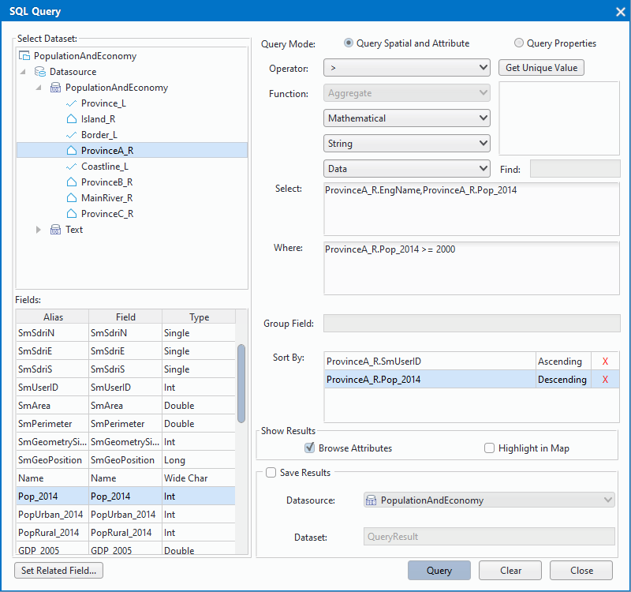
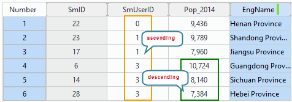
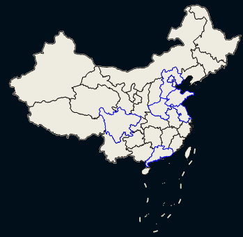

　　Query out the data meeting some specified conditions from existed data according to SQL expressions, the conditions is irrelevant to positions in space. The data type could be: point, line, region, text, CAD, attribute table, 3D point, 3D line, 3D region, net work or route dataset.

### Basic steps

1. Click "Spatial Analysis" > "Query" > "SQL Query", or right-click a dataset, and select "SQL Query..." then pop up "SQL Query" dialog box. The explanation and instructions of parameters in the dialog box are as follows:

  

  -   **Select Dataset: **All datasets are shown in the edit box, you can specify the datasets to involve in SQL query, all fields of a selected dataset will be displayed on the Fields box.
  -   **Fields: ** Display all fields of a selected dataset and types of the fields. The Fields box also lets you select the query, group, sort fields, constructs condition expressions. You can define a relationship between two tables to access the related data by clicking the Set Related Field... at the bottom of the list.
  -   **Query Mode: ** The query modes "Query Saptial and Attribute" and "Query Properties" are provided. The Query Saptial and Attribute mode lets you get both the spatial and attribute information while the Properties mode returns only the attribute information. If you don't want to save the results, the latter mode will be more favorable because it is faster. You can click the radio button ahead to select the corresponding query mode.
  -   **Operator, Function:** The operators and functions for composing SQL expressions. You can select any operator and function as your needs by clicking drop-down list.
  -   **Get Unique Value: **You can click the Get Unique Values button to view all values (without repetitive values) of a selected field in the Fields list. Besides, you can type a value in the Find text box to navigate to the value in the Values list. Also, you can double click a value to use it when building an expression.
  -   **Find:** After getting all unique values of a field, you can enter a value in the "Find" text box to navigate directly to the value in the values list. Note that this function is valid only when a field is selected and its unique values are listed.
2.  **Select:** Lists all fields you want to query, separated by commas. The listed fields will be added in the result dataset. 

   (1) Position your cursor in the Select box and select individual fields by double clicking in the Fields box. Each field added to the Select box will be displayed in the form of "Dataset.Field" by default. However, you can modify the form to "Dataset.Filed as dataset.Field" to save the result as a new field whose name is the content after "as".

   (2) Position your cursor in the Select box and double click the first item with the asterisk (*) in the Fields box to retain all fields.

   (3) Position your cursor in the Select box and build the field with functions provided.

3.  **Where: **Define the condition expression. You can directly type the condition in the Where box or build the condition with the fields in the Fields box, functions and operators provided in the drop-down lists. There are two situations for query statement construction:

   (1)  While using commonly used functions to construct query statements, functions supported by different engines are different. Please refer to [Engines Supported by SQL Queries](SQLSupporttedType.html)。

   (2) While directly inputting query statements, you can specify it according to the functions supported by the engine type of the current datasource. Please refer to [Constructing SQL Query Statements](SQLQuery_Expression.html).

4.  **Group Field:** Group the query results. The group field must be among the query fields. Aggregate functions apply to count up data in the same group. You can position the cursor in the Group Field box and double click in the Fields list to select fields.
5.  **Sort By:** The field values can be sorted in ascending or descending order. When you specify more than one fields the system firstly sorts the first field records. When the first field has the same value of records, the system sorts the second field, and so on, and finally get the results of this order. 

  　　The user can position the cursor in the text box, and then double click a field in the list of field information to set the field as a sort field. The default is ascending which can be changed by clicking "Ascending". Each end of a row is the Delete button, click the button to delete the row sorting information. **Note**:  The field used for sorting must be numeric.

  　　After setting the sort fields, the result will be sorted according to the first sort field, and if there are the same values in the first field, and then thy will be sorted as the second sorted field.

  　　

6.  **Show Results: ** Set how you want to display the query results.

    -   Browse Attribute: if the box has been checked, the result will be shown in an attribute table.
    -   Highlight in Map: Check the box to highlight the result in a map. You must set the Query Mode to Query Saptial and Attribute and have the dataset queried displayed in a map window to highlight the query results on map.

7.  **Save Results:** Check the box to save the query result in a new dataset.

  -   Datasource: The datasource to place the new dataset. You can select a datasource from the drop-down list.
  -   Dataset: The new dataset to save the query results. The default is QueryResult.

8.  After each of the parameters has been set and the query conditions have been built, click "Query" button to execute SQL Query operation, if failed, please check whether the SQL expression is correct. You can click Clear button to clear all settings.

The display effect for the map is as follows:

  

### The modes that the different engines process the alias names

1. For SDB datasources, aliases such as Expr1000, Expr10002, etc. will be assigned to the query field without a specified alias.
2. For SQL Server Plus datasources, no default alias will be given to the query field without a specified alias. In the attribute table opened for showing the query results, the results will be displayed and the field alias will be shown as empty. However, the query results will not be saved to the specified new dataset. That is caused by the differences of databases.
3. For UDB and Oracle datasources, the function expression will be directly assigned to the alias if you don't specify an alias. In the attribute table opened for showing the query results, the results will be displayed and the field expression will be shown as the field alias. However, the query results will not be saved to the specified new dataset. That is caused by the differences of databases.

### Note

　　When taking a function as a field in query results, an alias is necessary, such as Len(World.COUNTRY) as Length, the field name of the attribute table for browsing results is Length, and the field name from the attribute table of the saved result dataset is Length as well. However, if the alias name is empty, the default name is different from the field name in the browser attribute table for the different engines, meanwhile, the related field value will not be saved in the result. 