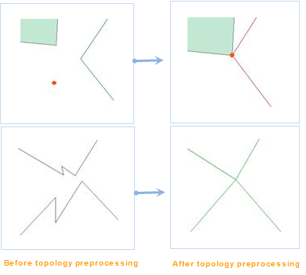
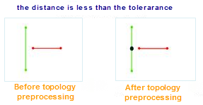
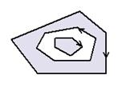

### Instructions

　　Before carrying out the topology check, it's needed to carry on the topology preprocessing operation, through the preprocessing to adjust the problem data within the tolerance range. Without topology preprocessing, there may be an error in the result of the topology check. Topology preprocessing methods include: the insertion of nodes, nodes and nodes snapping, and the adjustment of the polygon direction.

### Baisc Steps

1.  On the main menu, click "Data" > "Topology" > "Topology Preprocessing", and then click "Add" image button to add the datasets needed.

2.  Following parameter settings are required.
  -   **Tolerance**: The tolerance value for the topology preprocessing, which is a distance value, it means that in the range of the value, all the nodes or (and) lines are considered to be identical. For example, if the distance between a line's node and another line's node is within the tolerance range, it is considered that the two nodes coincide; if the distance between a line's node and a point object is in the tolerance range, it is considered that the point is on the line. When the distance between the nodes and (or) lines is less than the tolerance value, the topology preprocessing is performed.
  -   **Node Snap**: the nodes within the tolerance range are caught together (the nodes that are snapped are set to the same 2D coordinates), where the meaning of "node" is to the point object and the nodes on lines and regions. After checking the Node Snap check box, you can select a dataset in Reference Data which is taken as the reference points for the snap. After the snapping the points within the tolerance range on the lines or regions will be removed. The effect is shown in the picture below.

　　

   -   **Insert between vertex and arc**: If you check the item, it will preprocess the topology errors according to the tolerance value, that is, insert the foot point on the line for the point to the line when the distance between the point and the line is less than the tolerance.

　　 

  -   **Insert for arc intersections**: If the check box is checked, insert a node on the arc intersection or overlapped point while keeping the data direction. The processing result is as shown below. 

　　 

  -   **Adjust polygon direction**: If the check box is checked, the boundary direction of the region dataset is adjusted to the standard direction, that is, the outer boundary is clockwise, the hole is counter clockwise, the island is clockwise, as shown below. 

　　

### Note

　　This function may change the spatial position of the source dataset. Please make a copy before it.

