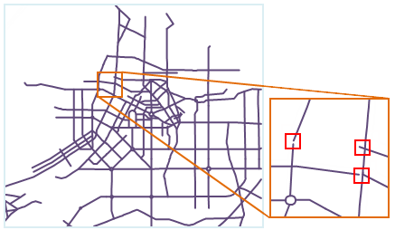
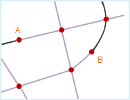
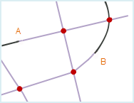
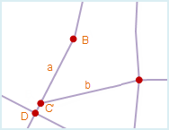
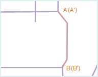
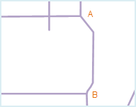
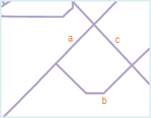

　　There may be errors during collecting and editing the spatial data. For example, one node or line been digitalized twice, and fissures, intersections and misclosure polygons may occur when collecting neighbouring region objects, these errors may lead topology errors like pseudo nodes, redundant nodes, overshoots, duplicated lines, thus the topological relationship between the spatial data captured is different from the real situation, this may affect the data processing and analysis and the quality and availability of the data. Besides, there may be lots of topological errors and they are too small to identify, it is not easy to remove them manually, so it is needed to fix these redundancy and errors by topology processing.

  

　　Topology processing is to repair the topology errors or avoid the creating of topology error, including checking and repairing. Topology processing including clean pseudo nodes, clean redundant vertices, clean duplicate lines, clean overshoots, clean undershoots, merge adjacent ends and intersect arcs.

　　In this software, topology processing is used mainly on line datasets, you can used the line dataset processed to construct region dataset or network dataset, you can also use "Dataset topology checking" functionality to perform the detailed topology checking operation. The operations involved including validate line topology, construct network and construct region.

### Clean pseudo nodes

　　Pseudo nodes are the points that only connects to two arcs. When pseudo nodes have no use, you can perform the clean pseudo nodes operation and merge the two arcs connected by the pseudo node to one arc. As shown in follwing pictures. point A and B are meaningless pseudo nodes and need to be cleaned, the result are shown in right picture below.

    

### Clean redundant vertices

　　Due to operation error, several nodes which have the same meaning and close to each other may exist on a line object,  only one node is correct, other nodes are redundant nodes. If two or more nodes on a line object whose distance are less than or equal to the specified node tolerance, only one node will be retained after topology processing, other points will be removed as redundant nodes. The node tolerance can be set in the attribute window of the dataset. As shown in left figure below, on the line object a, the distance between point A and point B is less than the node tolerance, when perform topology processing, point A will be removed as redundant point, point B will be retained, the result is as right figure.
　　Meanwhile, on line object a, the distance between point C and D is also less than the node tolerance, when perform topology processing, point C will be removed as redundant point, the result is shown as fig2. Since the end point of line object b (C') overlap with node C, and the two line objects do not have a common intersection point, line object b will not be affected when perform topology processing. To remove point C and merge point C' and D when perform topology processing, it is needed to select Redundant Vertices and Intersect Arcs.

     

　　The similarities and differences of pseudo nodes and redundant nodes:

   -   Removing redundant points and pseudo nodes are all removing redundant points.
   -   Redundant points must be removed, but pseudo node needs to be reserved sometimes.
   -   A redundant point is created by double-clicking when drawing a line object, a redundant point is a continuous and complete line object, a pseudo node is created when merge endpoints or snap lines, it connects two line objects.
   -   Redundant nodes are nodes, that is the points on the line object except the endpoints; pseudo nodes are the end points.

### Clean duplicate lines

　　When do not consider the direction of the line object, if all the nodes on two line objects coincide by order (that is has the same coordinate) or the distances between the nodes are less than the tolerance of the node, the two line objects duplicate with each other, one of the line objects is called  duplicate line. The node tolerance can be set in the attribute window of the dataset which contains the line object.

　　To avoid the creating of polygon region objects whose area is 0 or very small in the creating of topology polygon, only one of the two duplicate line objects will be retained.

　　As shown in left figure below, line object AB duplicate with line object A'B', A'B' is the duplicate line, to distinguish the duplicate line, A'B' is shown in another color. After the topology processing, A'B' is removed, the result is shown as right figure.

      

### Clean Overshoots

　　If an endpoint of one arc is not connected to any other arc, this endpoint is called a dangle point. A line with a dangle point is called a dangle line. Overshoots is the line object whose dangle part is short.

　　When the Clean Overshoots is checked, it is needed to set the tolerance extent for this rule, when the distance for the undershoots to extend to the nearest line object is less than the tolerance extent set, the undershoots will be extended to intersect with the nearest line object after the topology processing. The extent of the Extend Undershoots tolerance should be less than the 100 times of the dangle tolerance, the default tolerance will be used if set as 0. The dangle tolerance can be set in the attribute window of the dataset which contains the line object.

　　As shown in left figure, line object a, b and c are all undershoots, the distances for a and b to extend to the nearest line object d is less than the tolerance, after the topology processing, the two undershoot will be extended to line d; the distance for c to extend to the nearest line object d is larger than the tolerance, it will be retained after the topology processing. The result is shown as right figure below.

      

### Clean Undershoots

　　If an endpoint of one arc is not connected to any other arc, this endpoint is called a dangle point. A line with a dangle point is called a dangle line. Undershoots is the line object whose dangle part is long.

　　When the Clean Undershoots is checked, it is needed to set the tolerance extent for this rule, when the distance for the undershoots to extend to the nearest line object is less than the tolerance extent set, the undershoots will be extended to intersect with the nearest line object after the topology processing. The extent of the Extend Undershoots tolerance should be less than the 100 times of the dangle tolerance, the default tolerance will be used if set as 0. The dangle tolerance can be set in the attribute window of the dataset which contains the line object.

　　As shown in left figure, line object a, b and c are all undershoots, the distances for a and b to extend to the nearest line object d is less than the tolerance, after the topology processing, the two undershoot will be extended to line d; the distance for c to extend to the nearest line object d is larger than the tolerance, it will be retained after the topology processing. The result is shown as right figure below.

     

### Merge Adjacent Ends

　　When the distances between multiple arc end points are less than the node tolerance, these end points are called adjacent end points. After topology processing, these adjacent end points will be merged as one end point. The node tolerance can be set in the attribute window of the dataset which contains the line object.

　　Note that if there are only two end points whose distance are less than the node tolerance, a pseudo node will be created after merge.

　　As shown in left picture below, there are adjacent end points at A and B, they will be merged to one node after topology processing. A pseudo node will be created at A, and the Clean Pseudo Node operation is needed.

      

###  Intersect Arcs

　　When one or more line objects intersect with each other, the Intersect Arcs operation can be used to break the line object at the intersection and create several simple line objects that connect to each other. By performing the Intersect Arcs operation, you can avoid missing region objects or creating overlap region objects when creating topological polygons.

　　As shown in left figure below, line object a and b intersect, and both of them intersect with line object c, after topology processing, these three line objects will be broken at the intersections and several line objects will be created, meanwhile, three nodes are created: A, B and C, the result is shown as right picture below:

      

　　In a real world application, you may need to retain the intersection relation of some intersecting line objects, and can't break them at the intersection. You can set a field in the attribute table of the dataset which contains the line object representing whether to break the line, and controls whether to break the line object by input a filter expression.

   -   **NoBreak Object**: After setting the filter expression, the system will not break the line objects that meet the expression.
   -   **NoBreak Position**: Choose the point dataset from the dropdown list appeared by clicking the dropdown arrow to determine the NoBreak location. Whether a line object will be broken by checking whether the distance between a point object from the selected point dataset and its adjacent line object is within the tolerance.

　　If you do not set NoBreak Object, all the line objects will be used in the intersect arcs operation; if you do not set NoBreak Position, all the line objects will be used in the intersect arcs operation; when both of them are set, the system will process the union.

### Note

1.  You can select different topology processing option group based on the actual situation.
2.  It is recommended to select Intersect Arcs before topology processing.
3.  When perform topology processing, the source dataset will be changed, to retain the data of the source dataset, it is needed to backup dataset before topology processing.
4.  The intersect arcs operation will create a real node, but merge adjacent ends may create pseudo nodes, so it is needed to perform clean pseudo node after merging adjacent ends.
5.  The result of topology processing will be affected by the setting of the tolerance, it is recommended to use the default value.
