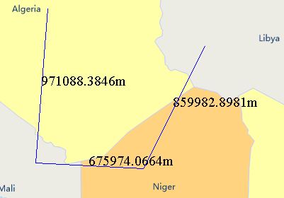
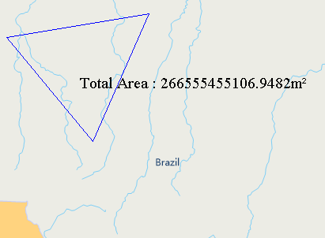

title: Map Measure
---

　　Measure distances, areas and angles on a map. You can redo the previous operations by the usage of Ctrl+Z.

　　Before doing the measurement operation, you should define the unit. Click "Unit" in the "Operation" group on the Map menu to open the dialog box "Measurement Settings" in where you can set the units of distances, areas, angles.

### Distance Measure

　　1.  Click "Map" and on the group "Operations" click "Map Measure", then select "Distance Measure" from the list.

　　2.  When the shape of the mouse pointer turn to a cross wire, click the left key of it at the starting point and then move the mouse, meanwhile there is a constantly changing line appearing in the screen with the distance value.

　　3.  Thera are two values displaying on the map during the operation, one is the distance between the current mouse position and last point, another one is the sum of the distances of all lines. The two values are the same when the first point has been confirmed but the second point has not been confirmed.

　　4.  You can click a series of points to continuously measure distances.

　　5.  The distance measurement will be finished when you click the right key of your mouse, while every distance will be labeled beside the corresponding line, the total distance will be output to the Output Window.

　　6.  You can clear the result from the current map window by clicking "Clear" button in the Operation group on the "Map" menu or pressing "ESC" key.

　　

### Area Measure

　　1. In the "Map" menu and on the group "Operations" click "Map Measure", then select "Area Measure" from the list.
 
　　2. When the shape of the mouse pointer turn to a cross wire, click to specify the first point of the temporary polygon for measuring distance. Click again to form the first edge of the polygon. When you move the mouse pointer from the second point, the area of the temporary polygon is displayed on the map when you move the mouse pointer.

　　3. Continuously click to define the polygon for polygon for measuring distance.
 
　　4. Right click to finish measuring area. The area of the temporary polygon is displayed on the map as well as in the Output Window.

　　5. To clear the polygon and the area label, click the Clear button in the Operation group. Besides, you can press Esc to implement the clear operation.

　　

### Angle Measurement

　　1.  In the "Map" menu and on the group "Operations" click "Map Measure", then select "Angle Measure" from the list.

　　2.  When the shape of the mouse pointer turn to a cross wire, click to specify the start point of one edge, a dotted line pointing to true north shows up. Move the mouse pointer to form the edge, the included angle between the dotted line pointing to true north and the edge, also called the azimuth of the edge, is displayed.

　　3.  Click again to confirm the first edge, continue to move the mouse to specify the other edge. The azimuth of the second edge and the angle between the two edges are displayed on the map.

　　4.  Continuously click mouse to measure included angles between edges and azimuths for all edges.

　　5.  Right click to finish measuring angles. Angles for each pair of connected edge are displayed around the junctions as well as in the Output Window. Also displayed in the Output window is the included angles of each edge.

　　6.  You can clear the result from the current map window by clicking "Clear" button in the Operation group on the "Map" menu or pressing "ESC" key.

　　
