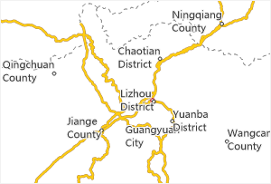
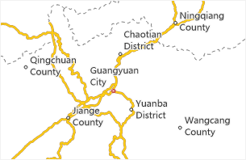
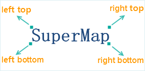
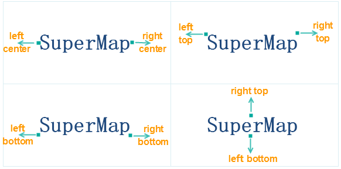
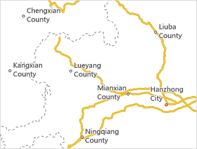
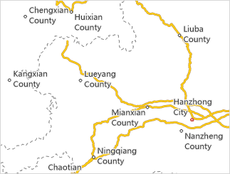
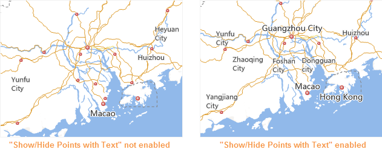
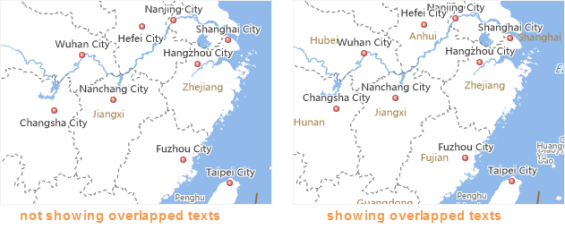
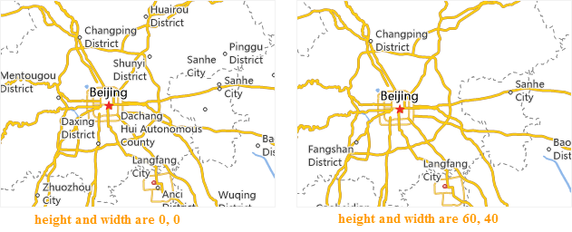

　　The overlapping between all features in the map often happens since the more and more information has been expressed by a digital map, especially the label texts. For dealing with these problems, there are some methods provided by SuperMap GIS to help you beautify your maps.

　　Generally, the provided function "No Overlap" can avoid some overlaps, and other overlaps can be removed by the advanced settings, while some important information may be hidden in practice, hence more flexible settings are required. Luckily, SuperMap GIS provides some flexible settings to allow you to determine whether the overlapped features are displayed or not.

### Avoid and Overlap

　　For instance a label thematic map which is created based on a point layer, when the map scale is small, the distribution of point features are dense, if labels of all point features are displayed on the map without enabling the "No Overlap" but opening the "Show Overlap", following effect will be shown.

　　

　　If the "No Overlap" function has been opened, some overlapped problems are resolved. To avoid overlaps, appropriate positions are calculated out by the system automatically to place the labels of point features.

　　

　　There are still some overlaps on the map after "No Overlap" function has been opened, to beautify the map, you could not check the "Show Overlap" function and check the "No Overlap" function to retain the most text contents.

　　

### Modes to avoid overlaps

　　For instance a label thematic map which is created based on a point layer, when the map scale is small, the distribution of point features are dense, if labels of all point features are displayed on the map, the situation that few labels are displayed and overlap each other may happen. At this point, opening the "No Overlap" function can balance the distribution of text labels, and eliminate some overlaps. The methods avoiding overlaps include: Avoid at Four Directions, Avoid at Two Directions.

- Avoid at Four Directions: The four directions at four corners of an exterior rectangle of a label text. When overlapping happens, the four directions of a label text will be aligned with the anchor point of the labeled object respectively and then adopt the type that the label text will not overlap with others.

　　

- Avoid at Two Directions: The appropriate position for a text label to avoid overlaps is related with the alignment of the thematic map. When there is a text label overlaps with others and the label thematic map is top left aligned, the function will calculate whether an overlap will happen when the symmetry point (top right point) of the exterior rectangle of the text label aligns with the anchor point of the labeled object, if not, the result shown in the map adopts the alignment.

　　

　　When creating a label thematic map for point objects, the "Show Overlap" is unusable and "No Overlap" is enabled, the comparison of above two avoiding functions is shown as follows, by the function "Avoid at Two Directions" the map can include more labels and show more information.

　　

　　Figure: Avoid at Two Directions

　　

　　Figure: Avoid at Four Directions

### Overlap

　　Besides, other kinds of features may overlap each other when the scale of the map is small, such as: point objects, text objects, symbols and so on. You can use special methods to show the important features, when they are hidden by the function to deal with the overlapping problems.

　　The overlapped objects can be in the same layer or different layers.

- **Show/Hide Points with Text**: Hide the point object if its label is hidden, otherwise show it. When the points in a point layer are dense, the map looks like there are many points without labels since some labels in the label thematic map which is created based on the point layer are hidden by enabling the "No overlap" function, but if the function is not enabled, the overlapping will happen. You can process these kinds of problems by using the function.

　　

- **Points Overlapped by Points**: When point objects in a same layer or in different layers are overlapped with each other, this item can control whether to filter the overlapped point objects. If it is selected, the bottom point object will be shown whereas the top point objects will be removed; otherwise, all the overlapped objects will be shown.

- **Points and Texts Overlapped**: The text here includes the annotation of the label map and the text of the text layer (CAD layer). When point objects in the point layer overlap with texts in the label map or text layer (CAD layer), this item can control the display of overlapped objects including points and texts which contain labels. If it is selected, the bottom point or text object will be shown whereas the top objects will be removed; otherwise, all the overlapped objects will be shown. Note: This item cannot control the overlaps among points or among texts.

- **Texts Overlapped by Texts**: The text here includes the annotation of the label map and the text of the text layer (CAD layer). When overlaps occur among texts or labels of the text layer or the label map layer, this item can be used to control the overlaps. If this check box is selected, the bottom object will be retained whereas the top object will be removed; otherwise, all the overlapped objects will be shown. Note: It firstly determines whether to execute the Avoid Overlap function in the label map layer.

　　

- **Graduated Symbols Overlapped**: The graduated symbols on the statistical symbol thematic map may overlap with each other, which can be in one or more layers. This item can be used to control the display of the overlapped graduated thematic elements. If this check box is selected, the bottom object will be retained whereas the top object will be removed; otherwise, all the overlapped symbols will be shown.

- **Graph Symbols Overlapped**: The statistical symbols on the statistical symbol thematic map (e.g., pie chart and bar chart) may overlap with each other, which can be in one or more layers. This item can be used to control the display of the overlapped statistical symbols. If this check box is selected, the bottom statistical symbol object will be retained whereas the top statistical symbol object will be removed; otherwise, all the overlapped symbols will be shown.

- **Overlap Bounds**: Sets the overlap distance between two objects, which can be determined by specifying the width and height. For example, the width and height are 60 and 40 respectively, then the method to calculate the overlap bound is using the circumscribed rectangle of the overlapped text objects as a unit; then this rectangle is moved 60 units to the left and to the right, and also 40 units upward and downward. The unit is 0.1mm. The overlap bound is applicable to all the above 5 overlap items. When the overlap distance (width or height of the overlap bound) is a positive value, it indicates the distance between two objects. The objects will not be displayed if the distance between them is less than or equal to this distance. When it is a negative value, the objects will not be displayed if the distance between them is greater than or equal to the absolute value of the distance.

　　