　　Both the vector data and the raster data can be used to create the thematic maps, but the difference is the thematic map of vector data is based on the attribute information in its attribute table, but the thematic map of raster data is based on the pixel value. The thematic map is applicable to the point, line, region, raster and complex datasets except the text and image datasets.

　　The datasets applying to vector data include: Unique Values Map, Ranges Map, Label Map, Graph Map, Graduated Symbols Map, Dot Density Map, Custom Map. The Grid Unique Values Map and Grid Ranges Map are applied to raster data. The features of thematic maps are as follows:

- A thematic map as an independent layer is shown on a map, you can adjust its order as your needs.

- You can produce multiple thematic maps in different types or the same type with a dataset.

### Unique Values Map

　　Classify the features with the same thematic value as a class, set a rendering style for every class to differentiate categories, such as colors or symbols. The thematic variable could be either a non-numeric attribute such as the name, type and state of a feature, or a numeric attribute which is used to identification, such as ID, the type identification number of land use and so on. Certainly, it also could be the numeric attribute which is used to represent quantity, at the time, the features with the same value are assigned a style, if there are a lot of different values, the method is not recommended.

　　The production of a unique thematic map aims to present the qualitative differences of phenomenon mainly. It can be used for a geological map, a geomorphologic map, a vegetation map, a land use map, a political map. For instance, to present the distribution area and range of different types of land (grassland, woodland and residential areas),  the same type of land will be given the same color or filled style.
  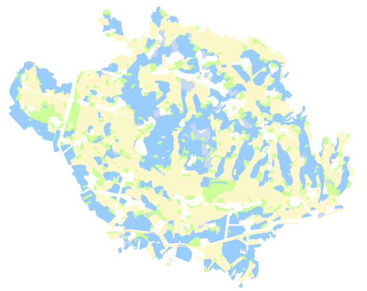

### Ranges Map

**1.Overview**

　　Divide the thematic value into several ranges according to a method, the objects whose attribute values are within a range are presented by the same color, the same filled symbol or the same marker. The thematic variable for a range map must be numeric. The range maps is best used for reflecting the characteristic in quantity and degree for continuous distribution phenomenon, such as precipitation distribution or soil erosion intensity.

　　How are the intensity levels of soil erosion presented intuitively on a map when you produce a soil erosion intensity map? The best answer is classifying the intensity of soil erosion, such as classify it into 6 ranges (range from: &lt;500; 500-2000; 2000-6000; 6000-10000; 10000-20000; &gt;20000),  and then give a different color for every range, for example, you can set the objects whose values are less than 200 are light red, and the features whose values are within 500-2000 are red, and so on.

　　Following sketches is about precipitation distribution.

  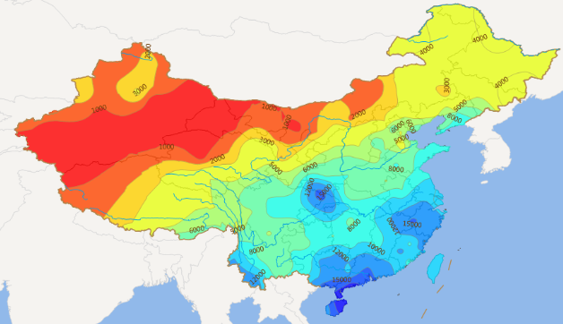

**2.Style Settings**

　　The best advantage of a range map is the reflection of different degrees between ranges by colors, such as by the changing of colors from green to red presents the changing of precipitation. SuperMap has provided some style settings (colors, line types, filled, etc) for you to render the style of every range.

**3.Method**

　　6 ways are provided by SuperMap to classify the thematic value, including: Equal Interval, Square Root Interval, Standard Deviation Interval, Logarithmic Interval, Quantile Interval, Custom Interval. Adopting different methods, the results are different. When the number of ranges is different, the produced thematic maps are also different.

　　The standard determining whether the thematic variable has been classified very well is all the objects with the similar values belong to the same category. The method and the number of ranges are the two important factors to decide the presentation of a range map. 

### Label Map

**1.Overview**

　　Labels are indispensable on a map which not only helps you more distinguish objects, but also present some important attributes, such as the name of river, tourist sites, institutions and the altitude of contour line, etc. With SuperMap, you can add labels on a map easily.

　　It mostly is used for labeling point, line or region objects, the thematic variable should be chart or numeric field (road names, address names, river levels, river width, etc.). But the drawing elements such as the legend, map name, scale and others will not be labeled.

　　In a label map, you can set the display style and position of labels together, or set the display style for every label or labels within a range separately.

　　The advantages of the label maps are: the settings of range styles are supported in a label map, you can set a range field expression to divide all objects into several classes, and then set different styles for the labels of objects within different classes; when zooming labels in or out on a label map, the text can be displayed only between the maximum and minimum.

  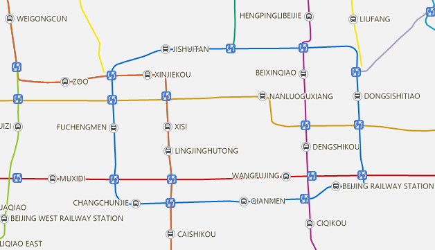

**2.The control of label position**

　　The position of a label is very important considering these problems, how to place labels can make a map more beautiful, how to avoid overlap phenomenon, how to better identify the relationship between labels and objects.

-   **Inner point**

　　Under the default and uniform setting situation, the anchor point of a label in a label map is the inner point.  Before you know about the position of anchor point, you should know the position of inner point.

　　For different geometric objects, the inner points are different. The inner point of a point object is itself, the inner point of a region point is located in the inside of the region object and close to the center. The inner point of a line object is the inner point of its first sub object, if the number of the nodes of sub object is odd, the middle point is the inner point, but if it is even, the inner point is the center point of the two points in the middle of all nodes.

-   **Anchor point and label position**

　　Generally, by the anchor point of a label controls the position of label. The settings of relation between a label and its anchor point are performed in text style. 12 position relations (alignment types) are provided to control the placing situation of a label around its anchor point. They are: Left Top, Center Left, Bottom Left, Top Center, Center, Middle Bottom, Top Right, Center Right, Right Bottom, Left Baseline, Right Baseline, Center Baseline.

   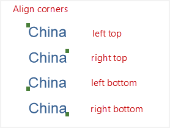   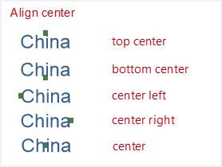   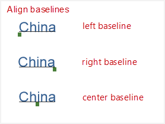

-   **Offset**

　　The anchor point of label can have a certain offset which can be set by setting the offset of label in x and y axes. The offset value can be a constant value or a value expressed by an expression (such as the expression is SmID, the SmID equals 2, then the offset value is 2), the unit of offset is the map unit. You can fix the offset value (means that the value doesn't change when zooming in/out on a map).

- **Effects and special processes**

　　In the settings of label position, SuperMap has provided various settings for you to meet your needs of labels, at this point the anchor point may have no connection with the inner point, including: Flow, No Overlap, Show Leader Line, Alongline Labeling, etc, among them, the Flow function only applies to label line or region elements, and the Alongline Labeling is only worked for line elements.

   -   **Flow**: It is used for displaying the labels of geometric objects, in case part of them are displayed on the current window while their labels can be viewed only by panning the map (if the labels' position is fixed), when the function is opened, the labels will be moved with the panning of the map. Following pictures shows the comparison before and after opening "Flow". **Note**: The function can not be available for the thematic maps which were created based on point layers.

   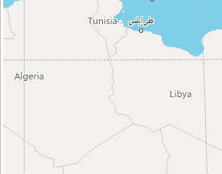   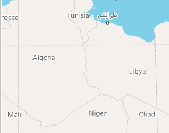

   - **No Overlap**: Under the situation that the objects are too close to each other and the space of every object is too small, the anchor point of label is controlled by the object's inner point with the labels overlap each other which could lead to some labels (at bottom) are hidden. When the function is opened, some overlapped labels will be shown against the position relative to the objects' inner points by default. Certainly, some overlapped phenomenon still can't be avoided when overlapping is severe.

   - **Show Leader Line**: Since a leader line is connected with a object's inner point, by a leader line, the object corresponding with a flowing label can be found out. Following picture shows a thematic map with the function has been opened.

   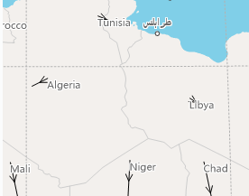

   -   **Alongline Labeling**: Some linear features are too long, so when producing a map, it can make the map more beautiful that the labels are placed along them, and the same label can be shown at regular intervals. 

　　5 items are provided for the function: Along the normal of the line; Top to bottom, right to left; Top to bottom, left to right; Bottom to top, left to right; Bottom to top, right to left. If you select the first direction, the labels will be labeled from the starting point to ending point along the line direction. For another 4 items, every item contains of two parts (vertical direction and horizontal direction), according to the line direction determines which part are effective. The direction of a straight line is horizontal if the angle between the line and horizontal direction is less than 60 degree, otherwise, it is vertical. But for an arc, the angle between the tangent at the anchor point and horizontal direction is considered. For the line whose direction is horizontal, the labels will be placed as right to left or right to left, whereas for the line whose direction is vertical, the labels will be placed as top to bottom or bottom to top.

　　**Note**: All labels will be shown as the rotation of font set up in the style settings if the text angle is fixed without considering the labeling direction, but if the text angle is not fixed, both the rotation of font and labeling direction are considered when displaying the labels.

      

   -   **Remove Repeat**: If it has a line object which consists of several segments, when producing a thematic map base on a thematic map, there are multiple repeated labels shown on the map. To resolve this problem, you can check the "Remove Repeat" checkbox, the result is shown as follow.
   -   

   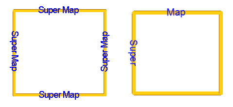

**3.Label Style**

-   **Text Style**

    　　The style settings of labels include: Font, Alignment, Font Size, Font Height, Rotation, Text Color, Background, etc., in addition, some font effects have been provided, such as: Bold, Italic, Shadow, Outline, Strikeout, Transparency and so on. Among them, when Transparency is not checked, the background is the text background, but both Transparency and Outline are checked, the background is the color of outline. For details, please consult the introductions of label position. Please note that the font size is relative to the font height.

    　　Provide the settings of display precision for number, for example, if the precision is 0.1, the object whose field value is 178.3129 is displayed as 178.3 on the label thematic map. The settings of max height and min height of text are provided, which are used to control the font size when zooming in or out on a map, the function is effective with the premise that the font size is not fixed.

-   **Background Style**

    　　7 types of background shapes of labels: Default, Rectangle, Round Rectangle, Ellipse, Diamond, Triangle, and  Marker Symbol. Among them, the function Marker Symbol allows you to choose a marker symbol from Marker Symbol Selector as the background of labels. The style settings of label background is the same with a region symbol's.

**4.Range Display of Label Thematic Maps**

　　 You can set a range field expression, and compare the values of the field with range values to determine which range an object belongs to, and then set the different styles for objects in different ranges.

### Graph Map

**1.Overview**

　　Used for reflecting the values of fields of objects or records. A graph map can reflect various attributes based on multiple variables, i.e. lots of field values can be drawn on a graph map. The vertical and horizontal comparisons between region itself and each region can be shown by a graph map. A graph map is mostly used for the map with quantitative characteristic, such as GDP, population and so on.

　　Such as, you can take Pop1, Pop2, Pop3, Pop4 (representing the amount of tourists for four quarters) as thematic variables to produce a graph map which is about the tourist amount in the tourist sites of Beijing for every quarter.

  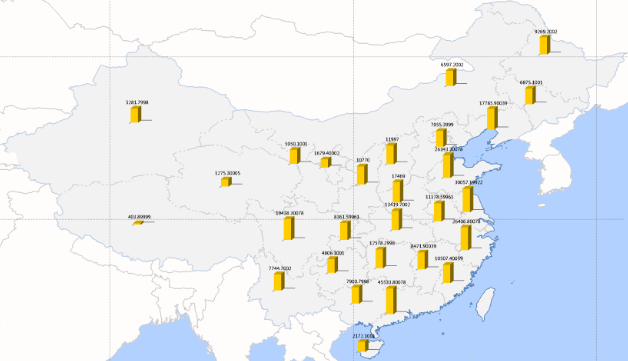

**2.Deeply Know about a Graph Map**

-   **a Graph Map with a Graph**

    　　They two different concepts. On a graph map, there is a graph representing the thematic value of it in every area. Graphs have various types, currently are supported including: Area, Step, Line, Point, Bar, 3D Bar, Pie, 3D Pie, Rose, Stacked Bar, 3D Stacked Bar and Ring.

   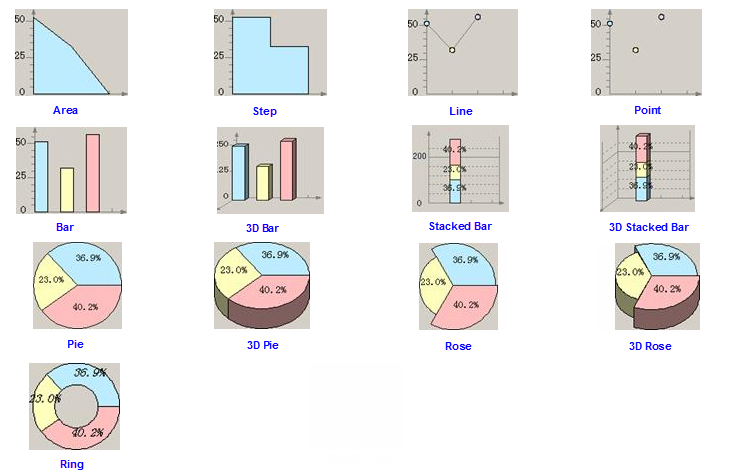

*   **Graduated By**

　　The graduated mode is mostly used for graph maps and graduated symbol maps. After the size of a graph map and proportion of every thematic variable are determined, the graduated mode will be used to reduce the differences between values. If there is huge difference between values, the appearance of a thematic map can looks more beautiful by using Square Root or Logarithm. Currently, three methods for graduating data are provided. Please have a notice for that if there are negative values, Square Root and Logarithm are not available.

　　　Constant: Graduated by the attribute value.

　　　Square Root: Graduated by the square root of the attribute value. 

　　　Logarithm: Graduated by the logarithm of the attribute value.

-   **How to determine the size of a graph map**

　　The display size of a graph map depends on the combination of extreme values of display, graduated mode and thematic extreme values. The extreme values of display include the maximum and minimum values displaying the graph map. If using a different graduating mode, the size of a graph also is different.

　　Thematic extreme values include the thematic maximum and minimum values. The thematic maximum value can be got by adding maximum values of all thematic variables, similarly, add minimum values of all thematic variables to get the thematic minimum value. For example, a field ID whose maximum value is 25 and a field SmID whose maximum value is 10 are thematic variables, the thematic maximum value is 35.

　　Note: the sum of every thematic value of an object decides the size of the corresponding graph , each thematic value decides the proportion of the object.

　　**Relative Relation**: According to the given display extreme values and thematic extreme values, a linear coefficient can be calculated by use of linear relationship, and then by the coefficient, a linear equation can be calculated which can computer the sizes of every graph. For example, the fields Val1 and Val2 are the thematic variables, the graduating mode is Constant, the given display extreme values are 20 and 10, the thematic extreme values are 10 and 6, and then the calculated linear equation is Y＝2.5X-5. The values of Val1 and Val2 of an object A are 2 and 6, the sum of thematic values of A is 8, according to the equation, the size of graph should be 15 (different types of graphs, the meanings represented by the value are different). For a bar, 15 represents the height of graph corresponding with A is 15, since the proportion of Val1 and Val2 is 1:3, the bar heights representing Val1 and Val2 are 3.75, 11.25 respectively.

　　**Note**: The unit of the above numbers is the same with the map unit. 

-   **The settings of display effect of thematic maps**

　　Similar with a label thematic map, a graph map also can be set whether to open Flow, No Overlap, Show Leader Line, and whether there are offset in the graph map and so on. Besides, the styles of coordinate axes of some graphs and the graphs themselves can be set.

　　(1). **Settings of coordinate axes of a graphs**

   　　You can set whether to display the coordinate axes of a graph, if yes, then the colors of axes and whether to display grids and text labels on the axes can be set. If the text labels are displayed on the axes, you can set styles for them. 

　　　　

　　(2). **Settings of a graph**

   　　You can set whether to fix the graph size, and whether to display the text labels on graphs. If the labels are displayed, you can set the display format and text style of graphs. The display formats include: Percent, Value, Caption, Label + Percentage, Label + Value.

   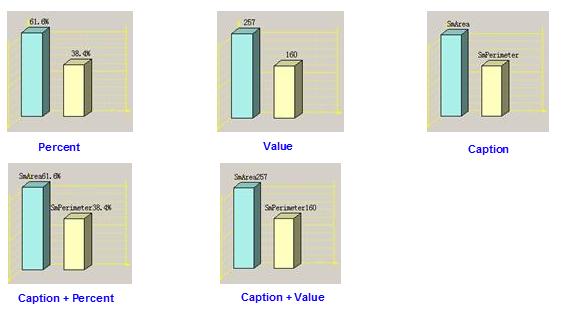

　　(3). **No overlap**

   　　For a graph map and a label map, both of them are produced based the same dataset, when the text labels of the graph map are displayed on current window and overlap the labels of the label thematic map, the former will be hidden, so, you can avoid this problem by the function.

　　(4). **Other settings**

   　　You can set whether to display the data with attribute values are negative. The width of a bar in the Bar, 3D Bar, Stacked Bar or 3D Stacked Bar can be specified, and for a Rose or 3D Rose, you can specify the rose angle. For a Pie, 3D Pie, Rose, 3D Rose, you can specify the starting angle.

### Dot Density Map

　　点密度专题图用一定大小、形状相同的点表示现象分布范围、数量特征和分布密度。点的多少和所代表的意义由地图的内容决定。点密度专题图利用图层的某一数值属性信息（专题值）映射为不同等级，每一级别使用不同数量或表现为密度的点符号来表示该专题值在各个分区内的分布情况，体现不同区域的相对数量差异。多用于具有数量特征的地图上，比如表示不同地区的粮食产量、GDP、人口等的分级，主要针对区域或面状的要素，因而，点密度专题图适用于面数据集。

  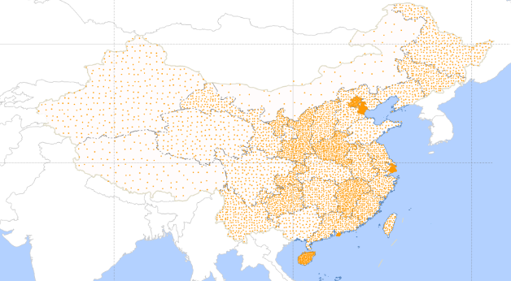

**专题图中点的意义**: 

-   点密度专题图使用点的数目或者密集程度来反映一个区域或范围所对应的专题值，其中一个点代表一定数量，则一个区域内的点的个数乘以点所表示的数量就是此区域对应的专题值。例如，一个城市共有 2000000 人口，点密度专题图中一个点代表 20000 人口，则在这个市的区域范围内将会分布有 100 个点。
-   在点密度专题图中，对于点的个数相同的两个区域，面积比较小的区域的点分布密集，因而点密度专题图的专题值（或制图对象）是数量，反映的却是密度。例如，对各区域的人口数制作点密度专题图，以图形的表现方式，即点的密集程度，反映了人口密度；当然，也可以以人口密度作为专题变量制作分段专题图，用颜色的差异来反映区域的人口密度的差异。点密度专题图中点的个数越多越密集，则说明数据反映的事物或现象在该区域的密度或浓度越大。
-   用户可以指定点密度专题图中单个点所代表的数值及其显示尺寸。当单个点所代表的数值太小，或设置的点符号显示尺寸过大时，都会使点相互堆叠成块，从而使得现象的分布不明显，因而设置合适的点所表示的数值以及点的显示尺寸是很重要的。当用来制作点密度专题图的专题值很大时，最好将点所代表的数值设置大一些，点符号的尺寸设置小一些。实际制图中，可能需要通过多次尝试来找到合适的点所代表的数值与点显示尺寸的组合。
-   对于一个点密度专题图，点的风格都是一致的。用户可以对数据的多个属性制作多个点密度专题图，使用不同的点风格来区分不同的点密度专题图，从而在一个地图上表现多种属性的分布密度特征。
-   点密度专题图中点的分布是随机的，并不代表实际的分布位置。即使在相关设置完全相同的情况下，每次制作出的专题图，点的数量相同，但点的位置都有差异。

### Graduated Symbols Map

　　等级符号专题图根据各要素的某个数量特征，按照一定的分类方法用一组等级符号表示在地图上，以呈现要素间该数量特征的相对关系。等级符号专题图多用于具有数量特征的地图上，比如表示不同地区的粮食产量、GDP、人口等的分级，也就是说，用于制作等级符号专题图的专题变量类型为数值型。

  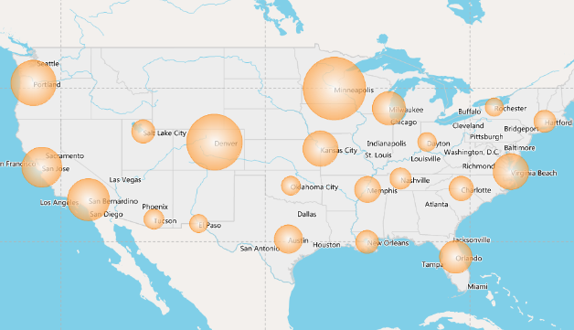

　　**如何确定等级符号显示的大小**

　　显示大小主要取决于以下因素: 点状符号（即等级符号专题图中的符号）的大小，等级符号专题图的基准值，按照分级模式运算后的统计值的大小。点状符号大小不是等级符号专题图中符号的显示大小。对于一幅等级符号专题图来说，点状符号的大小是统一的，由于每个要素的专题值不同，所以最终显示在专题图中的点状符号大小会有所不同。

　　统计指的分级模式有三种: 常数分级模式、对数分级模式和平方根分级模式。在等级符号专题图中，不同分级模式用于确定符号大小的数值是不相同的，常数分级模式按照字段的原始数据进行，对数分级模式是对每个要素对应的专题值取自然对数、平方根分级模式则是对其取平方根，用最终得到的结果来确定其等级符号的大小。基准值由用户设定，基准值越大，点状符号最终的显示大小越小。

　　**等级符号显示效果设置**: 等级符号专题图也可以像标签专题图，统计专题图一样，设置是否流动显示，是否显示牵引线，是否进行偏移，偏移量是否固定，所不同的是标签专题图针对的是标签，统计专题图针对的是统计图，等级符号专题图针对的是符号。除了以上设置，用户还可以设置是否显示专题值为负值或者零值的要素，以及专题值为正值，负值，零值时等级符号的风格。

### Grid Unique Values Map

　　栅格单值专题图，是将属性值相同的像元归为一类，为每一类设定一种颜色，从而用来区分不同的类别。栅格单值专题图适用于离散栅格数据和部分连续栅格数据，对于单元格值各不相同的那些连续栅格数据，使用栅格单值专题图不具有任何意义。

　　用户在了解了单值专题图后，对栅格单值专题图的理解就比较容易了，因为这两类专题图除了操作对象的不同之外，只有一些细节上的不同。下面通过对比两类专题图的相异之处来帮助用户理解栅格单值专题图。

1.  单值专题图的操作对象是矢量数据，而栅格单值专题图的操作对象是栅格数据；
2.  单值专题图的专题值为要素的字段值或字段表达式的值，而栅格单值专题图所使用的专题值为栅格数据集中像元的属性值；
3.  单值专题图子项的风格设置包括颜色风格设置，填充风格设置，符号风格设置等，而栅格单值专题图子项的设置，只有颜色风格设置一种。

### Grid Ranges Map

　　栅格分段专题图，是将所有像元的属性值按照某种分段方式分成多个范围段，属性值在同一个范围段中的像元使用相同的颜色进行显示。栅格分段专题图一般用来反映连续分布现象的数量或程度特征。比如某年的全国降水量分布图，将各气象站点的观测值经过内插之后生成的栅格数据进行分段显示。

　　用户在了解了分段专题图后，对栅格分段专题图的理解就比较容易了，因为这两类专题图除了操作对象的不同之外，只有一些细节上的不同。下面通过对比两类专题图的相异之处来帮助用户理解栅格分段专题图。

1.  分段专题图的操作对象是矢量数据，而栅格分段专题图的操作对象是栅格数据；
2.  矢量数据集分段专题图支持所有的分段方法，而栅格分段专题图只支持其中的四种，即等距离分段法、平方根分段法、对数分段法以及自定义分段法；
3.  分段专题图的专题值为要素的字段值或字段表达式的值，而栅格分段专题图所使用的专题值为栅格数据集中单元格的属性值；
4.  分段专题图中每一段的风格设置包括颜色风格，填充风格，符号风格等，而栅格分段专题图中，只有颜色风格设置一种，各分段使用不同的颜色来进行区分。

