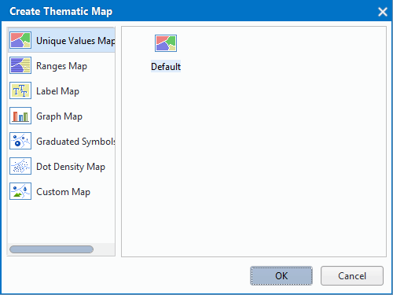

SuperMap iDesktop Cross provides the function of creating the thematic maps based on vector and raster data. The supported types of thematic maps include: Unique Values Map, Ranges Map, Label Map, Graph Map, Graduated Symbols, Custom Map, Grid Unique Value Map, Grid Range Map and so on. Following are the thematic maps in details.

- **Unique Value Map**: The objects with same attribute value are as a category. To express the differences between different attribute values, set a special rendering style for each category, such as color or symbols. The unique value map contributes to the emphasizing of the type differences and are often used for the maps with categorized attributes, such as: Land-use, Four-color, etc.
- **Ranges Map**: The thematic values of all objects can be grouped into multiple classes, and each class is set up a special rendering style. The range map can indicate the quantitative characteristics for an area, such as sales volume in different areas,  also can display a ratio information, such as population density.
- **Label Map**: Mainly used for labeling point, line, region objects in the map with thematic values. Label Maps are often used in text or numeric fields, such as labeling place names, road names, width of rivers and so on.
- **Graph Map**: Draw graphs for every object in layers to reflect the thematic values. The Graph maps also allows users to symbolize multiple attributes on a map based on multiple thematic variables. The distribution and development of natural phenomenon and socio-economic phenomena can be better analyzed. The Graph maps are often used for the maps with quantitative characters, user can create the horizontals and vertical comparison between the area itself and each area by graph maps, such as the maps about GDP, or population, etc.
- **Graduated Symbols**: Graduate a field of a vector layer to different classes, use different marker symbols to represent each class, The size of a symbol is in proportion to the value of the field, the larger the value, the bigger the symbol. The Graduate maps are often used for the maps with quantitative characters, such as the maps about GDP, or population, etc.
- **Dot Density Map**: Identify the distributional range, quantitative characteristics and density for phenomenon by points with the same size and shape. The density of points in a range is in proportion to the value of the field,  the higher the value of the field, the denser the distribution of point symbols on the map. The maps are often used for the maps with quantitative characters, such as the maps about GDP, or population, etc. The representing meanings depend on the content of maps.
- **Custom Map**: Create a custom map through customizing a field. Set the display style according to the field value in numeric type and the style of the related ID, which is more freedom to express data information. 
- **Grid Range Map**: The attribute values of pixels in a raster dataset are divided into multiple ranges. The pixels whose attribute value is within the same range are displayed in the same color.
- **Grid Unique Unique Map**: Categorize the grids with the attribute values are the same to a class, and set a special color for every class.

### Create a Thematic Map

Open data to create a thematic map, then select a vector or raster layer from the Layer Manager, right-click the layer and click "Create Thematic Map...". Or you can click "Thematic Mapping" in the "Thematic Mapping" menu, the "Create Thematic Map" dialog box will appear, in which you can choose thematic maps they want to create.

　　

Choose the thematic map from the left of the dialog box, then select the corresponding template at right, finally click "OK" and a thematic map will be created. The created thematic map will be added into the current map window automatically, at the same time, the Thematic Mapping panel will pop up for you to set related properties.

