　　The parameters in "Properties" panel for the thematic maps with uniform style and range style are the same. The parameters for beautifying the labels in maps fall into three classes: Properties, Style, Advanced.

### Properties

**Expression**

　　Specify the thematic variable used to label objects. The thematic variable can be a field or a field expression. If multiple fields need displaying, you can click “Expression…” at last of the drop-down list shown by clicking the Expression combo box. Build expression in the pop-up “SQL Expression” dialog box, after that, the objects in current thematic map can be re-labeled.

**Label Map Expression Description**

 Operators | Definition | Engines Supported | Instance | Effect
 :------ | :----- | :------ | :------
 + | Hyphen | UDB, SQL | Format: Filed name 1 + Field name 2 +...  Field type: Text, character  Sample: NAME + ENAME | 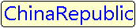  
 &#124;&#124; | Hyphen | UDB, Oracle | Format: Filed name 1 &#124;&#124; Field name 2 &#124;&#124; ... Field type: Text, character or numeric, Sample: NAME &#124;&#124; GDP\_2000 | 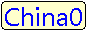  
 \[/\] | Fractional | UDB, Oracle | Format: Filed name 1 \[/\] Field name 2, Field type: Text, character or numeric, Sample: NAME \[/\] POP\_1990 &#124;&#124; 'ten thousand people' | 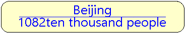  
 chr(10) | Line break | UDB, Oracle | Format: Filed name 1 &#124;&#124; chr(10) &#124;&#124; Field name 2...", Field type: Text, numeric, character, Sample: BaseMap\_R.NAME &#124;&#124; Chr(10) &#124;&#124; BaseMap\_R.POP\_1999 | 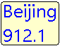  
 char(10) | Line break | SQL | Format: Filed name 1 + char(10) + Field name 2...", Field type: Text, Sample: NAME + Char(10) + POP\_1999 |   
 chr(45) | Bland character | Oracle | Format: Filed name 1 &#124;&#124; chr(45) &#124;&#124; Field name 2...", Field type: Text, Sample: NAME &#124;&#124; Chr(45) &#124;&#124; NAME | 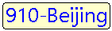  
 char(45) | Bland character | SQL | Format: Filed name 1 ＋ char(45) + Field name 2...", Field type: Text, Sample: NAME + Char(45) + NAME | 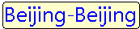  
 str() | Convert numeric value to string | SQL | Format: str (field name), Field type: Text, character or numeric, Sample: NAME + ':' + Str(POPU) + 'ten thousand' | 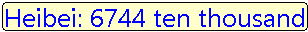  
 to\_char() | Convert numeric value to string | Oracle | Format: to\_char (field name), Field type: Text, character or numeric, Sample: NAME \[/\] 'area:' &#124;&#124; to\_char( SMAREA) | 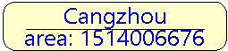  

　　**Note:** While creating thematic maps for Oracle Plus, SQL Plus engine data, field expression can only be field values or field operations, such as SmID, SmID + 1, etc. Currently, condition expression is not supported. If the field expression is condition expression, such as SmID &gt; 100, then thematic mapping will fail.

**Background settings**

　　Define the shape and style of background for the labels.

- **Back Shape:** Set the background shape of the labels. The options are:

  -   **Default:** Without background shape.
  -   **Rectangle, Round Rectangle, Ellipse, Diamond, Triangle:** Use the corresponding shape.
  -   **Marker Symbol:** Use a marker as the background shape.

- **Back Style:** Set the background styles of objects. If objects are rectangles, round rectangles, ellipses, diamonds or triangles, the [Fill Style Settings](../../Visualization/LayerStyle/FillSymStyle.htm) pops up; if objects are points, [Marker Style Settings](../../Visualization/LayerStyle/FillSymStyle.htm) pops up.

**Offset Settings**

　　Control the distance the label is placed from the object.

-   **Offset Unit:** Set the unit with which the offset will be measured. The label offset distance can be measured in map units or 0.1 millimeters.
-   **False Easting:**  The horizontal label offset. You can directly type in a value or select a numeric field from the drop-down list.
-   **False Northing:** The vertical label offset. You can directly type in a value or select a numeric field from the drop-down list.

**Effect Settings**

　　Set the display effects of the labels.

-   **Flow:** Check the box to display labels in floating mode. If checked, the labels move with the map window for optimal effects. When opened the flow display, please don't use the partly refreshing function, or the display effect will be incorrect. Note: When using the point layer to create the Label Thematic Map, it doesn't support the flow display.
-   **Superscript/Subscript:** Select this check box, and implement the display effect of the superscripts and subscripts according to the rules set in the label expression. Please notice bellowing problems:
    -   The feature doesn't support labeling along line, rotation, word wrap and so on.
    -   The feature doesn't support a expression with a separator.
    -   The feature doesn't support strikethrough and underline.

-   **Show Slivers:** Check the box to display labels for all objects, even small ones. Otherwise, the labels for certain small objects will be filtered out based on the scale.
-   **Landscape Display Tags:** Check the box to display labels in vertical. **Note**: If Alongline Labeling or Rotation has been checked, here the setting will not take effect.
-   **No Overlap:** Check the box to display labels as much as possible without overlap. You can choose to avoid at all directions or four directions.
   -   **Avoid at Four directions:** Adjust surrounding labels in the order as shown below in four directions (left-top, left-bottom, right-bottom, right-top) to avoid overlapping.

　　　  

 
   *   **Avoid at Two directions:** Check the box to avoid overlap of labels at directions surrounding labeling objects. If the alignment type is top left, then the system will calculate whether the top right is overlapped or not. If not, the result will employ this alignment type.

　　　  

-   **Show Leader Line:** Check the box to show lines connecting the labels and the objects if the labels are placed away from the objects. You can set the styles for the leader lines through the Line Symbol Selector dialog box that shows up by clicking the Line Style button at right. To know how to set line styles, please refer to [Line Symbol Style Settings](../../Visualization/LayerStyle/LineSymStyle.htm).
-   **Precision:** Set the number of decimal places of the numeric values displayed as labels. The command is only active if the thematic variable is a numeric field. By default, the labels display the original numeric values. You can change the precision by selecting an option from the drop-down list. For example, if you set the Precision to 1, the label 178.5 will display as 179 on the label map.
Note

　　**Note**: When any of Flow, Show Slivers, No Overlap or Show Leader Line is checked, "Enable instant refresh" is not recommended to be checked, if enabled, the edge label of the map may appear incomplete.

### Style

　　**Font**: Set the font used by label texts in a label thematic map. Abundant fonts have been provided in the drop-down list for people to choose from. <!--You can select a font used recently as well.--> Typing a letter to locate to fonts beginning with the letter is supported.

　　**Alignment**: Align the selected labels. Multiple alignment methods are provided in the Alignment drop-down list. There are 12 types of alignment, see Text Alignment.

　　**Font Size**: Change the font size. Font size can be set either by entering a value, or by choosing a value from the drop-down list shown by clicking the down arrow.

　　**Font Height**: Change the font height. Font Height can be set either by entering a value, or by clicking the up or down arrow. The unit of font height is 0.1 millimeter.

　　**Rotation**: Change the label rotation. It can be set either by entering a value, or by clicking the up or down arrow. The positive rotation is counter-clockwise. The unit is degrees.For more information about custom tab settings, see custom label setup instructions .

　　**Tilt Angle**: After checking Italic check-box, the Tilt Angle text box will be worked and texts of labels in a map  will be shown in italics. The italic angle can be modified by clicking the up or down arrow or by entering a value directly. The unit is degrees.

　　**Text Color**: The text color of the label. Click the drop-down arrow at right to display the color panel, in which you can select and set an appropriate color.

　　**Background**: The background color of the label. Click the drop-down arrow at right to display the color panel, in which you can select and set an appropriate color. The item is only active if you check the Outline or uncheck the Transparency box. The background color will be invisible if you check the Transparent to transparently display the backgrounds of the labels.

**Font Effects**

- **Bold**: Set whether to make the labels bold.
- **Italic**: Set whether to italicize the labels.
- **Strikeout**: Set whether to draw lines through the middles of the labels.
- **Underline**: Set whether to underline the labels.
- **Shadow**: Set whether to add shadow effects to labels.
- **Outline**: Set whether to add outline effects to labels. You cannot set both the outline effects and the background color for the labels. Actually, if you have set the background color, the labels are outlined by the color. Outline width is also supported, with the unit being pixels, ranging from 1 to 5. If the box is not checked, there is no outline for the text. Text outline conflicts with text background decoration, which cannot exist together. Text outline color is the color set for the Background.

   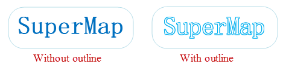

- **Fixed Size**: Fix the size of the labels so that they will not change with map zooming.
- **Transparency**: Transparently display the backgrounds of the labels. You cannot set both the outline effects and the background color for the labels. If check the Transparent box, the labels are outlined by the color you set for the background.

### Advanced

**Alongline Labeling**

- **Alongline Labeling**: Check it to place labels in a map along lines. The settings in the Alongline Settings area are only available if you check this box and the current label map is created based on a line layer. **Note**: Alongline Labeling is the precondition for the following items.
- **Fixed Text Angle**: Check the box to keep all labels in the map in vertical direction.
- **Remove Repeat**: Check the box to avoid repeated labeling. For instance, each simple line composing a complex line is individually labeled if the box is unchecked. If the box checked, only the longest simple line within the visible extent will be labeled.
- **Label Direction**: Set the label direction along the relevant line. Five options are provided: Along the normal of the line; From bottom to top, left to right; From top to bottom, right to left; From bottom to top, right to left; From top to bottom, right to left. 

　　SuperMap Desktop will first judge the direction, whether it is horizontal or vertical (judgment criterion: if the angle between a line and the horizontal direction is less than 60 degrees, this line direction is regarded as horizontal, otherwise vertical); for the horizontal direction, the label is placed from left to right or from right to left; for the vertical direction, the label is placed from up to down or from down to up.

　　**Note**: You are not allowed to set label direction if the Fixed Text Angle box is checked. If you have modified the label direction, or checked the fixed text angle, some labels will not show up because of overlap.

- **Spacing**: The spacing between two neighboring words. The unit is a multiple of font height. The value range is from 1 to 8. The space is measured from the center of a word. Note: For letters and number, special operations will be done by the system. Whether it is a letter or number can be controlled by a space. Such as both  "SuperMapDesktop" and  "12325" are as a word. But "SuperMap Dekstop" and "123 25", since there are spaces, they will be separated at the spaces and displayed as the specified spacing. 
- **Repeat Interval**: When the line object is overlong, you can label the line one time at each certain distance. You can set the repeat label distance here. The repeat length refers to the front of the former label to the front of the next one (or the back of the former label to the back of the next one). The unit of repeat interval is consistent with the unit of map.

　　　

- **Fixed Repeat Interval**: Set whether the markers will be labeled repeatedly with a fixed interval. If it is checked, the interval will not change as the map zooms in or zoom out. At this time, the unit is pixel. But if it is not checked, the separation distance of markers is consistent with the map unit.

**Label Length Settings:**

- **OverLength**: Set the method to deal with overlength texts. Three options are provided: Single Line Display, Omit, and New Line Display.
 Methods | Description | Illustration 
 :------ | :---- | :----
 Single Line Display | All texts are displayed in a single line.|  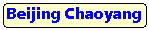
 New Line Display | If the label exceeds the maximum length, the system will display overlength texts in another line.|  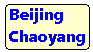
 Omit | If the label exceeds the maximum length, the system will omit the characters exceeded.| 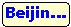

　　**Note**: If AlongLine Labeling is checked, this function isn't available.

- **Specify Line Break**: Click the right down button of the label control and select a symbol as a line break. The text label will show the newline characters. 
- **Length Limit**: The number of characters for a single line. An English word will not be broken even if the label is too long and needs to be wrapped. The whole world will be displayed at the end of the previous line. The Normal Length setting is only available if you choose to wrap the text to fit the or omit the part beyond the length limit.
- **Text Alignment**: If the the overlength processing type is set to wrap, you can set text alignment type here. Supported text alignment types are: center, align left, align right, and distributed.
- **Automatic Multiple Line Alignment after Avoiding**: Check this box, then you can make the text automatic alignment after avoiding.

**Label Height Range** 

- **Max Height**: The maximum height of a label. The label will not zoom in with the map if the label reaches the max height. 
- **Min Height**: The label will not zoom out with the map if the label reaches the min height. 

**Avoid Overlap Settings** 

- **Horizontal**: Filter out the labels within the horizontal buffer. The unit for Horizontal is identical to Offset Unit you specified.
- **Vertical**: Filter out the labels within the vertical buffer. The unit for Vertical Buffer is identical to Offset Unit you specified.
