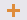
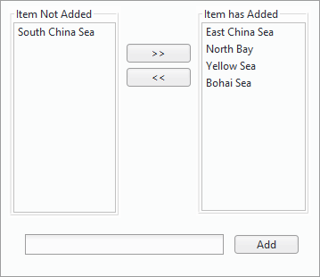

　　Right click a unique values map in the Layer Manager and click "Modify Thematic Map..." to pop up "Thematic Mapping" panel where you can modify the settings of parameters.

　　The parameters can be classified two categories: "Properties" and "Advanced" For more description on common parameters, please refer to [Create Thematic Map](CreatThematicMap.html).

### Properties

**visibility:**

-   Click  button to show or hide the objects corresponding with the selected thematic values.
-   Click the icon  in a item from the thematic values list to hide or show the object corresponding with the item.

**Style:**

　　The image button "Style" is used to set display styles of objects that attribute values are within corresponding range. Also you can click the style of the related item in the list to change corresponding objects' styles. For different kinds of objects, the functions for setting style are different.

　　You can choose one or more items from the list by holding Shift or Ctrl key and then click "Style" image button to view the "Modify Style in Bulk" dialog box. In the dialog box, you can modify the styles for the selected items. For details operation, please refer to [Modify Thematic Map](CreatThematicMap.html).

**Add or Delete:**

-   Add: Add one or more thematic values. Click  button to view a thematic value manager dialog box, where you can add or delete thematic values and add a new thematic value in the dialog box below. After the thematic value was added, the thematic list will update synchronously and corresponds to the modified thematic value.

   

-   Delete: Is used to delete the selected thematic values in the thematic list. Select the thematic value, and click the  button. After this thematic value was deleted, the object corresponding to the original thematic value will be displayed in the default styles.

**Reverse Color Scheme:**

-   Click  button, the color scheme will be adjusted in reverse order, that means the position of each color will be ordered in reverse order.

　　Besides, you are allowed to set the value and caption of the subitem.

-   **Unique Value:** Used to display and modify the value of the subitem. You are allowed to directly modify the value in the cell. If the specified value already exists, the setting will not be valid and the original value will be restored.
-   **Caption:** Used to display or modify the caption of the subitem. You are allowed to directly modify the value in the cell.

　　**Note**: The default style of the subitem is used to render items that have not specified styles.

### Advanced

　　"Offset Settings" area: Set the offset of point, line, region objects in a unique values map.
- **Offset Unit**: It is used to set the offset unit. The system provides two units for users to choose: Unit and 0.1 mm. Unit means the offset unit is identical to the unit of the map. 0.1mm represents the offset unit is 0.1 millimeter.
- **Offset X**:  It is used to set False Easting that the label is relative to its expressive object. You can directly input a value to set the offset, and also can choose a value field from this layer. This field can be the offset.
- **Offset Y**: It is used to set False Northing that the label is relative to its expressive object. You can directly input a value to set the offset, and also can choose a value field from this layer. This field can be the offset.

