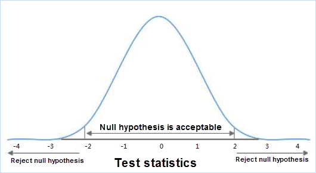
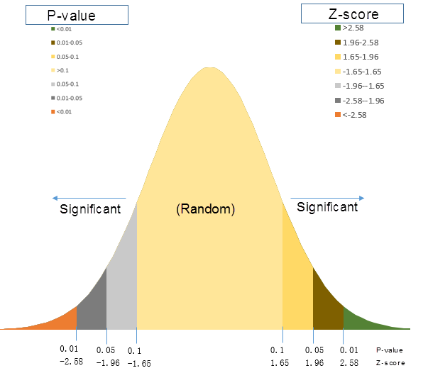

title: Basic Vocabulary of Spatial Statistical Analysis 
---
 
　　The theoretical basis of spatial statistical analysis is based on statistics, before using spatial statistical analysis function, learn some basic vocabulary and concepts of statistics is conducive to understand the spatial statistical analysis function.

### Null hypothesis

　　Statistical term, also known as the original hypothesis, refers to the presupposition established when conducting statistical tests. When the null hypothesis is established, the relevant statistics should be subject to the known probability distribution. When the calculated value of the statistic falls into the negative domain, the small probability event is known, and the original hypothesis should be negated. The null hypothesis in spatial statistical analysis is assumed to be spatial randomness, namely spatial random distribution of spatial data, or spatial random distribution of values associated with spatial data. As shown in the figure below, if your calculation falls somewhere between -2 and 2, your hypothesis is acceptable, but not in this range, indicating a small probability event.

　　

　　For example, a city in February there were N crime incidents, without any additional conditions, should be evenly distributed in each area of the city, this is the so-called "null hypothesis", in spatial statistics, the null hypothesis means the space position in a certain area present completely random distribution (uniform). Crime may also be a random distribution, some regions have not occurred, while others have occurred several times. We need to analyze the values of P and Z to determine whether we accept the null hypothesis or reject the null hypothesis.

### Gi_Pvalue

　　P is the probability, it reflects the probability of a particular event happening. In spatial statistical analysis, Gi_Pvalue indicates the probability that the observed spatial pattern is spatially random. When the Gi_Pvalue is very small, it is unlikely that the observed spatial pattern is generated in a random process (a small probability event), so the null hypothesis can be rejected.

### Gi_Zscore

　　Z is a multiple of the standard deviation. Standard deviation can reflect the dispersion degree of a data set. Both Gi_Zscore and Gi_Pvalue are associated with standard normal distribution. At both ends of the normal distribution, a very high or very low (negative) Gi_Zscore is associated with a very small Gi_Pvalue. When you run the analysis, we get very small Gi_Pvalue as well as very high or very low Gi_Zscore, suggests that the observed spatial pattern is unlikely to reflect the null hypothesis suggests a theoretical random pattern, which can reject the null hypothesis. The threshold value of Gi_Zscore and Gi_Pvalue is shown as below:

　　

### Gi_ConfInvls

　　Spatial statistical analysis uses inferential statistics, which will preestablish the "null hypothesis" in the process of statistical test, assuming that the related values between the elements or elements are presented as random spatial patterns.
　　The P value is used to represent the correct probability of the null hypothesis, to determine whether to accept the null hypothesis or reject the null hypothesis.
　　The Z score is used to represent a multiple of the standard deviation to determine whether the data is clustered, discrete, or random.
   The typical Gi_ConfInvl is 90%, 95% or 99%. For example, when calculating the results of P is less than 0.1, says there is a 10% chance of data is random, there is a 90% chance of clustering or discrete, the situation may refuse to "null hypothesis", think clustering or discrete characteristics of the data.

　　The following table shows the uncorrected critical p value and critical Gi_Zscore of different confidence values (which can be used to apply error detection rate (FDR) to use the corrected critical p value.These thresholds are equal to or less than the values shown in the table below).

 Gi_Zscore(Standard Deviations)|Gi_Pvalue(probability)|Gi_ConfInvl 
 :----------- | :--------- | :------------
 \*<-1.65 or\*>1.65 | \*<0.10   | 90% 
 \*<-1.96 or\*>1.96 | \*<0.05   | 95% 
 \*<-2.58 or\*>2.58 | \*<0.01   | 99% 

### Moran's I

　　Moran's I is an important metric for measuring spatial correlation. The Moran's I is a rational number, after the variance normalization, its value will be normalized to -1.0-1.0. Moran's I >0 indicates the positive correlation of space, and the larger the value, the more obvious the spatial correlation. Moran's I <0 indicates the negative correlation of space, the smaller the value, the larger the spatial difference. Otherwise, Moran's I = 0 means that space is random.

### The center of mass

　　The input dataset type of some spatial statistical analysis can be point, line or region. However, the actual space distance is used to calculate the space weight in the space relationship of inverse distance or fixed distance. So, for point, line, and region objects, its center of mass is used in the distance calculation. The object's center of mass is the weighted average center for all children. The weighted term of the point object is 1 (that is, the center of mass is itself), the weighted term of the line object is length, and the weighted term of the region object is the area.

### Its own weight

　　Spatial statistical analysis of certain functions allows users to provide a numeric field for their weight values. Its own weight is the distance or weight between the elements and their own. In normal cases, the weight value is 0. But in the case that the user specifies its own weight field, the value will replace itself in the calculation.

### Distance

　　There are two kinds of distance in spatial statistical analysis, which are Euclidean distance and Manhattan distance.

　　Euclidean distance is the most commonly used distance measurement method in rectangular coordinate system, the planar linear distance between two points, if the coordinates of two points respectively (x1, y1) and (x2, y2), the Euclidean distance calculation formula is:

　　

　　Manhattan distance is a different measurement method from European distance. The distance between two points is not a straight line, but a sum of the length of the axes. It is the sum of the distance of the projection of the axis generated by the line segment formed by the two points in the continental distance fixed rectangular coordinate system. The formula is:

　　

### Regression analysis

　　Regression analysis is a statistical analysis method to determine the quantitative relationship between two or more variables. Regression analysis can be divided into linear regression analysis and nonlinear regression analysis according to the relationship type between independent variables and dependent variables. If only one independent variable and one dependent variable are included, and the relationship of the two can be approximated by a straight line, this regression analysis is called linear regression analysis. If two or more independent variables are included, and the dependent variable and the independent variable are linear, it is called multiple linear regression analysis.

### Spatial weight matrix

　　Spatial weight matrix is a representation of data space structure. It is a quantification of the spatial relationship between the elements of a dataset (or, at least, a quantification of the conceptualization of such relationships). Because the spatial weight matrix has to impose a structure on the data, so should choose the most appropriate elements reflect the actual interaction between conceptualization (of course, also need to consider trying to measure objects). For example, if you want to measure the clustering of a particular species of seed in the forest, it might be best to use some form of inverse distance. However, assessing the geographic distribution of commuters in a particular area may be a better option for travel time and cost.

　　Although it depends on the physical implementation of various methods, the spatial weight matrix is the NxN table (N represents the number of elements in the dataset) conceptually. Each element has one row and one column. The pixel value of any given row/column combination is a weight that can be used to quantify the spatial relationship between these row elements and the column elements.

　　

###  Related Topics

　　 [Measuring geographic analysis](MeasureGeographicDistributions.html)

　　 [Cluster analysis](Clusters.html)

　　 [Modeling spatial relationships](SpatialRelationshipModeling.html)

　　 [Analyzing patterns](AnalyzingPatterns.html)

