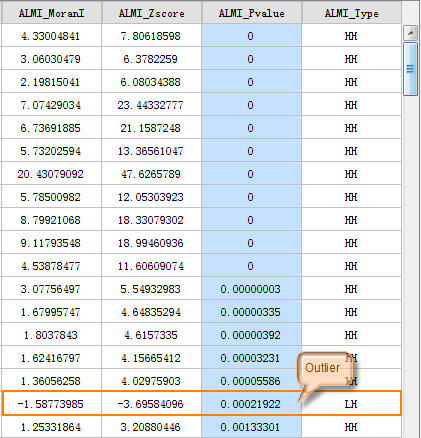

title: Cluster and Outlier Analysis
---

　　The cluster and outlier analysis can identify hot spots, cold spots and abnormal space values with crowding and significance. The weighted features are analyzed using Anselin Local Moran‘s I.

##### 　　Applications

- Where are the sharpest boundaries between affluence and poverty in a study area? 
- Are there locations in a study area with anomalous spending patterns? 
- Where are the unexpectedly high rates of diabetes across the study area? 

##### 　　Operating Instructions

　　Cross provides two functional entrances, as follows:

- Click "Spatial Analysis" tab > "Spatial Statistical Analysis" group > "Cluster Distributions" drop-down button > "Cluster and Outlier Analysis".
- Click "Model Builder" tab > "New" to open the "Toolbox" panel, then double-click the "Spatial Statistical Analysis" > "Cluster Distributions" > "Cluster and Outlier Analysis".

##### 　　Main Parameters
- **Source Dataset**: Set up the vector data sets to be analyzed, supports points, lines, and regions three types of datasets. 
- **Assessment Field**: Refers to a field that divides the analysis elements into categories. After classification, each group of objects has a central element. The Group Field can be of integer, date, or string type. Records with NULL values for the Group Field will be excluded from the analysis.
- **Concept Model**: Your choice for the Conceptualized Model should reflect inherent relationships among the features you are analyzing. The more realistically you can model how features interact with each other in space, the more accurate your results will be. 
  - Fixed Distance: It is suitable for point and region with large changes in region size.
  - Region Adjacent (Common Edges or Intersect): applicable to the data of adjacent side and intersection.
  - Region Adjacent (Adjacency Point, Common Edges or Intersect): applicable to the region data with adjacent points,adjacent sides and intersecting.
  - Inverse Distance: all features are regarded as adjacent features of all other features. All features affect the target features, but as distance increases, the effect is smaller, and the weight between the elements is one over the distance, which is applicable to continuous data.
  - Inverse Distance Square: similar to the "Inverse Distance Model", with the increase of distance, the influence decreases faster, and the weight between the features is one over the square of the distance.
  - k Nearest: The K features closest to the target features are contained in the calculation of the target features (the weight is 1), and the remaining features will be excluded from the target feature calculation (the weight is 0). This option is very effective if you want to ensure that you have a minimum number of contiguous features for analysis. This approach works well when the distribution of data changes in the study area so that some features are removed from all other features. When the proportion of fixed analysis is not as important as the number of fixed adjacent objects, k-nearest neighbor method is suitable.
  - Spatial Weight Matrix File: space weight matrix file is required. The spatial weight is a number that reflects the distance, time, or other cost of each feature and any other feature in the dataset. If you want to model the accessibility of city services, for example, to look for areas where urban crime is concentrated, it is a good idea to use the network to model spatial relationships. Before analyzing, create a spatial weight matrix file (.swm) using the generated network space weight tool, and then specify the full path of the SWM file created.
  - Undifferentiated Regional: The model is a combination of "Inverse Distance Model" and "Fixed Distance Model". Each feature is regarded as an adjacent feature of other features. This option is not suitable for large datasets. The features within the specified fixed distance range have equal weights (weights 1);In addition to the specified distance of fixed distance, the effect will be smaller as distance increases.
- **Break Distance Tolerance**: "-1" means to calculate and apply the default distance, which is to ensure that each element has at least one adjacent feature;" 0 "means that no distance is applied, and each feature is an adjacent feature. Non-zero positive values are adjacent features when the distance between the features is smaller than this value.
- **Inverse Distance Power Exponent**: The higher the exponent, the higher the power value, the smaller the exponential effect.
- **Number of Adjacent Features**: Set a positive integer, indicating that the nearest K features around the target features are adjacent features.
- **Measure Distance Method**: Currently, only Euclidean distance calculation is supported, namely the linear distance between two elements.
- **Spatial Weights Matrix Standardization**: When the distribution of elements is likely to deviate due to sampling design or the aggregation scheme imposed, the use of the line standardization is recommended. When you select the row normalization, each weight is divided by the sum of the rows(The sum of the weights of all adjacent features). The normalized weights are usually used in combination with the fixed distance adjacent features and are almost always used for the adjacent features of the adjacent side. This can reduce the deviation caused by the different number of adjacent features. Line standardization takes ownership weights, making them between 0 and 1, creating relative (rather than absolute) weight solutions.
Whenever you want to handle the region features that represent administrative boundaries, you might want to choose the "line standardization" option.
- **Whether FDR correction is conducted**:If the FDR (false discovery rate) is corrected, the statistical significance will be based on the false discovery rate correction, otherwise the statistical significance will be based on the p-value and z-score fields.
- **Self Weight Field**:Set up the distance weight value, only supports numeric fields.
- **Retention Statistics Fields**:Refers to the retention field that sets the result data in the field list box, and the calculation of the field value.The fields shown in the list are the fields that are reserved for the resulting data, and the fields can be used to remove, add, select, and reverse, and select the field to set the statistical type of its retention value.
- **Result Settings**:Set up the datasource for the result data and the dataset name.　　

##### 　　Results Output

　　The result dataset of Cluster and Outlier Analysis will include four property fields: local Moran‘s I, Gi_Zscore and Gi_Pvalue, clustering and outlier value types, respectively ALMI_MoranI, ALMI_Zscore, ALMI_Pvalue, ALMI_Type four fields. As shown in the figure below:

　　

- Because the analysis of clustering and outliers is based on 95% of the confidence level, therefore, the value is only in the ALMI_Type field when the P-value is less than 0.05. If the false discovery rate (FDR) correction, statistical significance to correction of confidence threshold (p-value reduced to a new value from 0.05) as the foundation, to juggle multiple tests and spatial dependence.

- On the premise of P-value is less than 0.05, where the Moran's I is greater than 0, displays high or low value clustering, and the ALMI_Type field value is HH or LL; where the Moran's I is less than 0, displays outliers, and the ALMI_Type field value is HL or LH.

- When the P value is less than 0.05, the Z-score is higher and positive, indicating that the surrounding features have similar values (high or low). The value of high value clustering ALMI_Type field is HH, and the value of low value clustering ALMI_Type field is LL. When z-score is lower and negative, it indicates that there is a spatial data outlier with statistical significance. The value of ALMI_Type field is HL when the low value around the high value,  while the value of ALMI_Type field is LH when the high value around the low value.

  Below for Pakistan and Afghanistan, for example, the results of the analysis of the terrorist attacks in 2014-2016, the figure in the orange area for high value clustering, green areas for low clustering, blue area for outliers.

  

###  Related Topics

　　[Hot spot analysis](HotSpotAnalyst.html)

　　[Analyzing patterns](AnalyzingPatterns.html)

