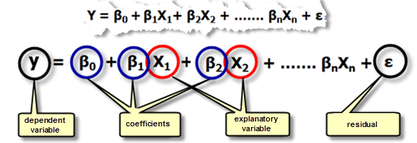
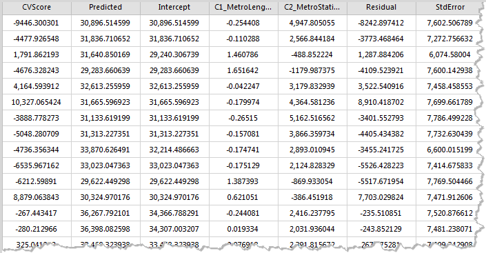
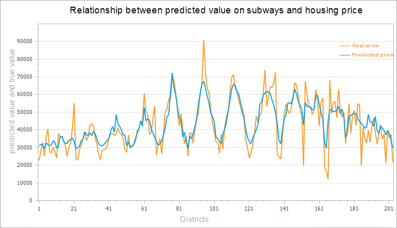
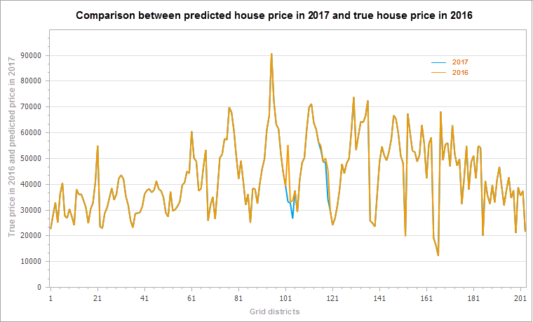

title: Geographically Weighted Regression Analysis  
---

　In addition to the analysis of spatial patterns, GIS analysis can be used to explore or quantify relationship between features. The Modeling Spatial Relationships tools model spatial relationships using regression analyses, allowing you to make predictions for unknown values or to better understand key factors influencing a variable you are trying to model. 

​    The following types of questions can be solved: why does a phenomenon continue to occur, and what factors contribute to this situation? Modeling a phenomenon to predict other locations or other time values?

### 

　　Geographically Weighted Regression is a new method of spatial analysis proposed in recent years, which is a local regression model. By embedding spatial structure into linear regression model, it probes into the nonstationarity of spatial relationship. Regression analysis allows you to model, examine, and explore spatial relationships and can help explain the factors behind observed spatial patterns, can also the forecast of these phenomena.

##### 　　How Geographically Weighted Regression Analysis works

　　Geographically Weighted Regression (GWR) is one of several spatial regression techniques increasingly used in geography and other disciplines. GWR provides a local model of the variable or process you are trying to understand/predict by fitting a regression equation to every feature in the dataset. GWR constructs these separate equations by incorporating the dependent and explanatory variables of features falling within the bandwidth of each target feature. The shape and size of the bandwidth is dependent on user input for the Kernel type, Bandwidth method, Distance, and Number of neighbors parameters. IT is a local form of linear regression for modeling space change relations.

　　Geographical weighted regression equation is the mathematical formula applied to the explanatory variables to best predict the dependent variable you are trying to model. Unfortunately for those in the geosciences who think of x and y as coordinates, the notation in regression equations for the dependent variable is always **y** and for the independent or explanatory variable is always **X**. Each independent variable is associated with a regression coefficient describing the strength and the sign of that variable's relationship to the dependent variable. A regression equation might look like this (y is the dependent variable, the Xs are the explanatory variables, and the βs are regression coefficients.

　　

　　Geographical weighted regression analysis should first identify a study area. Calculate the decay function by using the different space position of each feature. The decay function is a continuous function. Decay function with this, when you put every feature of spatial location (typically coordinate information (x, y)) and the value of the features into this function, you can get a weight value (β). This value can be brought into the regression equation. The W (UI, vi) in the decay function is the spatial weight matrix.

　　

##### 　　Applications

　　Regression analysis is widely used to explain market share, sales, brand preference and marketing effect. To express the relationship between two or more fixed distance or proportional quantities is to solve the problem of regression analysis. Some of the application examples include:

-  Modeling high school retention rates to better understand the factors that help keep kids in school.
-  Modeling traffic accidents as a function of speed, road conditions, weather, and so forth, to inform policy aimed at decreasing accidents.
-  Modeling property loss from fire as a function of variables such as degree of fire department involvement, response time, or property values. If you find that response time is the key factor, you might need to build more fire stations. If you find that involvement is the key factor, you may need to increase equipment and the number of officers dispatched.

##### 　　Operating Instructions

　　Cross provides two functional entrances, as follows:

- Click "Toolbox" - "Spatial Statistical Analysis" - "Modeling Spatial Relationships" - "Geographically Weighted Regression Analysis" in the menu bar, and the "Geographically Weighted Regression Analysis" dialog box will pop up.
- In the "Visual Modeling" panel, double-click the "Spatial Statistical Analysis"-"Modeling Spatial Relationships"-"Geographically Weighted Regression Analysis", and the "Geographically Weighted Regression Analysis" dialog box will pop up.

##### 　　Main Parameters

- **Input Feature**:Set up the vector data sets to be analyzed, supports points, lines, and regions three types of datasets. Note: the number of objects in the source data is greater than 20.
- **Explain Field**:The explanatory variable is the independent variable, which is the X in the regression equation, which is used to model or predict the value of the dependent variable. For example, we want to study a number of reasons for obesity, to find out whether obesity is related to income, healthy food intake, or education levels. In this example, obesity is the dependent variable (Y), income, healthy food intake, education level and some other factors are the explanatory variables (X).
- **Kernel Type**:The kernel type is the calculation function type that sets the distance between two points. The following five kernel function types are supported: W_ij is the weight between point I and point j. D_ij is the distance between point I and point j, and b is the bandwidth range.
  - Secondary Kernel Function:if d_ij≤b，W_ij=(1-(d_ij/b)^2))^2； Otherwise W_ij = 0.
  - Box Kernel Function:if d_ij≤b， W_ij=1；Otherwise W_ij=0。
  - Gaussian Kernel Function:calculation formula is W_ij=e^(-((d_ij/b)^2)/2).
  - Cube Kernel Function:if d_ij≤b, W_ij=(1-(d_ij/b)^3))^3;Otherwise W_ij=0.
- **Modeling Field**:Dependent variables, which are variables to be studied and predicted, only support numeric fields.
- **Bandwidth Method**:Sets the way to determine the scope of the analysis bandwidth. Supports the following three types of determination:
  - Akaike Information Criterion(AICC):The use of the Akaike information criterion (AICc) determines the bandwidth range for use in cases where the number of parameters is not determined or adjacent.
  - Cross Validation:Cross validation is used to determine the bandwidth scope, and cross-validation does not include the regression point itself when the regression coefficients are estimated, namely, the regression calculation is performed based on the data points around the regression point. This value is the difference between the estimated value and the actual value of each regression point in the cross validation, and their sum of squares is the CV value.Applies to the number of parameters that are not specified distance or adjacent elements.
  - Fixed Distance or Adjacent Number:To determine the bandwidth range based on fixed distance or fixed adjacent number, the number of distance or adjacent features must be set.
- **Bandwidth Type**:There are two types of fixed bandwidth and variable bandwidth:
  - Fixed Bandwidth:If the user chooses bandwidth type is fixed distance or number of neighbors, then a "bandwidth range" is required to specify a fixed distance. If the user chooses the bandwidth method as AICC or cross validation, the user does not need to specify the distance, and the program can calculate a fixed distance value according to the data.
  - Variable Bandwidth:If the user chooses bandwidth is fixed distance or number of neighbors, the number of neighbors is set. The application will be the range of the bandwidth between the return point and the nearest neighbors point.I f the user selected bandwidth is AICC or cross validation, the user does not need to specify the number of neighbors, the program can find neighbors points according to the data and calculate a fixed distance value.
- **Result Setting**:Set up the datasource for the result data and the dataset name.

##### 　　Results Output

　　After setting up the above parameters, click the "Run" button in the dialog box to perform the Geographically Weighted Regression Analysis. Results dataset contains property fields: cross validation (CVScore), the Predicted values (Predicted), regression coefficient (Intercept, C1 / _ the name of the Explain Field), Residual (Residual), standard error (StdError), coefficient of standard error (SE / _Intercept, SE1 / _ the name of the Explain Field), pseudo t value (TV_Intercept, TV1_ the name of the Explain Field) and the Studentised Residual (StdResidual).As shown in the figure below:

　　

- Cross Validation(CVScore):This value is the difference between the estimated value and the actual value of each regression point in the cross validation, and their sum of squares is the CV value, as a model performance indicator.

- Predictive Value(Predicted):These values are estimates (or fitting values) of geographical weighted regression.

- Regression Coefficient(Intercept):It is the regression coefficient of the geographical weighted regression model and the regression intercept of the regression model, indicating that all explanatory variables are the predicted values of the zero time dependent variables.

- Regression Coefficient（C1_ _the name of the Explain Field）:It is the regression coefficient of the explain field, indicating the relationship strength and type between the variables and the dependent variables. If the regression coefficient is positive, the relationship between variables and dependent variables is positive. Conversely, there is a negative relationship. If the relationship is strong, the regression coefficient is relatively large.When the relationship is weak, the regression coefficient is close to 0.

- Residual（Residual）:These are the parts that the dependent variable cannot explain, the difference between the estimate and the actual value. The mean value of the normalized residuals is 0, and the standard deviation is 1. The residual error can be used to determine the fitting degree of the model, and the residual difference indicates that the fitting effect of the model is better, which can explain the majority of predicted values, indicating that the regression equation is valid.

- Standard Error(StdError):The standard error of estimates is used to measure the reliability of each estimate. The smaller standard error indicates that the smaller the difference between the fitting value and the actual value, the better the fitting effect of the model.

- Standard Error of Coefficient（SE_Intercept、SE1_ _the name of the Explain Field）:These values are used to measure the reliability of each regression coefficient estimate. The standard error of the coefficient is compared to the actual coefficient, and the estimate is more reliable. The larger standard error may indicate the existence of local multiple co-linear problems.

- Pseudo T value(TV_Intercept、TV1_ _the name of the Explain Field):It is the significance test for each regression coefficient. When the T value is greater than the critical value, the null hypothesis is rejected, and the regression coefficient is significant, that is, the regression line estimate is reliable. When the T value is less than the critical value, the null hypothesis is accepted and the regression coefficient is not significant.

- Studentised Residual（StdResidual）:The ratio of residual and standard errors can be used to determine whether the data is abnormal. If the data is in the interval (-2, 2), it indicates that the data has normal and variance homogeneity. If the data exceeds the interval (-2, 2), it indicates that the data is abnormal data, without variance homogeneity and normality.

  　　The figure below is a comparison between the predicted value of the geographical weighted regression analysis and the actual value. According to the housing price in downtown Beijing in 2016, the number of subway stations around the city and the length of subway lines are explained to simulate the housing prices in downtown Beijing in 2016. The orange line in the figure below is the real house price, and the blue line is the fitting house price.

　　

　　After successful execution, the output window will output the results of this analysis. If the result of the analysis is in the user's acceptance range, the results can be predicted according to the results and explanatory variables.

　　At this point, according to the attribute values of geographically weighted regression analysis in the results and the new subway stations and subway lines in 2017, to estimate the center of Beijing city house prices in 2017, the calculation formula is: 2017 forecast prices = Intercept (regression coefficient) + C1 (regression coefficient of explain field 1) * 2017 subway station + C2 (regression coefficient of explain field 2) x 2017 subway line length. According to the change information of the subway, the housing price of Beijing central city will be predicted in 2017, as shown in the figure below. As can be seen from the result chart, the housing price has a certain fluctuation in the change of the subway line.

　　

###  Related Topics

　　 [Basic vocabulary](BasicVocabulary.html)

　　 [Measuring geographic analysis](MeasureGeographicDistributions.html)

　　 [Cluster analysis](Clusters.html)

　　 [Analyzing patterns](AnalyzingPatterns.html)

