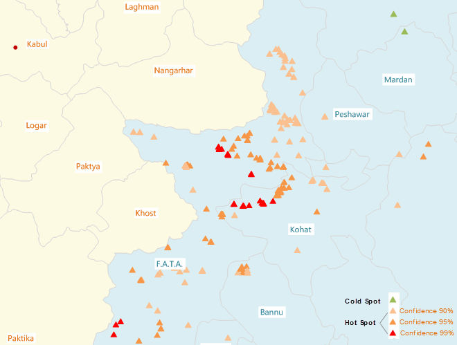

title: Hot Spot Analysis
---

　　The hot spot analysis is given a set of weighted features, using the local General G index, and statistical identification of hot spots and cold spots with statistical significance. Hot spot analysis looks at every feature of a neighboring feature environment. Therefore, only an isolated high value does not constitute a hot spot,a single feature and its neighbors are high values.

##### 　　How Hot Spot Analysis works

　　When measuring high low value clustering, the General G index is usually used. In the hot-spot analysis tool, Gi_Zscore and Gi_Pvalue are statistically significant measures to determine whether or not to reject the null hypothesis by feature. The features in the confidence interval (Gi_Bin field) +3 to -3 reflect the statistical significance of the Gi_ConfInvl of 99%. The features in the confidence interval +2 to -2 reflect the statistical significance of the Gi_ConfInvl of 95%. The features in the confidence interval +1 to -1 reflect the statistical significance of the Gi_ConfInvl of 90%. The clustering of the features in the confidence interval 0 was not statistically significant.

　　If the feature's Gi_Zscore is high and the Gi_Pvalue is small, then there is a high value spatial clustering. If Gi_Zscore is low and negative and Gi_Pvalue is small, then there is a low value spatial clustering. The higher the Gi_Zscore (or lower), the greater the clustering degree. If Gi_Zscore is close to zero, there is no obvious spatial clustering.

##### 　　Applications

　　Applications can be found in crime analysis, epidemiology, voting pattern analysis, economic geography, retail analysis, traffic incident analysis, and demographics. Some examples include the following:

- Where is the disease outbreak concentrated? 
- Where are kitchen fires a larger than expected proportion of all residential fires?
- Where should the evacuation sites be located?
- Where/When do peak intensities occur?
- Which locations and at during what time periods should we allocate more of our resources?

##### 　　Operating Instructions

　　Cross provides two functional entrances, as follows:

- Click "Spatial Analysis" - "Spatial Statistical Analysis" - "Cluster Analysis" - "Hot Spot Analysis", and the "Hot Spot Analysis" dialog box will pop up.
- Click "New" in the "Model Builder" tab, then the "ToolBoxs" panel will show up. In the panel, choose the "Spatial Statistical Analysis"-"Cluster Analysis"-"Hot Spot Analysis", and the "Hot Spot Analysis" dialog box will pop up.

##### 　　Main Parameters

- **Input Feature**:Set up the vector data sets to be analyzed, supports points, lines, and regions three types of datasets. 
- **Assessment Field**:Select the property field for the analysis variable. The value of this field should be multiple values, and if all of the properties of the object have a value of 1, then it cannot be solved. Only numeric fields are supported.
- **Conceptualized Model**:Your choice for the Conceptualized Model should reflect inherent relationships among the features you are analyzing. The more realistically you can model how features interact with each other in space, the more accurate your results will be. 
  - Fixed Distance Model:applicable to point and region with large changes in region size.
  - Region Adjacency Model (co-side, intersecting):applicable to the data of adjacent side and intersection.
  - Region Adjacency Model (adjacency point, cop-edge, intersecting):applicable to the region data with adjacent points,adjacent sides and intersecting.
  - Inverse Distance Model:all features are regarded as adjacent features of all other features. All features affect the target features, but as distance increases, the effect is smaller, and the weight between the elements is one over the distance, which is applicable to continuous data.
  - Inverse Distance Square Model:similar to the "Inverse Distance Model", with the increase of distance, the influence decreases faster, and the weight between the features is one over the square of the distance.
  - k-Nearest Neighbor Model:The K features closest to the target features are contained in the calculation of the target features (the weight is 1), and the remaining features will be excluded from the target feature calculation (the weight is 0). This option is very effective if you want to ensure that you have a minimum number of contiguous features for analysis. This approach works well when the distribution of data changes in the study area so that some features are removed from all other features. When the proportion of fixed analysis is not as important as the number of fixed adjacent objects, k-nearest neighbor method is suitable.
  - Spatial Weight Matrix: space weight matrix file is required. The spatial weight is a number that reflects the distance, time, or other cost of each feature and any other feature in the dataset. If you want to model the accessibility of city services, for example, to look for areas where urban crime is concentrated, it is a good idea to use the network to model spatial relationships. Before analyzing, create a spatial weight matrix file (.swm) using the generated network space weight tool, and then specify the full path of the SWM file created.
  - Non-Differentiated Regional Model:The model is a combination of "Inverse Distance Model" and "Fixed Distance Model". Each feature is regarded as an adjacent feature of other features. This option is not suitable for large datasets. The features within the specified fixed distance range have equal weights (weights 1);In addition to the specified distance of fixed distance, the effect will be smaller as distance increases.
- **Interrupt Distance Tolerance**:"-1" means to calculate and apply the default distance, which is to ensure that each element has at least one adjacent feature;" 0 "means that no distance is applied, and each feature is an adjacent feature. Non-zero positive values are adjacent features when the distance between the features is smaller than this value.
- **Inverse Distance Power Exponent**:The higher the exponent, the higher the power value, the smaller the exponential effect.
- **Number of Adjacent Features**:Set a positive integer, indicating that the nearest K features around the target features are adjacent features.
- **Distance Method**:Currently, Euclidean distance is supported by the linear distance between two elements.
- **Whether FDR correction is conducted**:If the FDR (false discovery rate) is corrected, the statistical significance will be based on the false discovery rate correction, otherwise the statistical significance will be based on the Gi_Pvalue and Gi_Zscore fields.
- **Self Weight Field**:Set up the distance weight value, only supports numeric fields.
- **Retention Statistics Fields**:Refers to the retention field that sets the result data in the field list box, and the calculation of the field value.The fields shown in the list are the fields that are reserved for the resulting data, and the fields can be used to remove, add, select, and reverse, and select the field to set the statistical type of its retention value.
- **Result Setting**:Set up the datasource for the result data and the dataset name.

##### 　　Results Output

　　After setting up the above parameters, click the "Run" button in the dialog box to perform the Hot Spot Analysis. The graph below shows the hot spot analysis results of the terrorist attacks in Pakistan. The orange and red spots in the picture are hot spots. The green points are the cold points.

　　

　　The result dataset returned by hotspot analysis will contain four attribute fields: Gi_Zscore and Gi_Pvalue, Gi_ConfInvl, Gi_ConfInvl. 

　　If the feature's Gi_Zscore is high and the Gi_Pvalue is small, then there is a high value spatial clustering. If Gi_Zscore is low and negative and Gi_Pvalue is small, then there is a low value spatial clustering. The higher the Gi_Zscore (or lower), the greater the clustering degree. If Gi_Zscore is close to zero, there is no obvious spatial clustering.

　　In the premise of spatial aggregation, Gi_Zscore is negative, which indicates that the place is a cold spot and the corresponding Gi_ConfInvl field is negative. The Gi_Zscore is positive, indicating that the place is a hot spot, and the corresponding Gi_ConfInvl field is positive.

　　The Gi_ConfInvl field identifies the hot and cold spots of statistical significance. The features of Gi_ConfInvl for +3 to -3 reflect the statistical significance of the Gi_ConfInvl of 99%. The features of Gi_ConfInvl for +2 to -2 reflect the statistical significance of the Gi_ConfInvl of 95%. The features of Gi_ConfInvl for +1 to -1 reflect the statistical significance of the Gi_ConfInvl of 90%. The clustering of the features of Gi_ConfInvl for 0 was not statistically significant.

　　The following table shows:

|   Gi_Zscore(Standard Deviations)    | Gi_Pvalue(probability) | Gi_ConfInvl  | Gi_ConfInvl value |
| :------------: | :-----: | :--: | :-----------: |
| <-1.65 or >1.65 |  <0.10  | 90%  |    -1 , 1     |
| <-1.96 or >1.96 |  <0.05  | 95%  |    -2 , 2     |
| <-2.58 or >2.58 |  <0.01  | 99%  |    -3 , 3     |

###  Related Topics

　　[Cluster and outlier analysis](ClusterOutlierAnalyst.html)

　　[Optimized hot spot analysis](OptimizedHotSpotAnalyst.html)

　　[Analyzing patterns](AnalyzingPatterns.html)

