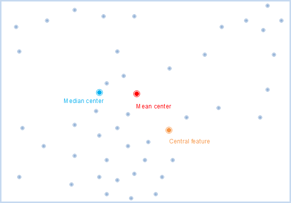

title: Median Center
---

　　The median center function can be used to find the point that minimizes the total Euclidean distance between all the elements. The result is a new point, not an object in the source data.

　　Mean center and median center are central trend measurements. However, in comparison, the median center is less sensitive to extreme values than the mean center. For example, the results of the calculation of the mean center of the compact cluster point are somewhere in the center of the cluster. If you add a new point away from the cluster and redo the mean center, you will notice that the result will be close to the new outlier. If you want to perform the same test using the median center tool, you will find that the new outliers have significantly less impact on the result location.

  The median center and the central feature are all the points that look for the least distance of the other features. The difference is that the result of the calculation of the central feature must be an original sample of the element sample. The median center, which is calculated, can be not one of the original feature, but it can generate a new position.​

##### 　　Operating Instructions

　　Cross provides two functional entrances, as follows:

- Click "Spatial Analysis" tab > "Spatial Statistical Analysis" group > "Measuring Geographic Distributions" > "Median Center".
- Click "Model Builder" > "New" to open "Toolbox" panel, double-click the "Spatial Statistical Analysis" > "Measuring Geographic Distributions" > "Median Center", and the "Median Center" dialog box will pop up.

##### 　　Main Parameters
- **Source Dataset**:Set up the vector data sets to be analyzed, supports points, lines, and regions three types of datasets. If it is a line or region object, the center of mass of the object is calculated, the weight of the point is 1, the weight of the line is the length of the line, and the weight of the region is the area.
- **Group Field**:Refers to a field that divides the analysis elements into categories. After classification, each group of objects has a central element. The Group Field can be of integer, date, or string type. Records with NULL values for the Group Field will be excluded from the analysis.
- **Weight Field**:Refers to the weighting of each element to other elements. After setting the weight field, the distance is D = W1 x D, where W1 is the weight value and D is the distance between the two elements.
- **Keep Statistics Field**:Refers to the retention field that sets the result data in the field list box, and the calculation of the field value.The fields shown in the list are the fields that are reserved for the resulting data, and the fields can be used to remove, add, select, and reverse, and select the field to set the statistical type of its retention value.
- **Result Settings**:Set up the datasource for the result data and the dataset name.

　　After setting up the above parameters, click the "Run" image button in the dialog box to perform the Median Center analysis. As shown in the figure below, the blue point is the median center of the mall.

　　

###  Related Topics

　　 [Central feature](CentralFeature.html)

　　 [Mean center](MeanCenter.html)

　　 [Directional distribution](MeasureDirection.html)

　　 [Linear directional mean](MeasureLinearDirectional.html)

　　 [Standard distance](MeasureStandardDistance.html)

