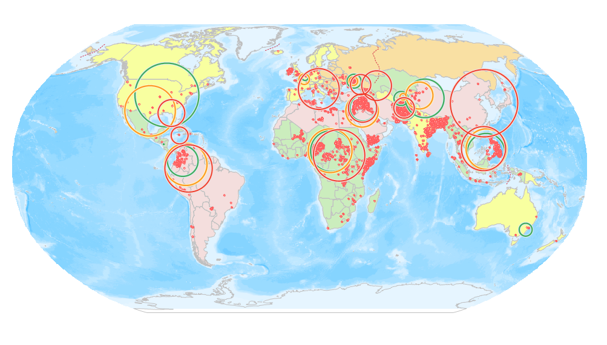

title: Standard Distance
---

　　Measures the degree to which features are concentrated or dispersed around the geometric mean center. The result data is a circle, which is the center of the mean center of all sample data, and the standard distance of all data is a circle of radius. As a result, the circle represents the concentration of all data on the average center, the smaller the radius, the higher the concentration.

##### 　　Applications

- You can use the values for two or more distributions to compare them. A crime analyst, for example, could compare the compactness of assaults and auto thefts. Knowing how the different types of crimes are distributed may help police develop strategies for addressing the crime. If the distribution of crimes in a particular area is compact, stationing a single car near the center of the area might suffice. If the distribution is dispersed, having several police cars patrol the area might be more effective in responding to the crimes.
- You can also compare the same type of feature over different time periods—for example, a crime analyst could compare daytime and nighttime burglaries to see if burglaries are more dispersed or more compact during the day than at night.
- You can also compare the distributions of features to stationary features. For example, you could measure the distribution of emergency calls over several months for each responding fire station in a region and compare them to see which stations respond over a wider area.

##### 　　Operating Instructions

　　Cross provides two functional entrances, as follows:

- Click "Spatial Analysis" tab > "Spatial Statistical Analysis" > "Measuring Geographic Distributions" > "Standard Distance".
- Click the "Model Builder" tab > "New" button to open the "Toolbox" panel, then double-click the "Spatial Statistical Analysis"-"Measuring Geographic Distributions" > "Standard Distance" to open the "Standard Distance" dialog box.

##### 　　Main Parameters
- **Source Dataset**:Set up the vector data sets to be analyzed, supports points, lines, and regions three types of datasets.
- **Ellipse Size**:Set up the level of the result ellipse, according to the data contained in the results, the range of data is divided into three levels, different standard deviation levels, and the resulting center points will be different.
  - One Standard Deviation: the result range of the first level standard deviation can be included in the source data center of about 68%.
  - Two Standard Deviations: the result range of the second standard deviation can be included in the data center of about 95%.
  - Three Standard Deviations: the result range of the third standard deviation can be included in the data center of about 98%.
- **Group Field**:Refers to a field that divides the analysis elements into categories. After classification, each group of objects has a central element. The Group Field can be of integer, date, or string type. Records with NULL values for the Group Field will be excluded from the analysis.
- **Weight Field**:Set up a numeric field for weight, for example: with the death toll from the terrorist attack as weight field, the results according to the severity of the attacks reflect the spatial distribution of the event.
- **Keep Statistics Fields**:Refers to the retention field that sets the result data in the field list box, and the calculation of the field value.The fields shown in the list are the fields that are reserved for the resulting data, and the fields can be used to remove, add, select, and reverse, and select the field to set the statistical type of its retention value.
- **Result Settings**:Set up the datasource for the result data and the dataset name.

##### 　　Results Output

　　The result circle represents the discrete or aggregation degree of the sampled data in the mean center. The graph below shows the results of the standard distance, which compares the dispersion degree of terrorist attacks in different regions in 2014, 2015 and 2016, and the change of center point of terrorist attacks. The green, orange and red colors in the picture are respectively indicated in 2014, 2015 and 2016. Taking South America as an example, the comparison shows that the terrorist attacks in 2015 were larger than that of 2014, and the dispersion degree of 2016 was larger than that of 2015, indicating that the area of the terrorist attack was larger.

　　　　

###  Related Topics

　　 [Central feature](CentralFeature.html)

　　 [Mean center](MeanCenter.html)

　　 [Median center](MeanCenterResult.html)

　　 [Directional distribution](MeasureDirection.html)

　　 [Linear directional mean](MeasureLinearDirectional.html)
