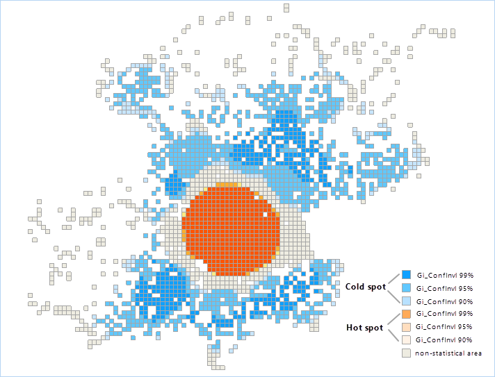
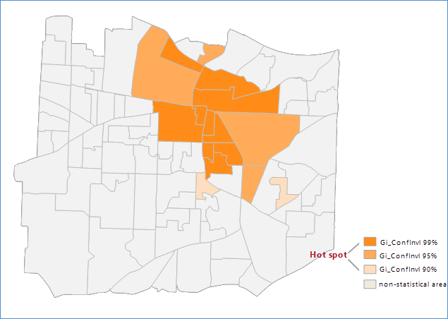

title: Optimized Hot Spot Analysis
---

　　Optimized Hot Spot Analysis uses the parameters derived from the characteristics of input data to perform Hot Spot Analysis, and reflects the distribution of hot spots and cool spots. Such as: given incident points and weight features, analyzes the distribution of incident points to generate optimal cold and hot spot analysis result.

##### 　　How the feature works

　　According to the input features, optional assessment fields, regions with incident points, aggregation methods, analyses whether an incident point locate a hot spot region or a cold spot region. The result dataset includes: Counts, Gi_Zscore, Gi_Pvalue, Gi_ConfInvl, for details, please reference [Hot Spot Analysis](HotSpotAnalyst.html).

　　The supported incident data can be points, lines or regions. Provides four aggregation methods, and the required minimum number for every method is as follows: 

 Minimum Number of Incidents  |Aggregation Way     | Minimum Number of Features After Aggregation
 :----------- | :--------- | :------------
 60 | Grid region, without providing the boundary data of the region where incidents are possible  | 30 
 30 | Grid region, providing the boundary data of the region where incidents are possible   | 30 
 30 | Polygon, calculating incident points within the setting aggregation region | 30 
 60 | Calculating the snapping distance to aggregate incidents nearby   | 30 

##### 　　Applications

　　The feature is used to identify the spatial cluster with statistically significant high values (hot spots) and low value (cold spots). It can aggregate incident data automatically, identify an appropriate analyzing scale, and correct multiple testing and spatial dependence. The tool queries data to determine the settings which will be used to generate optimal hot spot analysis results. If you want to full control the settings, the Hot Spot Analysis should be adopted.

##### 　　Operating Instructions

　　Cross provides two functional entrances, as follows:

- Click "Spatial Analysis" - "Spatial Statistical Analysis" - "Cluster Analysis" - "Optimized Hot Spot Analysis", and the "Optimized Hot Spot Analysis" dialog box will pop up.
- Click "New" in the "Model Builder" tab, then the "ToolBoxs" panel will show up. In the panel, choose the "Spatial Statistical Analysis"-"Cluster Analysis"-"Optimized Hot Spot Analysis", and the "Optimized Hot Spot Analysis" dialog box will pop up.

##### 　　Main Parameters

- **Source Dataset**: Set a vector dataset (point, line or region) to execute Optimized Hot Spot Analysis.
- **Assessment Field**: The parameter must be set for a line or region dataset, but not necessary for a point dataset. If an assessment field was given, the Hot Spot Analysis can be executed directly. However, if the value is not given, aggregates all incident points with the specified aggregation method to get count, the Hot Spot Analysis can be performed by taking the count as an analysis field.
- **Aggregation Method**: The following three aggregation methods apply only to point dataset.
  - Grid Polygon: Calculates an appropriate grid size and create a grid region dataset according to the densities of incident points. Takes the count of points within a grid cell as an analyzing field to execute the Hot Spot Analysis. The grids will overlay the input incident points and the number of points per grid cell will be calculated. if the bounding region data has been provided, the grid cells within the bounding region will be retained and analyzed. But if the bounding region data has not been provided, polygon can be generated according to the input incident point dataset, the polygons without any points will be removed.
  - Aggregation Polygon: A region dataset is required for recording the number of incidents. Calculates number of points within every region object, and then execute the Hot Spot Analysis to the region dataset taking the number of points as an analysis field.
  - Aggregation Point: Calculates the snapping distance for an incident point dataset and aggregates neighbor incident points using the distance. Provides a point count for every aggregation point, and then executes the Hot Spot Analysis using the number of incident points as an analysis field.
- **Incident Bounding Dataset**: Takes a region dataset as a bounding region dataset of incident point regions
- **Result Settings**: Set a datasource and a dataset to preserve the results.

##### 　　Results Output

　　Click "Run" image button, the Optimized Hot Spot Analysis will be done. Following picture shows the analysis result map about the positions of logging in Weibo in Beijing. The orange section represents the hot spot area, the blue points represents the cold spot area, and the tawny parts mean non-statistical area.

　　

　　When setting the aggregation method to aggregation polygon, the result of performing Optimized Hot Spot Analysis for the number of calling 911 within a region is shown as follows, the orange parts are the hot spot area, the blue parts represents the cold spot area, and the tawny parts mean non-statistical area.

　　

　　There are four property fields included in the result dataset: Counts, Gi_Zscore, Gi_Pvalue, Gi_ConfInvl, Gi_ConfInvl.

　　Counts records number of points within a correspoding analysis region. If the feature's Gi_Zscore is high and the Gi_Pvalue is small, then there is a high value spatial clustering. If Gi_Zscore is low and negative and Gi_Pvalue is small, then there is a low value spatial clustering. The higher the Gi_Zscore (or lower), the greater the clustering degree. If Gi_Zscores are close to zero, there is no obvious spatial clustering.

　　In the premise of spatial aggregation, Gi_Zscore is negative, which indicates that the place is a cold spot area and the corresponding Gi_ConfInvl field is negative. The Gi_Zscore is positive, indicating that the place is a hot spot area, and the corresponding Gi_ConfInvl field is positive.

　　The Gi_ConfInvl field identifies the hot and cold spots of statistical significance. The features of Gi_ConfInvl for +3 to -3 reflect the statistical significance of the confidence level of 99%. The features of Gi_ConfInvl for +2 to -2 reflect the statistical significance of the confidence level of 95%. The features of Gi_ConfInvl for +1 to -1 reflect the statistical significance of the confidence level of 90%. The clustering of the features of Gi_ConfInvl for 0 was not statistically significant.

　　The following table shows:

|   Gi_Zscore(Standard Deviations)    | Gi_Pvalue(probability) | Gi_ConfInvl  | Gi_ConfInvl value |
| :------------: | :-----: | :--: | :-----------: |
| <-1.65 or >1.65 |  <0.10  | 90%  |    -1 , 1     |
| <-1.96 or >1.96 |  <0.05  | 95%  |    -2 , 2     |
| <-2.58 or >2.58 |  <0.01  | 99%  |    -3 , 3     |

###  Related Topics

　　[Cluster and outlier analysis](ClusterOutlierAnalyst.html)

　　[Hot spot analysis](HotSpotAnalyst.html)

　　[Analyzing patterns](AnalyzingPatterns.html)

