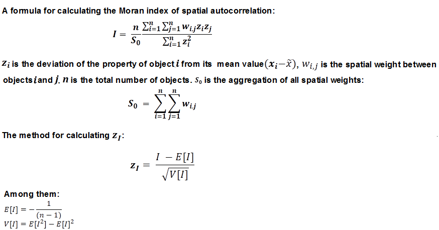
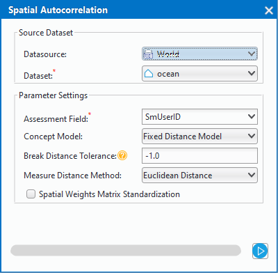

title: Spatial Autocorrelation
---

　　According to the specified features and related attributes, the mode expressed by the Global Moran's I is cluster mode, discrete mode or random mode.

##### 　　How Spatial Autocorrelation works

　　The statistical values of spatial autocorrelation can be calculated according to the following formula:

　　The math behind the Global Moran's I statistic is shown above. The tool computes the mean and variance for the attribute being evaluated. Then, for each feature value, it subtracts the mean, creating *a deviation from the mean*. Deviation values for all neighboring features (features within the specified distance band, for example) are multiplied together to create a *cross-product*. Notice that the numerator for the Global Moran's I statistic includes these summed cross-products.  

　　After the Spatial Autocorrelation (Global Moran's I) tool computes the Index value, it computes the Expected Index value. The Expected and Observed Index values are then compared. Given the number of features in the dataset and the variance for the data values overall, the tool computes a z-score and p-value indicating whether this difference is statistically significant or not. Index values cannot be interpreted directly; they can only be interpreted within the context of the null hypothesis. 

##### 　　Applications

- Help identify an appropriate neighborhood distance for a variety of spatial analysis methods by finding the distance where spatial autocorrelation is strongest.
- Measure broad trends in ethnic or racial segregation over time—is segregation increasing or decreasing?
- Summarize the diffusion of an idea, disease, or trend over space and time—is the idea, disease, or trend remaining isolated and concentrated, or spreading and becoming more diffuse?

##### 　　Operating Instructions

　　Cross provides two functional entrances, as follows:

- Click "Toolbox" - "Spatial Statistical Analysis" - "Analyzing Patterns" - "Spatial Autocorrelation" in the menu bar, and the "Spatial Autocorrelation" dialog box will pop up.“”
- In the "Visual Modeling" panel, double-click the "Spatial Statistical Analysis"-"Analyzing Patterns"-"Spatial Autocorrelation", and the "Spatial Autocorrelation" dialog box will pop up, as shown in the figure below:

- 

##### 　　Main Parameters

- **Input Feature**:Set up the vector data sets to be analyzed, supports points, lines, and regions three types of datasets. It is suggested that the number of objects in the source data is greater than or equal to 30 to ensure the reliability of the results.
- **Assessment Field**:Select the property field for the analysis variable.
- **Conceptualized Model**：Your choice for the Conceptualized Model should reflect inherent relationships among the features you are analyzing. The more realistically you can model how features interact with each other in space, the more accurate your results will be. 
  - Fixed Distance Model:applicable to point and region with large changes in region size.
  - Region Adjacency Model (co-side, intersecting):applicable to the data of adjacent side and intersection.
  - Region Adjacency Model (adjacency point, cop-edge, intersecting):applicable to the region data with adjacent points,adjacent sides and intersecting.
  - Inverse Distance Model:all features are regarded as adjacent features of all other features. All features affect the target features, but as distance increases, the effect is smaller, and the weight between the elements is one over the distance, which is applicable to continuous data.
  - Inverse Distance Square Model:similar to the "Inverse Distance Model", with the increase of distance, the influence decreases faster, and the weight between the features is one over the square of the distance.
  - k-Nearest Neighbor Model:The K features closest to the target features are contained in the calculation of the target features (the weight is 1), and the remaining features will be excluded from the target feature calculation (the weight is 0). This option is very effective if you want to ensure that you have a minimum number of contiguous features for analysis. This approach works well when the distribution of data changes in the study area so that some features are removed from all other features. When the proportion of fixed analysis is not as important as the number of fixed adjacent objects, k-nearest neighbor method is suitable.
  - Spatial Weight Matrix: space weight matrix file is required. The spatial weight is a number that reflects the distance, time, or other cost of each feature and any other feature in the dataset. If you want to model the accessibility of city services, for example, to look for areas where urban crime is concentrated, it is a good idea to use the network to model spatial relationships. Before analyzing, create a spatial weight matrix file (.swm) using the generated network space weight tool, and then specify the full path of the SWM file created.
  - Non-Differentiated Regional Model:The model is a combination of "Inverse Distance Model" and "Fixed Distance Model". Each feature is regarded as an adjacent feature of other features. This option is not suitable for large datasets. The features within the specified fixed distance range have equal weights (weights 1);In addition to the specified distance of fixed distance, the effect will be smaller as distance increases.
- **Interrupt Distance Tolerance**:"-1" means to calculate and apply the default distance, which is to ensure that each element has at least one adjacent feature;" 0 "means that no distance is applied, and each feature is an adjacent feature. Non-zero positive values are adjacent features when the distance between the features is smaller than this value.
- **Inverse Distance Power Exponent**:The higher the exponent, the higher the power value, the smaller the exponential effect.
- **Number of Adjacent Features**:Set a positive integer, indicating that the nearest K features around the target features are adjacent features.
- **Distance Method**:Currently, Euclidean distance is supported by the linear distance between two elements.
- **Space Weight Matrix Standardization**:When the distribution of features is likely to deviate due to sampling design or the aggregation scheme imposed, the use of the row standardization is recommended. After selecting the row normalization, each weight is divided by the sum of the rows (the sum of the weights of all adjacent features). The normalized weights are usually used in combination with the fixed distance adjacent features and are almost always used for the adjacent features of the adjacent side. This can reduce the deviation caused by the different number of adjacent features. Row standardization takes ownership weights, making them between 0 and 1, creating relative (rather than absolute) weight solutions. Whenever you want to handle the region features that represent administrative boundaries, you might want to choose the "Row Standardization" option.

##### 　　Results Output

　　After setting up the above parameters, click the "Run" button in the dialog box to perform the Spatial Autocorrelation Analysis. The results of the analysis will be shown in the "Output Window".

The Spatial Autocorrelation returns five values: the Moran's I Index, Expected Index, Variance, z-score, and p-value. Using z-score or p-value indicates statistical significance, you can refuse to null hypothesis, if Moran 's index value is positive, I have said this data with spatial correlation, the analysis of the dataset is used to value is proportional to the spatial concentration; If Moran's I index is negative then indicates the discrete trend. The following table summarizes the interpretation of the results:

| **Analysis Result**                 | **Spatial Autocorrelation**                                |
| ------------------------ | ---------------------------------------- |
| The p-value is **not** statistically significant.     | You cannot reject the null hypothesis. It is quite possible that the spatial distribution of feature values is the result of random spatial processes. The observed spatial pattern of feature values could very well be one of many, many possible versions of complete spatial randomness (CSR).|
| The p-value **is** statistically significant, and the z-score is positive. | You may reject the null hypothesis. The spatial distribution of high values and/or low values in the dataset is more spatially clustered than would be expected if underlying spatial processes were random. |
| The p-value **is** statistically significant, and the z-score is negative. | You may reject the null hypothesis. The spatial distribution of high values and low values in the dataset is more spatially dispersed than would be expected if underlying spatial processes were random. A dispersed spatial pattern often reflects some type of competitive process—a feature with a high value repels other features with high values; similarly, a feature with a low value repels other features with low values.|

###  Related Topics

[High/Low clustering](HighLowClustering.html)

[Incremental spatial autocorrelation](IncrementalSpatialAutocorrelation.html)

[Average nearest neighbor](AverageNearestNeighbor.html)

