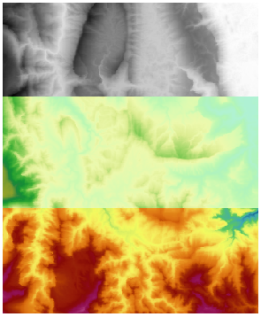
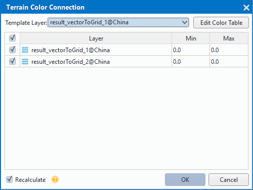
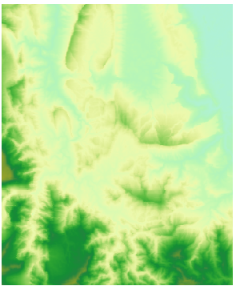

　　Since the color table and the range of its value for each data are different, it maybe display the uneven color or pixel color out of touch in the position of connecting raster data when multiple raster data are added to the same map. And now, you can make the display for translation between the adjacent raster layers in the map seamless.
    
The principle of the function: Setting the layer color tables are the same table, then the grid with the same pixel value will use the same color table to make the pixel display for joint positions of adjacent data are coherent and uniform.

**Application Instance**  
   
As the following picture shows, the DEM data consists of three adjacent datasets, among them, one color table is different from another two color tables, and one elevation raster dataset has high terrain and its maximum elevation value is bigger a lot than another two. Hence, the picture looks like having three parts.

　　  
 
With the "Color Balance" function, the problem can be solved. Detail operations are:

　　1.  Add adjacent raster data into a map, and then click the "Map" tab > "Mapping" gallery > "Terrain Color Connection" 
　　    
　　  

　　2.  Template Layer: Click the Template Layer dropdown button, and select a layer as the color table template, and apply the color table to the layers checked in layer list. If the color table of layer needs to be adjusted, you can click "Color Table" button and set in the pop-up "Color Table" dialog box. Please reference Color Table Settings for specific steps. 

　　3.  Selecting the raster data that needs to be color connection in the layer list of the dialog box, at the same time maximum and minimum pixel value of each layer will be displayed in the list, and you can reference the range of data pixel value when selecting a template layer. 

　　4.  Recalculate:  If you don't check this checkbox, it means the pixel that is smaller than the minimum value of template layer is indicated with the color of minimum pixel; Otherwise it means the union of the pixel value for the checked layers is used as the value range of color table, so that the pixel values and the corresponding colors in the color table are reassigned. 

　　5.  Clicking "OK" button to deal with the raster data in the map. 

　　　　

