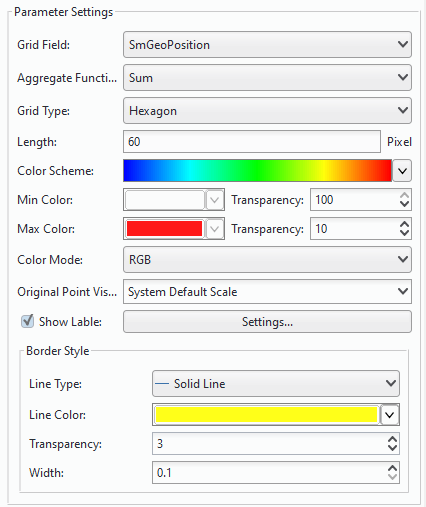
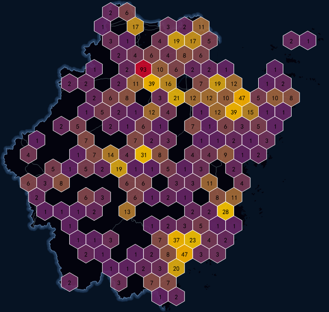

  
### What is a grid map?  
   
The grid aggregation map is simply a method of using spatial aggregation method to express the distribution and statistical characteristics of spatial data. Its basic principle is that: based on the grid aggregation algorithm, the spatial region is divided into the grid cells in regular shape, each grid cell is divided into multiple levels, high-level grid cells are divided into multiple low-level cells, and each grid cell has statistics information.

SuperMap supports the construction of grid aggregation map for the point dataset, and provides two types of grid types for display, one is rectangular and the other one is hexagonal. Then the number of points in each grid cell is calculate and is as the statistical value of the grid, the weight information of the point can also be introduced; Finally, based on soring the statistics values of the grid cells, use different color to fill the grids.

The grid aggregation map contains the following elements:    

+ **Grid**: Each grid cell is a uniformly sized grid that can be quadrilateral or hexagonal, and when the map scale changes, the size of the grid cell is fixed; the grid is used to count the points falling within each grid cell. 
+ **Label**: Each grid has a label that is the statistical value of the grid cell, which can be the number of point objects falling within each grid cell, or the weighted value. 
+ **Grid Style**: The fill color of the grid cell represents the distribution trend of the grid statistics, and its color is from deep to shallow, indicating that the value of the grid cell is from large to small. In addition, you can also set the grid rectangle border style. 

  
### How to create a grid map?    
  
1.**Select data and creat a grid layer** :     

   +  Select the point layer in the Layer Manager, then click "Thematic Mapping" tab > "Aggregation Map" group> "Grid Map". The created grid map will shown up in the current window automatically, meanwhile a thematic map layer will be added in the layer manager.
   +  Select the grid layer in the layer manager and right click, then select "Layer Properties", in the pop-up window "Layer Properties" all information on current layer are shown up.

　　  
       
      
2.**Set Grid Field**:   

  The grid field can not be specified. In this case, the grid aggregation map's statistics value is the number of point objects that fall within the cell; if a grid field is specified, the value of the field will be the weight information. In addition, the specified grid field must be a numeric field. 

  
3.**Set Grid Type**    

Grid Type: Two types of grids are provided: quadrilateral and hexagonal.
   
 
4.**Set Color Scheme**    
  
+ Select the desired color scheme, the system will automatically assign the theme style of each render field value. 
+ Set the maximum color and minimum color values respectively. Construct a gradient ribbon with the maximum color and minimum color, and the maximum color is used to render the largest grid cell. The minimum color is used to render the minimum grid cell. The other grid cells use the other colors in the gradient ribbon, where it follows the rule that the larger the cell value, the closer to the maximum color value. 
+ It supports making a semi-transparent effect, easy to overlay with the basic map data. 

5.**Set Grid Style**: :   
  
+ Grid size: Specify the border length of every grid.
+ Grid border: A): line types of borders of grids. You can choose: Null, Solid Line, Dotted Line. B) Set the line width. C) Set the line color. The settings of translucent color are supported.
+ Grid Label: Set the style of lables of statistics values.
  
5.After all the settings mentioned above, a grid map is produced.
  
### Instance   
  
Create a hexagon grid map on tourist attractions distribution in Zhejiang province.
  
SampleData: Installation directory\SampleData\AggregationMap\GridAggregationMap\GridAggregationMap.smwn 

Hexagon grids: Based on the point dataset "Attraction_P" create a grid map without specifying grid field. The number in every grid represents how many points are within the grid. The result map is:
  
　　    

  

