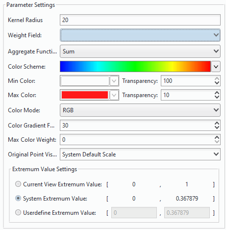

### What is a heat map?    

The heat map uses colors to depict phenomenon such as population distribution, density, and the trend of change. It is a very intuitive way to present some data, such as density, frequency, temperature, etc.
  
SuperMap heat map allows creating heat map layers for points. The heat map layer draws point element as surfaces of the relative density, and renders the surfaces with color ramps, therefore representing point density. In general,low density and high density points are drawn with cool color to warm color. You need to turn on alpha channel of the map for the heat map. 

In addition to reflecting the relative density of points, the heat map layer can also represent the point density weighted according to attributes.

The heat map zoom in or out with the map and it is dynamic raster surface. For example, For example, when the map is enlarged, the heat map layer for visitors of national tourist attractions will reflect the distribution of visitors of tourist attractions in a province or in a local area.
  
### How to create a heat map    
  
1.**Select data and create a heat map**:  
  
  +  Select the point layer in the Layer Manager, then click "Thematic Mapping" tab > "Aggregation Map" group> "Heat Map". The created heat map will shown up in the current window automatically, meanwhile a thematic map layer will be added in the layer manager.
  +  SuperMap only can create the heat map based on point data. The supportive data can be not only UDB file datasources, database datasources, but also ES (Elasticsearch) data. The feature of heat maps is the access of data is more efficiency.
  +  Right click the heat map layer and select "Layer Properties" to open the "Layer Properties" windows where all setting information on the heat map are shown up.

　　  
       
      
2.**Kernel Radius**: The effect of the kernel radius in the heat map is as follows: 
  
+  The heat map will create a buffer for each discrete point based on the kernel radius value. The unit of the kernel radius value is: screen coordinate;
+  After the buffer areas have been created for each discrete points, the buffer of each discrete point will be filled with progressive gray band (the complete gray range is 0 to 255) from the inside out from shallow to the deep; 
+  Because the gray value can be added when they overlay (the larger the value, the brighter the color, the whiter it will look). In real practice, you can choose any channel in the ARGB model as the overlay gray value, so that the region with buffer intersection can have all gray values added. Therefore, the more the buffer crosses, the greater the gray value, the more "hot" the area is. 
+  The heat map will be ready when we redraw the map with a 256 color ramp based on the gray value. 
  
3.**Weight Field:**    

According to the above, the heat distribution density can be determined according to the overlay of discrete point buffers, and the weight is to determine influence of the point on the density. The weight of a point determines the impact of the buffer of the point on the density. If the original impact coefficient of the point buffer is 1, the weight of the point is 10, then the influence coefficient of the point buffer is 1*10=10 after introducing the weight.
Then, after the weight is introduced, a new gray value after overlay will be used for indexing. The specified color ramp will be used for rendering to get the heat map. You can specify a field as weight, and the field for weight must be a numeric field.
 
4.**Color Scheme**    
  
+ The combo box lists the color schemes provided. When you select a color ramp, colors will then be assigned automatically. 
+ Set the maximum and minimum color values respectively and build a color ramp with the maximum and minimum color values. The color with maximum value will be used to render the heat map with maximum gray value (the hottest area), while the color with the minimum value will be used to render the heat map with minimum gray value (the coldest area).
+  Adjust the transparency of the color, click the right button to the max/min color box to display the slider for setting the transparency of the color. You can change the transparency with the slider, or directly enter a number from 0-100. The default is 0, fully opaque. The heat map with translucent effect is easy to overlay with the base map.
+  **Color Gradient Fuzzy Degree**: Adjust the blur degree of the color gradient in the heat map, thereby adjusting the rendering effect of the color ramp. 
+  **Max Color Weight**: Determine the proportion of the maximum color value in the gradient ramp. The larger the value, the greater weight the maximum color takes up in the color ramp. 

5.**Original Point Visible Scale**   
 
After set the value, when zoom the heat map at the scale you set, it will be invisible and only the point objects will be shown. 
  
6.**Extremum Value Settings**    
  
Set a maximum value and a minimum value of your heat map, then according to the colors of extremum values to render your heat map. The colors of other parts that values are greater or less than the extremum values are the same with the color of maximum or the color of minimum value. 
  
+  Current View Extremum Value:  Take the extremum values in the current view as the extrimum values of a heat map to render your heat map. (The extremum values are changing with zooming in/out current view.) 
+  System Extremum Value: In default, the application will calculate out a default maximum value and a default minimum value of a heat map. (The system extremum values vary with scales). 
+  Userdefine Extremum Value: You can input a maximum value and a minimum value to render your heat map. 
  
7.After all the settings mentioned above, the creation of a grid map is completed.
  
### Instance   
  
Create a heat map on global education resources:
  
Sample Data: Installation directory\SampleData\\AggregationMap\HeatMap.smwn   
 
Select the point dataset: CultureService_P. 
  
　　     
  

