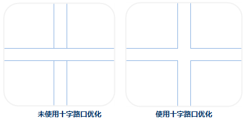

　　Choose one or more layers from the Layer Manager and them optimize the layers by settings.

### Common Properties

　　Following properties of layers (vector, raster, image layers) can be set in the Layer Properties panel.

　　**Transparent(%)**

　　Set the transparency of the current layer. You can adjust the transparency of the current layer by clicking the up or down arrows. Also you can directly type the transparency in the text box. The transparency ranges from 0 (default) to 100, 100 indicates fully transparent and 0 means fully opaque.

　　**Min Visible Scale**

　　The min scale displaying the current layer. If the scale of the current layer is smaller than the min scale, the layer can not be visible.

　　You can directly enter a value into the text box at right of "Min Visible Scale", such as: 1:500000. Also you can choose a scale from the drop-down list shown by clicking the down arrow at right. If the map has some fixed scales set, the contents in the drop-down list will show the fixed scales of the current map.

　　**Max Visible Scale**

　　The max scale displaying the current layer. If the scale of the current layer is greater than the max scale, the layer can not be visible.

　　You can directly enter a value into the text box at right of "Max Visible Scale", such as: 1:500000. Also you can choose a scale from the drop-down list shown by clicking the down arrow at right. If the map has some fixed scales set, the contents in the drop-down list will show the fixed scales of the current map.

### Properties of Vector Layers
　　Take a vector layer as the current layer, related parameters of the layers will shown in the "Layer Properties" panel, including: Complete Line, Optimize Cross, Scale Symbol, Min Object Size, Filter Expression, etc.

　　**Complete Line**

　　Ensure the line symbols can be displayed completely. If the line length is less than a unit of the cycle length of the line symbol or is not the integer multiple of the line symbol, the lack part will not be displayed. The Complete Line command will calculate considering the line length and line symbol length to draw a line whose length is very similar to the original line. Below shows the incomplete display of the line symbol

　　

　　**Optimize Cross**

　　In line layers, lines often intersect with each other. It is not beautiful and can not show the connectivity between the two line objects. So the cross position should be handled to make the effect more real.

　　

　　**Scale Symbol**

　　Set whether the symbol objects are zoomed in/out with the map is zoomed in/out. The function can be used in marker symbols, line symbols, region symbols and boundaries of regions.

　　Check the Scale Symbol box to make the symbols in the current map zoom with the map zoom. The zoom level of the symbols depends on both the Reference Scale and the scale of the current map zoomed. For instance, if you set the reference scale at 1:500000 and the symbol size is 30 at now. The symbol will be scaled up by 5 times to 150 if you zoom the map to 1:100000.

　　**Antialiasing**

　　The appearance of lines or polygon edges drawn in a raster display will appear jagged. The reason is raster consists of many discrete points, but a straight line, or a polygon is continuous, hence sampling is required for displaying straight lines or polygons on a raster display, information distortion occurs which is called aliasing. Antialiasing is the technique which is used for minimising the distortion.

　　There are two methods to reduce or remove information distortion, including line antialiasing and text antialiasing. Map antialiasing and layer antialiasing must be enabled together to make antialiasing take effect, meanwhile the transparency of the layer must be 0.

　　**Show Overlap**

　　For controlling whether or not objects overlapped will be displayed. All overlapped objects will be displayed if you check it, at the same time the Show Overlap checkbox in the Map Properties panel has been checked.

　　**Min Object Size**

　　Used to set the minimum size of objects displaying in the current layer. For a zooming map, if the maximum value of the width and height of the minimum bounding box of any geometry object is less than the specified minimum size, then the object is invisible. You can enter a number in the text box to set the minimum size. The unit is millimeter.

　　**Filter Expression**

　　Used for setting filter expression to display the objects meeting the condition. Enter a SQL expression and click Enter key, then the objected meeting conditions be displayed in the layer.

　　**Object Order Field**

　　The drawing order of an object affects the position where the object is displayed on the map. Objects in the map are displayed in the order of the values in the set fields. If the field values for this field are the same or empty, then default display order is used, in general, the field SmID is sorted in ascending order. Currently, only the single vector layer or a single thematic map layer are supported to set Object Order Field.

   

　　**Set Join Attribute Table**

　　Set the associated field to connect to an external table. And then through the constructed filter condition involved in an external table field to filter the contents of the display layer.

### Properties of Raster Layers

　　**Brightness**

　　Used to adjust the brightness of a raster layer, you can enter a number directly in the text box or click the up and down arrow to adjust the brightness for a layer.

　　**Contrast**

　　Used to adjust the contrast of a raster layer, you can enter a number directly in the text box or click the up and down arrow to adjust the contrast for a layer.
　　<!-- 拉伸设置        在缩放浏览栅格数据时，需将原始图像映射为较大或较小的一组像素，SuperMap提供了 5 种插值方式，分别为最临近插值、低质量插值、高质量插值、高质量双线性插值、高质量三次插值。不同的插值方式决定了栅格显示的质量，但是输出图像的显示质量越高，所需的时间就越长。最临近插值: 是一种较简单的插值方式，该方式处理速度较快，但是图像显示效果最差。 低质量插值: 该方式会执行预筛选以确保高质量的收缩，插值后图像放大显示质量不好。 高质量插值: 缩放时图像显示质量较高，但是输出图像时间较长。 高质量双线性插值: 通过指定的高质量双线性插值法，执行预筛选，以确保缩放栅格的高质量显示效果。 高质量双三次插值: 通过指定的高质量双三次插值法，执行预筛选，以确保缩放栅格的高质量显示效果，此方式式输出的图像显示质量最高。 -->

　　**Color Table**

　　Click "Settings..." button to view the "Color Table" dialog box where you can set, modify colors, also you can add or delete a pixel value to adjust the color scheme for raster data. 

　　**Special Value**

　　Set a special grid value, the display effect of the pixels with the special grid value can be set.

　　**Special Style**

　　Set the color of the pixels with the special grid value. Click drop arrow at the right of "Special Style", the color panel will pop up, in where you can specify the color.

　　**Spatial Value Transparent Display**

　　Check the box to set the pixels with the special grid value transparent. 

### Properties of Image Layers

　　**Brightness**

　　Used to adjust the brightness of an image layer, you can enter a number directly in the text box or click the up and down arrow to adjust the brightness for a image layer.

　　**Contrast**

　　Used to adjust the contrast of an image layer, you can enter a number directly in the text box or click the up and down arrow to adjust the contrast for an image layer.

　　**Transparent**

　　Set a color in an image layer transparent. When the parameter To complete the setting of transparent, "Transparent" and "Transparent Tolerance" need setting together.

- Transparent: Check it, then click the down arrow to display the color panel where you can specify a color to be transparent.
- Transparent Tolerance: Set the transparent tolerance. For example, the original RGB value is (r, g, b), the tolerance is a, and the range of transparent color is from (r-a, g-a, b-a) to (r+a, g+a, b+a).

　　**Color Mode**

　　The display devices, such as the monitor, the projector, etc., and the printing devices, such as the printer, the press, etc., use different color models to generate colors. To better fit for different types of devices, SuperMap can define color in these seven color models: RGB, CMYK, RGBA, CMY, YIQ, YUV and YCC. 

　　All the color modes are provided for you to choose from the Color Model drop-down list to set the color mode of image data. Click the Color Mode drop-down arrow and select a color mode from the drop-down list. The default color mode is RGB.

- RGB: Mainly used in the display system. RGB is the abbreviation for Red, Green and Blue. With the RGB color model, every color is defined by three values: red, green, and blue, each of which ranging from 0 to 255.
- CMYK: Mainly used in the printing system. CMYK is the abbreviation for Cyan, Magenta, Yellow and Black. The Cyan, Magenta and Yellow are used as the base color to form different colors and the Black is used to adjust the brightness and the purity.
- RGBA: Mainly used in the display system. RGB is the abbreviation for Red, Green and Blue, and A controls the transparency.
- CMY: Mainly used in the printing system. CMY is the abbreviation for Cyan, Magenta and Yellow. The Cyan, Magenta and Yellow are used as the base color to form the different colors.
- YIQ: Mainly used in the NTSC system.
- YUV: Mainly used in the PAL system.
- YCC: Mainly used for the JPEG format.
　　**Stretch Settings**

　　Change the contrast of the original image by stretching. In general, the greater difference between the values, the more noticeable the contrast of the features. Hence, for the image that the contrast is not obvious, stretching it is required to expanding the difference. 

　　**Stretch Mode**

　　Now, SuperMap Desktop provides four stretch methods: None, Minimum Maximum, Standard Deviation, and Gaussian.

- None: Used to process the image data without any stretch, which is only valid for image data in the 8-bit unsigned integer type. The pixel value of image data displayed on the computer are from 0 to 255. Hence for image data in the 8-bit unsigned integer type, after the process, all of them will be linear stretched and whose value will be converted into [0, 255]. 
- Minimum Maximum: Max and Min Stretch is a linear stretch, based on the maximum and minimum pixel values which will be considered as two endpoints of the stretched histograms. By this stretch method, contrast and brightness of the image are improved significantly so that the features in the image will be more easily identified.
- Standard Deviation: This method performs statistics on the original image data, which is mainly to get the value range of a standard deviation, then to recalculate the range of the standard deviation according to its stretch coefficient, and ultimately to do the linear stretch for the last calculated range of standard deviation to make its values distribute within [0,255].
- Gaussian: The purpose of Gaussian Stretch is to make pixel values of image data tend to the normal distribution. If Using Median is selected, then Gaussion stretch would be performed with the median of cell value is as the center. If not selected, then Gaussion stretch would be performed with the maximum of cell value is as a center.

　**Stretch Coefficient**

　　Coefficient is only supported when the mode is Standard Deviation or Gaussian stretch.

- Coefficient of Standard Deviation: This parameter is available only when the stretch method is standard deviation stretch. The coefficient determines the value range of the standard deviation. If the range of the standard derivation is [a,b] and the coefficient is n, then the value range of the standard deviation is [an,bn]. The standard deviation stretch coefficient is 2 by default, i.e., the application uses a double standard deviation to stretch.
- Gaussian Coefficient: This parameter is available only when the stretch method is Gaussian stretch. If the range of the image data cell value is [a,b] and the Gaussian stretch coefficient is n, then the image cell value will be N multiple name stretched with the center unchanged and displayed within the range of [0,255]. The Gaussian stretch coefficient is 2 by default.
<!--As shown in the figure below, the figure 1 doesn't do any stretch processing, whose hue is quite dark, and this is not conducive to distinguish the ground objects. After stretching the image as shown in the figure 2, the image contrast is significantly enhanced, a lot of ground features are clearly displayed.-->
