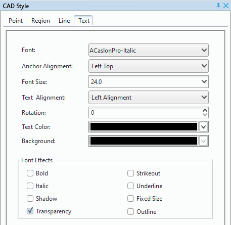
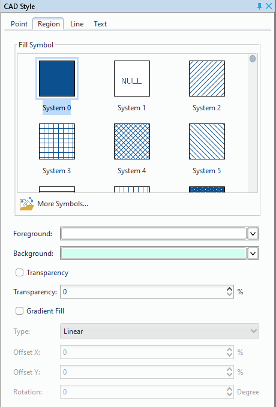

Only when the current active window is the map window, the "Style Settings" tab will appear in the ribbon area. 

All the features in the Style Settings tab works on the current layer, hence, you must set the layer you want to set as the current layer. During the procedure of setting layer styles, results will be reflected in the layer in real time.

In the "Style Settings" tab, you can set styles for objects or layers.
 
### Style settings for point layers   
 
 
+ Way 1: In the Layer Manager, double click the point layer whose style you want to change  to open the "Marker Symbol Selector" dialog box where you can set and modify point style.
+ Way 2: In the Layer Manager, select the layer whose style you want to change, and then click the "Style Settings" tab > "Layer Style" button to open the "Marker Symbol Selector" dialog box.
  
On the specification of the "Marker Symbol Selector", please consult "Manage Symbol Resource".

### Line layer style settings   
  
There are two ways :   
  
+ Way 1: In the layer manager, double click the layer whose style you want to change, then in the pop-up "Line Symbol Selector", you can set or change its style.
+ Way 2: In the layer manager, select the layer whose style you want to change, then click the "Style Settings" tab > "Layer Style" button to open the "Line Symbol Selector" dialog box.
  
On the specification of the "Line Symbol Selector", please consult "Manage Symbol Resource".
  

### Region layer style settings    
  
+ Way 1: Double click the region layer whose style you want to modify, then in the pop-up "Fill Symbol Selector", you can set or modify styles for the region layer.
+ Way 2: In the layer manager, select the region layer whose style you want to modify, then click the "Style Settings" tab > "Layer Style" button to open the "Fill Symbol Selector" dialog box.
  
On the specification of the "Line Symbol Selector", please consult "Manage Symbol Resource".
  

### Text style settings
  
1. When it is editable and there are selected texts in the layer, you can change their styles. 
2. Click "Style Settings" tab > "Style" group > "Style" button, then in the pop-up window, you can view and reset styles for selected objects.
  
　　         
  
+ Font: Change the font face. You can directly type in the text box or select from the drop-down list. In the drop-down list, you can type a letter to quickly locate fonts beginning with the letter. 
+ Anchor Alignment: is used to align the selected text. The available 12 options are: Top Left, Top Center, Top Right, Left Baseline, Center Baseline, Right Baseline, Bottom Left, Bottom Center, Bottom Right, Left Center, Center, and Right Center. You can select an alignment mode from the drop-down list. 
+ Font Size: Change the font size. 
+ Text Alignment: Set how to align text objects Four alignments are provided: left-aligned text, centered text, .right-aligned text, justified text for you to select. 
+ Rotation: Specify the rotation angle for the selected text. You can click the button, and then type an angle in the text box or tune the spinner to the right of the text box to change the rotation angle of the text. 
+ Text Color: Is used to change the text color. Click the button to display the color panel, in which you can directly select a color or click More Colors at the bottom to define one. 
+ Background: Set the background color of texts. You can click the drop-down button and then select another color, also you can click the "Other Color" button and in the pop-up dialog "Choose Color" select a color.
+ Font Effects: Set some special effects for texts, including: Bold, Strikeout, Italic, Underline, Shadow, Fixed Size, Transparency, Outline

 

### CAD style settings  
  
A CAD dataset can consist of 2D points, 2D lines, 2D regions and texts. Open your CAD dataset, and set it editable, then you can set styles for elements in it.  
  
Click the "Style Settings" tab > "Style" group > "Style" button. In the pop-up dialog "CAD Style", you can view and reset the styles for selected points, lines, regions, or texts.  
  
+ Reset point styles: Select one or more points, then in the Point tab, you can set styles for them, for details, please refer to the settings of point layer styles.
  
+ Reset line styles: Select one or more lines, then in the Line tab, you can set styles for them, for details, please refer to the settings of line layer styles.

+ Reset region style:  Select one or more regions, then in the Region tab, you can set styles for them, for details, please refer to the settings of region layer styles.   

+ Reset text styles: Select one or more texts, then in the Text tab, you can set styles for them, for details, please refer to the settings of text layer styles.     

  
　　    

 