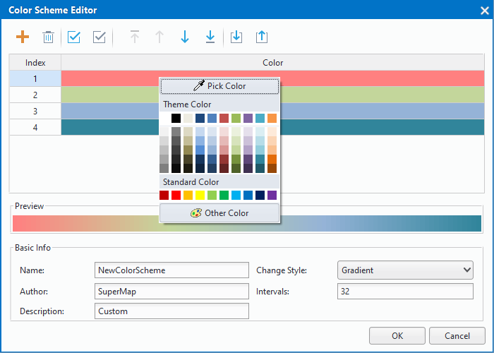

　　Color Scheme Manager is a tool for managing color schemes. Rich functions are provided for you to get color schemes with favorable effects.

### Introductions on the Color Scheme Manager
  
Manage the color schemes used in the program. SuperMap provides a set of commonly used color schemes in the Color Scheme Manager. Certain color schemes are prepared for particular usages, like the elevation color scheme. Besides, you are allowed to create your own color schemes to satisfy your needs.

190 default color schemes are provided by default. Each of the default color scheme is stored individually in a separate folder. The default location is: Installation directory\Templates\ColorScheme\. 

**Enable Color Scheme Manager**

In the Color Management group on the the Start tab, click Color Schemes to display the Color Scheme Manager. Through the Color Scheme Manager, you are allowed to add, edit, delete, import, export, custom color schemes and add to favorites.

According to the application of the data, the color scheme is divided into 9 groups including For DEM, For Aggregation Map, For Graph Map, For Ranges Map, For Unique Values Map, For Label Range Map, For Label Unique Map, All Gradient Colors, All Random Color.
  
### Create a color scheme group  
 
You can click "Add Group" image button to create a new group. You can add commonly used color schemes into the group.
    
### Add color schemes  
  
Create a new color scheme.
  
**Basic Steps**

1. **Color Scheme Editor**: In the "Color Scheme Manager" dialog, click "Add" image button to open the "Color Scheme Editor" dialog.
   
2. **Add colors**: In the "Color Scheme Editor" dialog, click "Add" image button, default colors will be added into the color list. You can click a color ribbon to change its color. There are at least two colors in the color list.   
  
　　     
3. **Manage colors**: you can manage the added colors through these buttons in tool bar.
4. **Basic Info**: Complete basic info of your color scheme including: Author, name, Description, Change Style, Intervals.  
  
  +  **Change Style**: Specify the way of ranging colors. Two options are provided: Gradient (default) and Random.
   
    +  In the gradient mode, color A will go smoothly to color B.  
    +  In the random mode, colors between color A and color B are randomly generated.
  
  +  **Intervals**: The number of colors during two adjacent colors. The range of number is from 0 to 255 and default number is 32. To make the color gradient goes more smoothly between colors, specify a bigger interval number. 

5. Preview: In the preview area, you can preview the color scheme effect immediately. Click "OK" to finalize the operation of creating a color scheme.

### Edit color schemes  
  
Change and adjust existing color schemes.
  
**Basic Steps**   
  
1. In the "Color Scheme Manager" dialog, double click a color scheme to head to the "Color Scheme Editor" dialog.
2. In the "Color Scheme Editor" dialog, you can not only change colors, but also modify the basic information. 

### Delete color schemes    
  
In the "Color Scheme Manager" dialog, select one or more color schemes, click "Remove" image button to remove the color schemes from the "Color Scheme Manager". 
  
### Import/Export color schemes
  
You are allowed to import a color scheme file into the color scheme manager, also you can export a color scheme. The exported color scheme file will be saved in scs format.
  
**Basic steps**  
  
In the "Color Scheme Manager", you can click the "Import..." or "Export..." image button in the tool bar to import or export a color scheme. Also you can select one or more color schemes you want to export, then right click and select "Export..."

  

  
