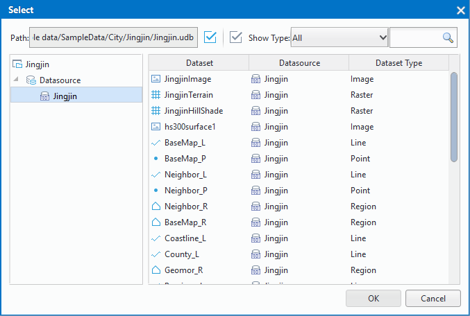
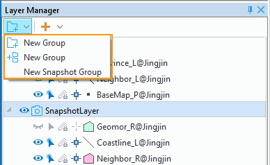

  
### Add layers  
  
With the supportive of SuperMap iDesktop Cross, you can add a dataset into the current map conveniently and quickly.
  
Three ways are provided:  
  
+ way 1: Select the dataset you want to add, and drag it to the map window, or you can right click and select "Add to New Map" or "Add to Current Map". Also you can select one or more datasets, and then open them at the same time.
+ Way 2: Create or open a map, click the "Maps" tab > "Data" group > "Add Data" to open the "Select" dialog box. At the left of the dialog box, all open datasources in the workspace are listed, you can select the one you need and then select one or more datasets as your needs, then click OK to complete to add data.
+ Way 3: Click the "Add" image drop-down button and select "Add Data" to open the "Select" dialog box.
+ Way 4: If you want to insert data after a layer, you can right click the layer and select "Insert Data..." to open the "Select" dialog, then as your needs, you can select datasets to insert. 
  
  
　　       
  
**Note**: When the image dataset to be added to the map is big, a prompt will appear to ask whether to build a pyramid to improve the display speed. When adding multiple datasets and the "Perform this operation for datasets" option is checked, all big image datasets will be created pyramid. 
  
### Add online maps  
  
Adding various online map services into maps is supported by SuperMap iDesktop. Click the "Start" tab > Datasource > Web to add online services, or click Map > Data to open online maps.
  
### Remove map layers  
  
"Remove" command is used to remove selected layers from relative maps. Right click the layer you want to remove and then select "Remove".
Or you can press Delete to remove selected layers.

### Rename layers  
  
"Rename" button is used to rename a vector layer.
    
Basic steps:    
1. Right click a vector layer in the Layer Manager and click Rename in the context menu.
2. The name of the map turns to editable and you can input a new caption for the map. 
3. Right click your mouse at anywhere else in the Layer Manager to confirm. 
  
**Note**  
  
1. A layer has a name and a caption. They have different functions.

  + The name of a layer is automatically generated to uniquely identify a map, and it is not editable. The format is Dataset Name@Datasoruce Alias, Continent@world#1 for instance.

  + By default, layer name and layer caption are identical. However, you are allowed to change the layer caption according to your needs.
    
2. You can press F2 to rename a layer.    
  
### Layer groups  
  
You can click "New Group" to create a group in the layer manager, and then you can add layers into the group. Layers in the same group can be managed uniformly. Meanwhile, a group can contain other groups. Also a group layer belongs to a kind of layers.
  
Operations such as creation, deletion, property setting, etc. will be introduced in detail below.

####  Create a layer group

1. Click the "New Group" image button in the layer manager, then a new group is created in the layer manager.
2. Right click a group layer and select "New Group", and a new sub-group is created 
The name of new group is LayerGroup, you can press F2 to change its name.
  
#### Add layers  
  
1. In the layer manager, select one or more layers and then drag them into the layer group.
2. In the layer manager, select one or more groups, then drag them into another group.
　　         
  
#### Layer properties

Select one or more layer groups, then right click and select "Layer Properties" to open the "Layer Properties" panel.

　         

1. Visible: In the layer properties panel, you can set the visibility for all layers under the visible status in the group. If you check the "Visible" check box, they will be visible, otherwise, they will be invisible.
2. Layer Name: Used to display the name of the selected layer group. Layer group name cannot be modified. Layer group name is the unique identification of a layer group in a map. 
3. Layer Caption: The text box is used to display the layer group caption. Layer group caption can be modified. After the modification of the layer caption, the display node of the layer group will be change, however, the layer group name will not change. 
4. Min Visible Scale: The combo box is used to set the minimum visible scales of all layers in the layer group. After setting the minimum visible scale for the layer group, all layers in the layer group will not be visible if the scale of the map is less than the minimum visible scale of the layer group. The minimum visible scale can be set through the integer box on the right, such as 1:500,000, or users can set the current scale as the minimum visible scale. Also, the minimum visible scale can be set through the drop down list. 8 scales from 1:5,000 to 1:1,000,000 can be set from the drop down list. If fixed scales is set for the map, available scales in the drop down list will be fixed scales.
5. Max Visible Scale: The combo box is used to set the maximum visible scales of all layers in the layer group. After setting the maximum visible scale for the layer group, all layers in the layer group will not be visible if the scale of the map is larger than the maximum visible scale of the layer group. The maximum visible scale can be set through the integer box on the right, such as 1:500,000, or users can set the current scale as the maximum visible scale. Also, the maximum visible scale can be set through the drop down list. 8 scales from 1:5,000 to 1:1,000,000 can be set from the drop down list. If fixed scales is set for the map, available scales in the drop down list will be fixed scales. 
  
  
### Snapshot layers  

Snapshot layer is a special layer group in which a layer corresponds to a snapshot layer of the map. Snapshot layers are drawn only when it is displayed at the 1st time. When browse it next time, if the map range has not changed, the snapshot layer will not be redrawn, that is, the snapshot layer will not be redrawn with map refresh. However, if the map range changes, the refresh and redraw operation will be triggered automatically. Snapshot layers can improve the performance of the map display.

Because of a snapshot layer is a special layer group. You can add a layer group object (LayerGroup) to the snapshot layer, but a snapshot layer can not be added to a snapshot layer or a LayerGroup object.

**Application scenario**: In the process of mapping, the data amount of some layers is too large to affect the refresh efficiency of the map. You can add the layers which will be refreshed not often and have big amounts of data into a snapshot layer. When you browse the map, layers in a snapshot layer group will not be refreshed unless the display range of map is changed, thereby improving the display performance.

**Basic steps**  

1. In the blank area of Layer Manager, right click and click New Snapshot Group to create a snapshot layer group. 
2. Select one or more layers, and move them to the snapshot layer group. As long as the display range of the map does not change, the layers in the snapshot layer group will not be refreshed.

--------------------------------------------------------------------------------

 

 

