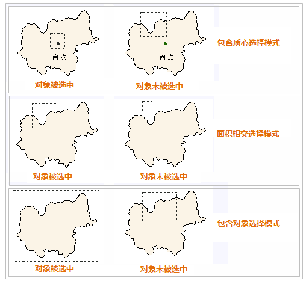

The Browse group on the Maps tab provides functions for map browse.

 
### Select objects  

The Select drop-down button allows you to select objects through multiple methods. You can click the select button directly then you can choose objects through clicking objects or drawing a rectangle. Also you can choose one method from the drop-down list.
  
**Select Modes**  

You can set how to determine an object is selected when you draw shapes (rectangles, circles or polygons). SuperMap iDesktop provides three modes:
  
+ Centroid Within: An object will be selected, when its centroid is in the shape you draw.
+ Intersect: An object will be selected, when it intersects with the shape you draw.
+ Completely Within: An object will be selected, when it is contained in the shape you draw.
  
When you select objects through drawing a rectangle, the following picture explains how the three select modes mentioned above work.

　　   

**Tolerance**  

Control the accuracy when selecting objects, when you are selecting objects, if the distance between the cursor and an object is less than the tolerance value (unit is pixel), the object will be selected.
  
### Zoom in maps
  
"Zoom In" button is used to zoom in your map.

On the Maps tab, in the Browse group, click the Zoom In button to change the mouse pointer to .
  
+ Click mouse: In the map window, click your mouse, and the map will be zoomed in by 2 times.
+ Draw rectangle: Hold down the left key of mouse and drag your mouse to draw a temporary rectangle, then release the left mouse button to zoom in the map. The map will be zoomed in from the center of the temporary rectangle. The magnification is the smaller one of ratios between the width of map widow to the rectangle width and the height of map window to the rectangle height.
+ In addition, you can press "Z" to switch the status as the status of zooming in.
  
### Zoom out maps  
  
"Zoom Out" button is used to zoom out your map.

On the Maps tab, in the Browse group, click the Zoom Out button to change the mouse pointer to .

+ Click mouse: In the map window, click your mouse, and the map will be zoomed out by 2 times.
+ Draw rectangle: Hold down the left key of mouse and drag your mouse to draw a temporary rectangle, then release the left mouse button to zoom out the map. The map will be zoomed out from the center of the temporary rectangle. The magnification is the smaller one of ratios between the width and height of map widow to the rectangle width and height.
+ In addition, you can press "X" to switch the status as the status of zooming out.
  
### Zoom maps  

**Zoom Free **  
 
Click the Zoom drop-down button then click Zoom Free. The mouse pointer turns to .
  
+  Hold the left key and drag your mouse in the map window, meanwhile the map will be zoomed in or out. Release the left key to end the operation and refresh your map.
+  White areas may exist during the zoom free operation because of the map is not instantly refreshed. For each zoom free operation, the map is refreshed after you release the left mouse button.
+  To instantly refresh the map during the zoom free operation, please use the Instant Zoom Free command. 
In addition, you can press "Z" to switch the status as the status of zooming free.

**Instant Zoom Free**  

Click the Zoom drop-down button then click Instant Zoom Free. The mouse pointer turns to .

+ Hold the left key and drag your mouse in the map window, meanwhile the map will be zoomed in or out. Release the left key to end the operation. During the process of dragging your mouse, the map will be refreshed in real time.
  
### Pan map
The Pan drop-down button allows you to view your map by panning map. You can click the Pan button to directly implement the corresponding action, or choose one method from the Pan drop-down list.

**Pan**  

Click "Pan" button or choose the "Pan" from the drop-down list to switch the operation status of map window as panning status.

+ Hold the left key of your mouse and drag it, at the same time the map will move along the direction of mouse moving. Release the mouse to stop the moving, and the map will be refreshed.
+ White areas may exist during the panning operation because of the map is not instantly refreshed until you release your mouse.
If you want to refresh your map in real time, you should use the "Instant Pan" function. 
+ In addition, pressing "A" or holding the middle button of your mouse can switch the operation status as panning status.

**Instant Pan**  

Click "Pan" drop-down button and select "Instant Pan" to switch the operation status of map window as panning status.
  
+ Hold the left key of your mouse and drag it, at the same time the map will move along the direction of mouse movement. Release the mouse to stop the movement of mouse. During the process of movement, the map will be refreshed in real time thereby making the movement procedure very smooth.
  
<!--Global Pan

Global Pan refers to the world experience when browsing the world map for the east and west hemisphere seamless pan, to achieve a plane in the world to browse the map with the sphere to browse the map of the same experience. When click Global Pan, and the range of the world map displayed is not limited to the -180 to +180 longitude, as the mouse moves, it changes.

This feature is mainly used for some special scenes that need to cross the east and west hemisphere. Such as the design of global navigation or aviation routes, cross-field measurements of the distance between the eastern and western hemispheres. Click the Pan drop-down button in the Browse group of the Map tab and select the Global Pan option to turn on the feature.

Global Pan has some requirements for the map of reference coordinate system. There are currently two types of coordinate systems that support global pan: WGS 1984 and World Mercator.
  
Parameter Name|Parameter Value   
:-:|:-:  
Datum|D_WGS_1984
Spheroid|WGS_1984
Semi-major Axis|6378137
Flattening|0.00335281066474748  
  

Parameter Name|Parameter Value   
:-:|:-:  
Datum|D_WGS_1984
Spheroid|WGS_1984
Semi-major Axis|6378137
Flattening|0.00335281066474748
Geographic Coordinate System|GCS_WGS_1984
Projection Mode|Mercator
Central Meridian|0
Central Parallel|0
Standard Parallel 1|0
Standard Parallel 2|0
Offset X|0
Offset Y|0
Scale Factor|0.9996
Azimuth|0
Longitude of Point 1|0
Longitude of Point 2|0  -->
  
**Show Whole Picture**   

The Full Extent button is used to show the whole map.

+  Click the "Map" tab > "Browse" group > "Full Extent" button and then your map will be shown in the map window wholly and maximally.
+  Besides, you can press F6 to show the whole map.
  
### Settings of map browse  

A series of operation settings are provided relative with maps. Such as: Delay Refresh, Auto Scroll, Partly Refresh, Instant Refresh, Select Mode etc.. 
  
Click the "Maps" tab > "Browse" group > "Settings" button to open the "Operation Settings" dialog box.
  
　　

**Delay Refresh**  

Delay Refresh function is used to control whether the map refresh will be delayed over zooming of your map. If this function is enabled, the map will be refreshed for 0.4 second after your mouse operation. When you zoom the map with a big amount of data and you don't enable this function, the real-time map refresh will slow down the map display. In order to optimize the effect, we suggest you enable this function. By default, this function is enabled.

**Auto Scroll**  

When you perform some operations on your map and you want to see the part beyond your current screen without switching the map operation status into the map pan status, you can select Auto Scroll, in this case, your map will auto pan at a time when your mouse pointer close to the screen bounds and click once.

Note:  The Automatic Scroll is unavailable when the operation status is Zoom In, Zoom Out, or Pan.

**Partly Refresh**  

The Partly Refresh function only refreshes part of the map when you zoom your map. This function ensures the map browsing smooth, reduces waiting time. It is very significant when you browse a very big data of the map.
  
**Instant Refresh When Editing**    
    
Refresh other objects which are not selected in real time when you edit the selected objects.
  

  

    
  

