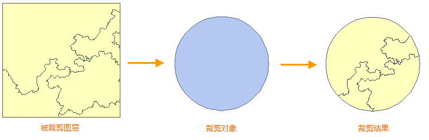
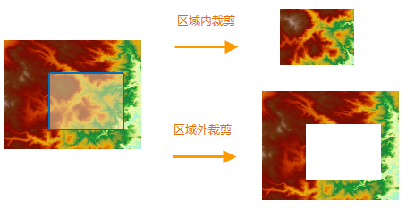
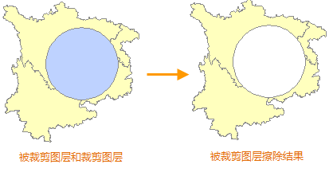
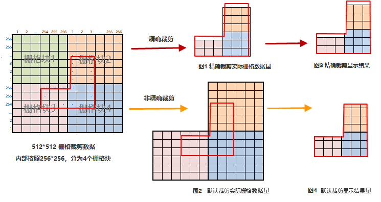
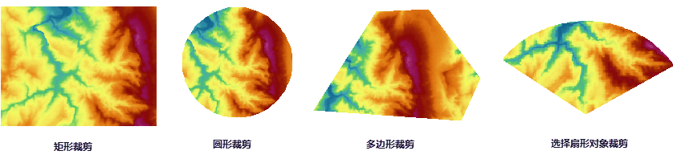

When you only need to research some area in your map, you can extract data of the area by the "Map Clip" function which can reduce data amount and improve the efficiency of data process.
  
### Overview
You can draw rectangles, circles, polygons or select region objects in a layer to clip a layer when there is one layer or multiple layers in the map window. The result can be saved as a new dataset. The clipped layer can be a point layer, a line layer, a region layer, a CAD layer, a text layer or a grid layer, and the clipping layer (or the drawn clip region) must be a region layer. The type of the clip result is consistent with the clipped layer's.

　　  

**Clip Region**: You can specify the extracting areas: outside or inside of the clipping area. If you set the Region as In, the map inside the clipping region will be retained and output. If you set the Region as Out, the map outside the clip region will be retained and output.
  
　　   
   
**Erase Areas**  

If you set the Erase as Yes, areas clipped in the layer will be erased after the clip operation. Currently, the Erase Clip Region operation can only be performed on maps in vector format, and the operation is not worked on raster maps.

As shown in the following figure, the yellow region is the clipped layer, and the blue region is the clipping layer. Select the circular region to clip the yellow polygon, and set the Region mode to Inside. The result layer is shown as below.
  
　　   
  
**Exact Clip**  
 
When clipping raster data or image data, you can choose whether to do the exact clipping operation from the Exact Clip drop-down list. The differences between the exact clip and the default clip are detailed below.  

1. The amount of data is different in results. 
  
  + Exact Clip: The process unit is pixels in borders of clipping area. Given a pixel split by a clipping boundary, if the clipping area overlays its center point, then keep the pixel (As figure 1). 
  + Default Clip: The process unit is raster blocks in borders of clipping area. If the clipping area intersects with raster blocks (As block 2, 3, 4 in figure 2), all intersected blocks will be kept that leads to a bigger amount of data.
  
　　     
   
2. The display effects are different. 

   + Exact Clip: Because of processes to pixels intersecting with borders of clipping area, there are some retained parts which are not whole pixels or even without any pixel in results, as figure 3. 
   + Default Clip: The result will show strictly as the clipping area.    
     
3.The clipping efficiency is different: The exact clip has higher efficiency than the default clip because of the difference of process unit. When you need to more exact storage data, the exact clip is suggested. But if the amount of data is huge and you focus on the display effect, the default clip is better. 
  
### Clip Modes  
   
You can exact data in an specified layer through drawing rectangles, circles, polygons or selecting objects with the settings of clipping regions.
  
Basic Steps  
  
1. Open the layer you want to clip.
2. Click "Maps" tab > "Operation" group > "Map Clip" drop-down button, then choose a way from the drop-down list.
  
  + Rectangle: Extract data through drawing rectangles.
  + Circle: Extract data through drawing circles. 
  + Polygon: Extract data through drawing polygons. 
  + Objects: Extract data by selecting one or more objects in the clipped layer. You can select objects first then perform the Map Clip operation or you can click the "Map Clip" > "Objects" then select objects.
    
3. In the pop-up dialog box "Map Clip", set parameters on clipping layers and clipping areas.
  
　　       
 
  + Region: If you set the Region as In, the map inside the clipping region will be extracted. If you set the Region as Out, the map outside the clip region will be extracted.
  + Erase: Whether to erase the clipped areas in the clipped layer.
  + Exact Clip: The item applies to GRID, DEM, MrSid, ECW, image datasets. See "Exact Clip" for more information.
   	+ If you select "Yes" meaning Exact Clip. You can clip data exactly, and abandon pixels being not within the clipping area and the result has a smaller amount of data. 
   	+ If you select "No" meaning Default Clip. The operation has high clipping performance. 
  + Multi-Objects Split Clip: If multiple vector objects are selected to clip layers separately to achieve the clipping operation in bulk, you can check the Multi-Objects Split Clip checkbox. Set a field in Result Name ID, then every clip result is named as target datasource name+_+Field value. The user can identify every clipping result. 
  + Save Map: Select this option and input the map name, then the clip result can be saved as a map. For example, if you clip a thematic map layer, its style will be retained in the clip result after using the Save Map command. 
      
4. After all of settings, click OK to start the performance.

　　       
   
**Note**  

1. Extracting data in network data, route data or 3D data (3D points, lines, regions) are not supportive.
2. Invisible layers also can involve in the clipping operation.
3. For text objects, if anchors of text objects are within the range of clipped areas, they will be extracted.
4. When clipping text layers or raster layers, the "Erase" item is not available.
5. For datasets in a readonly datasource, or readonly datasets, the "Erase" item is not available.
6.  If you check the "Save Map" in the "Map Clip" dialog box, the result map will re-associate the clipped dataset. If the displayed result is not correct, you need to reset parameters: "Layer Display Filter", "Thematic Map Expression" or "Layer Associate Attribute", etc.. 

    
  

