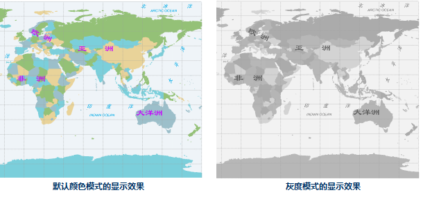
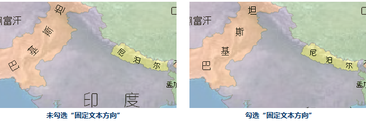

### Rotation Map

　　"Rotation" is used to set the rotation angle of the currently active map. You can enter a rotation angle in the text box at right of the label and click Enter key, then the map will be rotated as the angle you specified. The rotation angle ranges from -360 to 360 degrees with 0.1 degree accuracy. A positive value represents counterclockwise rotation, while a negative value represents clockwise rotation.

　　For each rotate operation, the map will be rotated based on the original status. The base point around which the map rotates is the center of the visible extent of the current map window. The rotate operation will not change the data in each layer of the map.

### Color Mode

　　The color modes of the vector datasets in the currently active map can be set by the color moded preset by the SuperMap Desktop. The provided color modes includes: Default, Black and White, Gray, Reverse Black and White, Reverse black and white with other colors unchanged.

　　

### Back Color

　　Click the right control or down arrow to pop up the color panel, from where you can choose the provided colors or customize colors by clicking "Other Color".

### Show Settings

　　The settings is on optimizing the display of point, line, region symbols and text labels. The description of parameters are followings in detail.

**Min/Max Text Size**

　　The size of texts can be bigger or smaller by zooming the map, when the texts are too big or two small, the actual meaning is lost, hence, set the min and max size of the texts in the current map, the texts will be invisible when the font height of texts are greater than the max size or less than the min size. 

**Visible Vertices**

　　Set the maximum number of vertices owned by a geometrical object displayed in the current map. If the number of vertices of a geometrical object in the current map is greater than the value, the object will not be displayed in the map.

**Show Overlap**

　　When there are many label elements in the map, there will be some regions where the elements of texts, labels and thematic maps are too dense. These elements may overlap with each other so that the readability of the map is reduced. The Set Overlap function is used to control the display of the text, label and thematic map objects, which is conducive to better process a variety of overlapped objects so as to get a satisfactory display effect.

　　All text objects will be shown on the map, if "Show Overlap" is checked, conversely, according to the overlapping situation, some text objects input later will be filtered to avoid overlapping problems.

**Overlap Settings**

　　Controls filtering various overlapped objects which can locate in a same layer or in different layers. Note: For two overlapped objects, after you set Filter Overlap Item, the application will preferentially display the bottom object and filter the top object.

- **Show/Hide Points with Text**: If points in the point layer are too dense, when you make a label map, the Avoid Overlap function of the label map will remove the overlapped labels, so you may have an illusion that some points don't have labels. If you don't use the Avoid Overlap function, then the labels may overlap with each other. This item controls whether to display points in the point layer and texts in the text layer which are created based on the point layer. If you select it and the text of the point object is hidden, then this point will not be shown either.
- **Points Overlapped by Points**: When point objects in a same layer or in different layers are overlapped with each other, this item can control whether to filter the overlapped point objects. If it is selected, the bottom point object will be shown whereas the top point objects will be removed; otherwise, all the overlapped objects will be shown.
- **Points and Texts Overlapped**: The text here includes the annotation of the label map and the text of the text layer (CAD layer). When point objects in the point layer overlap with texts in the label map or text layer (CAD layer), this item can control the display of overlapped objects including points and texts which contain labels. If it is selected, the bottom point or text object will be shown whereas the top objects will be removed; otherwise, all the overlapped objects will be shown. Note: This item cannot control the overlaps among points or among texts.
- **Texts Overlapped by Texts**: The text here includes the annotation of the label map and the text of the text layer (CAD layer). When overlaps occur among texts or labels of the text layer or the label map layer, this item can be used to control the overlaps. If this check box is selected, the bottom object will be retained whereas the top object will be removed; otherwise, all the overlapped objects will be shown. Note: It firstly determines whether to execute the Avoid Overlap function in the label map layer.
- **Graduated Symbols Overlapped**: The graduated symbols on the statistical symbol thematic map may overlap with each other, which can be in one or more layers. This item can be used to control the display of the overlapped graduated thematic elements. If this check box is selected, the bottom object will be retained whereas the top object will be removed; otherwise, all the overlapped symbols will be shown.
- **Graph Symbols Overlapped**: The statistical symbols on the statistical symbol thematic map (e.g., pie chart and bar chart) may overlap with each other, which can be in one or more layers. This item can be used to control the display of the overlapped statistical symbols. If this check box is selected, the bottom statistical symbol object will be retained whereas the top statistical symbol object will be removed; otherwise, all the overlapped symbols will be shown.
- **Overlap Bounds**: Sets the overlap distance between two objects, which can be determined by specifying the width and height. For example, the width and height are 60 and 40 respectively, then the method to calculate the overlap bound is using the circumscribed rectangle of the overlapped text objects as a unit; then this rectangle is moved 60 units to the left and to the right, and also 40 units upward and downward. The unit is 0.1mm. The overlap bound is applicable to all the above 5 overlap items. When the overlap distance (width or height of the overlap bound) is a positive value, it indicates the distance between two objects. The objects will not be displayed if the distance between them is less than or equal to this distance. When it is a negative value, the objects will not be displayed if the distance between them is greater than or equal to the absolute value of the distance.

　　

**Fixed Symbol Angle**

　　When it is checked, marker symbols used to draw points will not change with the rotation of the map, otherwise, they will rotate with the map rotation. **Note**: The check box is only active if the Rotation of the map is not set to 0.

**Fixed Text Angle**

　　When it is checked, text objects in the map will not rotate with the rotation of the map, otherwise, the they will rotate with the map rotation. **Note**: The check box is only active if the Rotation of the map is not set to 0.

**Fixed Text Direction**

　　When it is checked, each character is arranged in vertical direction. Even if you rotate the map, the characters will be kept in vertical direction.

　　

**Text Antialiasing**

　　Make the appearance of words in texts smoothed. **Note**: The text antialiasing takes effect only when the Layer antialiasing and Map antialiasing are checked.

　　

**Line Antialiasing**

　　Smooth the lines with an antialiasing algorithm. **Note**: The text antialiasing takes effect only when the Layer antialiasing and Map antialiasing are checked.