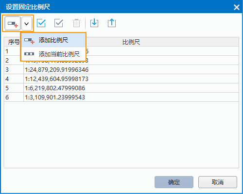

　　Set the map display range by the shown parameters, including: scales, centre point, current view, map bounds, etc. 

### Current Scale

　　Display the scale of the current map, you can specify the scale of the map by typing a value in the text box. The scale of the map also varies with the map zoom.

### Fixed Scale

　　You can set up a series of map scales as your needs, when the checkbox is checked, the current map scale only can be one of the map scales you have set.

**Set Scale**

　　Specifies the map scales. Click "Set Scale..." button to open the "Set Fixed Scale" dialog box for you to add the map scales.

　　Click the drop-down button to choose the "Add Scale" or "Add Current Scale".

　　

　　If there are no scales in the dialog box, the first scale added through any method is identical to the current map scale by default. Else if the selected scale is the last scale from the list, the scale added through Add Scale is twice the previous scale. If the selected scale is not the last one in the list, the scale added through Add Scale is half of the sum of the selected scale and the next scale. After zooming the map, you can click on Add Current Scale to add the current map scale into the list.

　　Finally, click "OK" button to finalize the addition of map scales. The map scale can be selected from the fixed scale list.

　　The check box will be checked automatically after the fixed scales are set up.

### Clip Visible Bounds

　　Specify the map display range. Only the map contents within the range can be displayed. The parameter is only for the map display without changing any dataset.

　　Check the "Clip Visible Bounds" check box, and then you can select a method from the drop-down list shown by clicking "Setting..." to draw the display contents of the map. The provided methods include: Select Object, Draw Rectangle, Draw Polygon, Draw Pie, Draw Circle. You can select one or more region objects by the method "Select Object".

### Lock Maximum Display Bounds

　　The Lock Maximum Display Bounds command lets you lock the specific extent of the map. The map contents beyond the locked extent is not visible. You can't pan or zoom in the map when the current window display the maximum bounds of the map.

　　The Settings button will be enabled when you check the "Lock Maximum Display Bounds", the maximum display extent is the map extent by default. Click Setting and select a method to specify the maximum display range from the drop-down list. Provides a series of method for you to choose, including: Select Object (only for region objects), Draw Rectangle, Draw Polygon, Draw Pie, Draw Circle.

　　You can click "Set as Map Bounds" and the maximum extent is the map extent, also you can respecify the map extent.

### Custom Full Bounds

　　Set the full extent of the map. After customizing the full extent, you can clip Maps/Browse/Full Extent or press F6 to display the full extent you specified.

　　Click the Settings button and select a method to specify the full extent. Provides a series of methods for you to choose, including: Select Object (only for region objects), Draw Rectangle, Draw Polygon, Draw Pie, Draw Circle.

　　You can clear the full extent you specified by clicking "Clear Custom Bounds" and respecify a full extent.

### Centre Point

　　Display or set the position of centre point in X, Y coordinate value. The values in the text boxes beside "X:" and "Y:" labels is the coordinate values of the centre point, you can determine a new center point by entering new values. 

### Current View

　　This command is used to view the map visible information in the current map window, including position information, such as left, top, right and bottom. You can edit these text boxes.

### Map Bounds

　　The Map Bounds command is used to view the spatial extent of the current map. The spatial extent of the map is the minimum enclosing rectangle of all datasets in the map. When there are datasets added or removed from the map, the spatial extent may change. You can not edit the Map Bounds.

